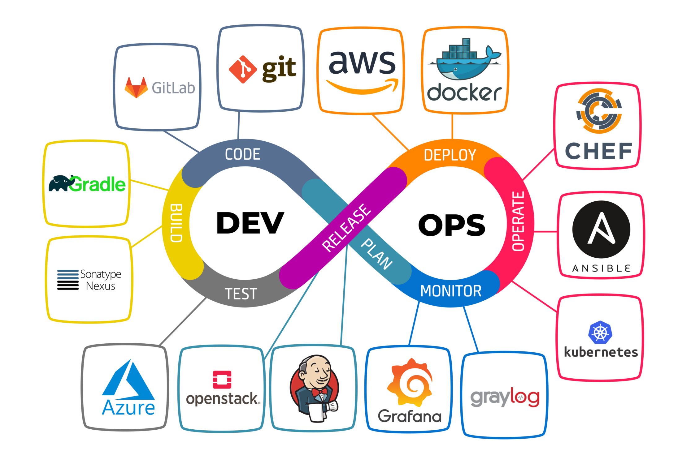
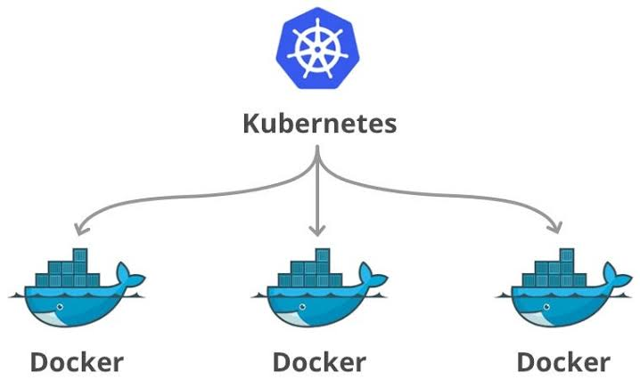
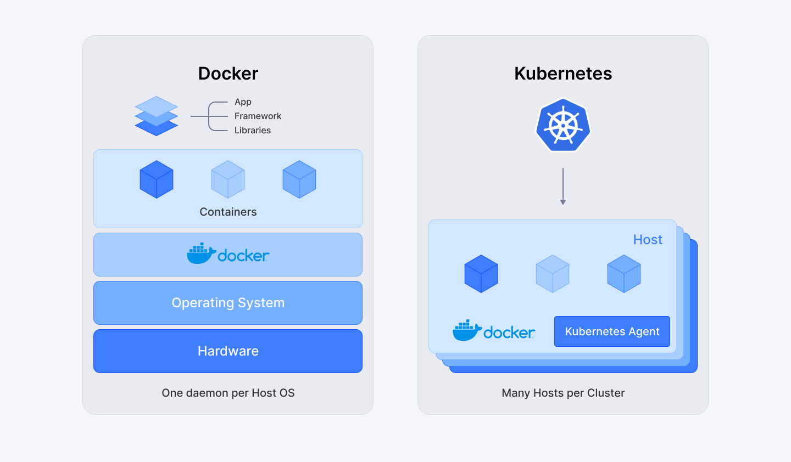
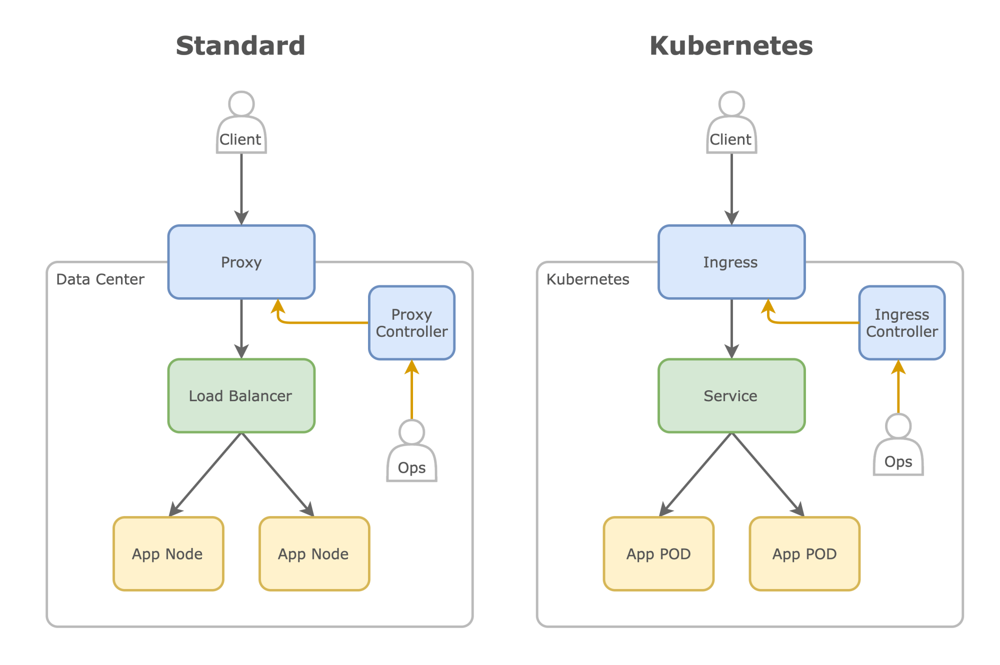
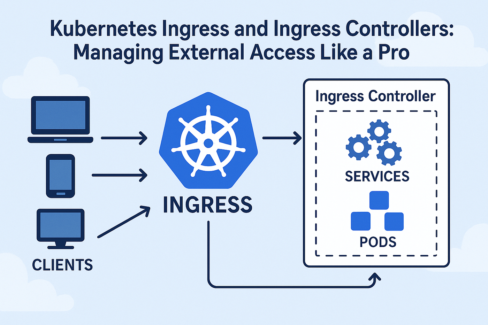
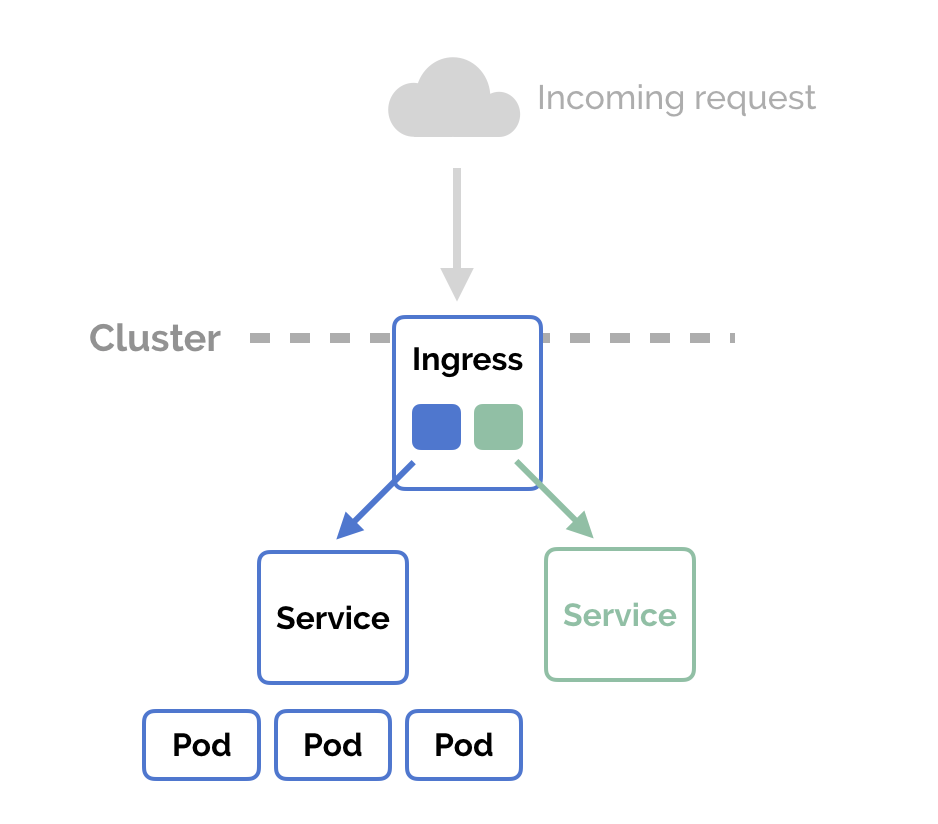

# 🚀 DevOps

**DevOps** (Development Operations) — это методология автоматизации технологических процессов и организации команд, позволяющая быстро создавать и запускать в production новые ИТ-продукты. Термин объединяет **development** (разработку) и **operations** (управление).

DevOps-подход превращает работу команд разработки, тестирования и эксплуатации в единый непрерывный конвейер. Инженер DevOps отвечает за безопасную работу систем, повышение эффективности и своевременное устранение возникающих проблем.

---

## 🐳 Docker vs ☸️ Kubernetes

Хотя Docker и Kubernetes часто упоминаются вместе, они решают разные задачи.

| Инструмент | Назначение |
|------------|------------|
| **Docker** | Платформа контейнеризации и среда выполнения. Позволяет упаковывать приложения в контейнеры со всеми зависимостями. |
| **Kubernetes** | Платформа для управления (оркестрации) контейнерами в кластере. Запускает, масштабирует и поддерживает жизненный цикл контейнеров. |

Kubernetes поддерживает множество контейнерных сред выполнения, включая Docker, но может работать и без него (например, с containerd). Связка «Docker как среда выполнения + Kubernetes как оркестратор» — классический вариант.

---

## 🌐 Ingress

**Ingress** — это компонент, который управляет внешним доступом к сервисам внутри кластера (обычно в Kubernetes). Он действует как «умный маршрутизатор» или шлюз для входящего трафика (HTTP/HTTPS, реже TCP/UDP).

Простая аналогия: кластер — здание, сервисы — комнаты, а Ingress — консьерж, который:
1. Принимает запросы извне (например, `app.example.com` или `api.example.com/data`).
2. Смотрит на правила и решает, в какую «комнату» (сервис) направить трафик.
3. Может выполнять дополнительную работу: SSL-терминацию, балансировку нагрузки, перезапись URL.

### Основные функции Ingress

- **Маршрутизация**  
  Направляет запросы на разные сервисы по домену (`host`) или пути (`path`).
- **SSL/TLS-терминация**  
  Расшифровывает HTTPS-трафик на себе, чтобы внутренние сервисы работали с HTTP.
- **Балансировка нагрузки**  
  Распределяет трафик между подами (Pods) сервиса.
- **Перезапись URL**  
  Меняет путь запроса перед передачей сервису (например, `/api/v1` → `/`).
- **Аутентификация и защита**  
  Интеграция с OAuth, Web Application Firewall через аннотации или сторонние контроллеры.

### Как это работает

- **Ingress-ресурс** — YAML-файл с правилами маршрутизации (куда и как направлять трафик).
- **Ingress-контроллер** — программа (Nginx, Traefik, Istio и др.), которая читает эти правила и реализует их.

### Зачем нужен Ingress

- **Единая точка входа** — не нужно настраивать отдельный LoadBalancer для каждого сервиса.
- **Гибкость** — правила маршрутизации можно менять без переделки сервисов.
- **Безопасность** — централизованное управление SSL и доступом.

### Ограничения

- Работает в основном с HTTP(S). Для TCP/UDP нужны альтернативы (Service типа LoadBalancer, Gateway API).
- Требует развёртывания Ingress-контроллера (это не часть Kubernetes «из коробки»).

### Примеры Ingress-контроллеров

- **Nginx Ingress** — популярный, на основе Nginx.
- **Traefik** — поддерживает автоматическое обнаружение сервисов.
- **AWS ALB Ingress** — для интеграции с AWS Application Load Balancer.
- **Istio Gateway** — часть сервис-меша Istio.

