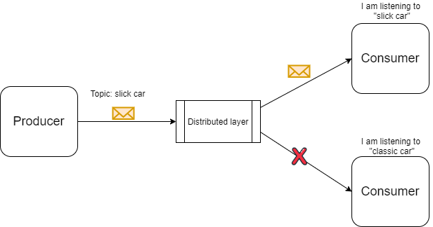
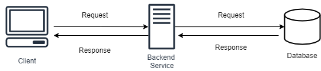

# ⚡ Event-driven архитектура (EDA)

**Событийно-ориентированная архитектура (Event-Driven Architecture, EDA)** — шаблон проектирования, в котором компоненты системы взаимодействуют через события. Событие — это сообщение о факте изменения состояния или выполнения действия. Службы обмениваются событиями через брокер сообщений, не вызывая друг друга напрямую.

По сути, это асинхронный обмен сообщениями через посредника (брокер), где производители (publishers) публикуют события, а потребители (subscribers) подписываются на интересующие их типы событий.

---

## 🆚 EDA vs Request-Response

В классической модели «запрос-ответ» клиент синхронно ожидает ответа от сервера. В EDA связь асинхронная и слабосвязанная: отправитель не ждёт реакции, а получатели реагируют независимо.

| Критерий | Request-Response | Event-Driven |
|----------|------------------|---------------|
| **Связь** | Синхронная (блокирующая) | Асинхронная |
| **Связанность** | Сильная (клиент знает сервер) | Слабая (отправитель не знает получателей) |
| **Масштабирование** | Горизонтальное, но сложнее | Каждый компонент масштабируется независимо |
| **Отказоустойчивость** | Отказ сервера прерывает клиента | События могут быть обработаны позже, брокер сохраняет их |
| **Типичные инструменты** | REST, gRPC | Kafka, RabbitMQ, AWS SNS/SQS |

---

## ✅ Преимущества событийно-ориентированной архитектуры

- **Слабая связанность** — службы не зависят друг от друга напрямую, обеспечивается независимость и модульность.
- **Масштабируемость** — службы масштабируются независимо, исходя из нагрузки по обработке событий.
- **Асинхронная обработка** — уменьшаются задержки и время отклика, система не блокируется.
- **Порождение событий (Event Sourcing)** — поддерживается естественным образом, состояние системы можно восстановить по цепочке событий.
- **Гибкость** — добавление новых сервисов или изменение существующих не влияет на всю систему.

---

## 📊 Схема работы

---

## 🧩 Когда применять EDA

- Бизнес-процессы, включающие несколько независимых шагов (оформление заказа: оплата, резервирование товара, уведомление).
- Системы реального времени, требующие быстрой реакции на события (IoT, финансовые трейдинговые платформы).
- Микросервисные ландшафты, где необходима слабая связанность и независимое развёртывание.
