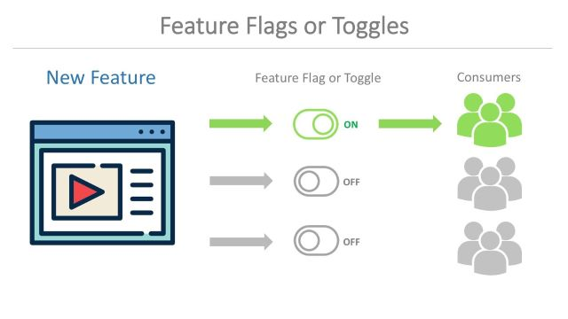
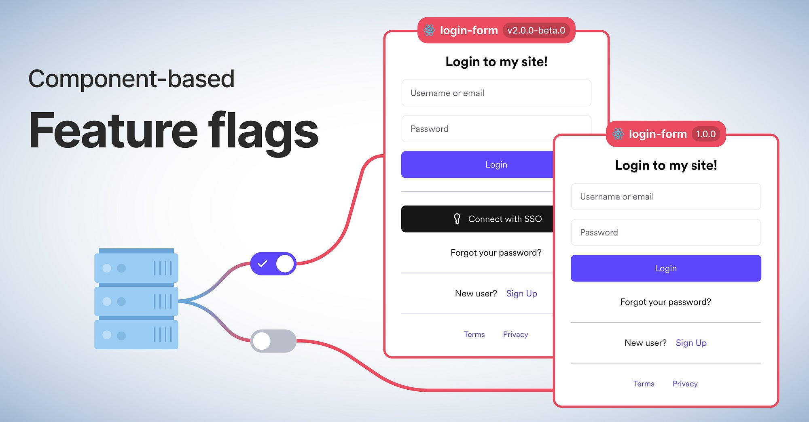

# 🎚️ Фича тоглинг (Feature Toggling)

**Фича тоглинг** — это техника, позволяющая включать или отключать отдельные функции приложения без изменения кодовой базы и повторного развёртывания. Работа переключателей основана на конфигурационных флагах (переменных), которые указывают, активна ли функция для пользователя в данный момент.

Такой подход избавляет от необходимости выпускать полное обновление продукта, когда нужно протестировать гипотезу, выкатить экспериментальную возможность или скрыть недоработанный функционал от широкой аудитории.

---

## ⚙️ Как это работает

В коде приложения размещаются условные операторы, проверяющие состояние флага. Если флаг включён — пользователь видит новую функциональность, если выключен — стандартное поведение. Сами флаги могут храниться в конфигурационных файлах, базе данных или специализированных сервисах (например, LaunchDarkly), что позволяет менять их значения «на лету».

Таким образом, команда может:

- активировать функцию только для определённой группы пользователей (например, для внутренних тестировщиков или платящих клиентов);
- постепенно увеличивать охват (канареечный запуск);
- мгновенно отключить проблемную функцию при обнаружении ошибок.

---

## 🧪 Сценарии использования

- **Тестирование гипотез и A/B-эксперименты** — сравнение двух вариантов интерфейса или логики на реальных пользователях.
- **Ранний доступ и бета-программы** — предоставление новой возможности ограниченному кругу лояльных пользователей до официального релиза.
- **Тёмный запуск (Dark Launch)** — скрытое внедрение функции для сбора метрик и обратной связи без анонсирования.
- **Постепенное развёртывание крупных изменений** — выкатка большого редизайна или архитектурного сдвига частями, контролируя нагрузку на систему и реакцию аудитории.
- **Модели монетизации** — разграничение платных и бесплатных возможностей без создания отдельных версий приложения.

---

## ✅ Преимущества фича-тоглинга

- **Быстрая реакция на проблемы** — опасную функцию можно выключить за секунды без отката всего релиза.
- **Снижение рисков** — новые возможности проверяются на малой группе, прежде чем стать доступными всем.
- **Непрерывная поставка** — позволяет разработчикам сливать код в основную ветку, даже если функциональность ещё не готова к публичному показу (она просто скрыта флагом).
- **Гибкость для бизнеса** — маркетинговые акции, платные подписки или региональные ограничения реализуются без дополнительных сборок.
