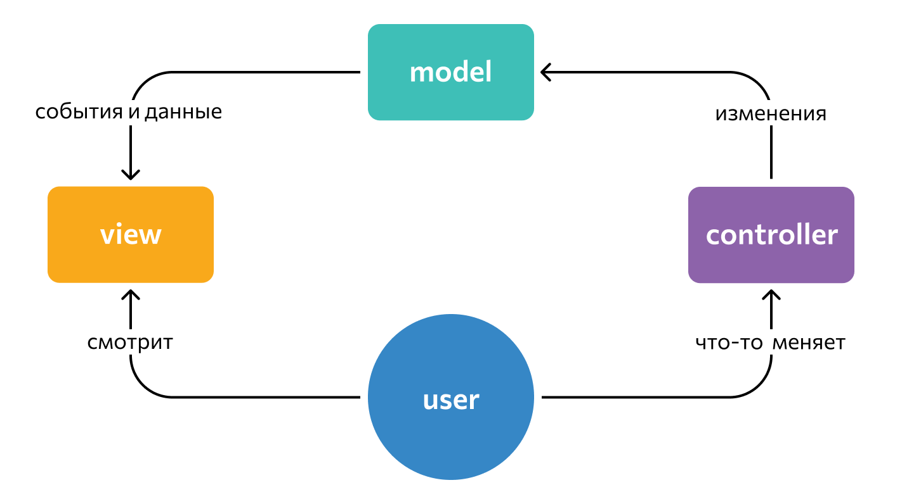
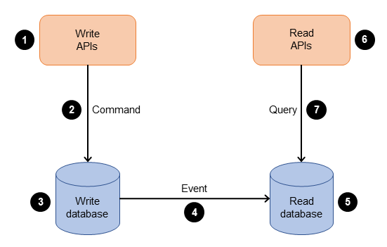

## 🔐 Идентификация, аутентификация и авторизация

- **Идентификация** — утверждение вашей личности (определение, существует ли конкретный пользователь в системе). Проводится, например, по номеру телефона или логину.
- **Аутентификация** проверяет это утверждение. Это процесс подтверждения права на доступ с помощью ввода пароля, пин-кода, биометрических данных и других способов.
- **Авторизация** определяет, к каким действиям или ресурсам вы можете получить доступ после установления вашей личности.

**Порядок всегда один:** сначала идентификация, затем аутентификация, и только после этого авторизация.

---

## 🧩 MVC (Model-View-Controller)

**MVC** — это шаблон программирования, разделяющий логику приложения на три компонента:

- **Model (модель)** — получает данные от контроллера, выполняет необходимые операции и передаёт их в вид.
- **View (вид или представление)** — получает данные от модели и выводит их для пользователя.
- **Controller (контроллер)** — обрабатывает действия пользователя, проверяет полученные данные и передаёт их модели.

Простая аналогия: HTML — это View, JavaScript-скрипт — Controller, а бэкенд-код на Java — Model.

---

## 🖥️ Толстый и тонкий клиент

### Толстый клиент
Клиентское приложение, содержащее значительную часть логики и функциональности непосредственно на стороне пользователя. При запуске загружает все необходимые ресурсы (интерфейс, логику), и большая часть обработки выполняется локально.

- **Примеры:** Adobe Photoshop, настольные игры.
- **Плюсы:** высокая производительность, возможность автономной работы.
- **Минусы:** требуется установка, сложные обновления.

### Тонкий клиент
Приложение, минимизирующее логику на стороне пользователя и делегирующее основные задачи серверу. Требует минимальной установки; вычисления выполняются на сервере.

- **Примеры:** веб-почта, CRM-системы (Salesforce).
- **Плюсы:** простота обновлений (централизованно), лёгкость в управлении.
- **Минусы:** зависимость от сети, ограниченная функциональность без подключения.

---

## 🗂️ Виды архитектур

- **Монолитная архитектура** — всё приложение как единое целое.
- **Микросервисная архитектура** — набор независимо развёртываемых сервисов.
- **Бессерверная архитектура (Serverless)** — облачные функции, выполняемые по требованию.
- **Сервис-ориентированная архитектура (SOA)** — слабосвязанные крупные сервисы, взаимодействующие через общую шину.

---

## ⚖️ Сравнение SOA и микросервисов

| Критерий | SOA | Микросервисы |
|----------|-----|--------------|
| **Стиль архитектуры** | Слабо разграниченная, централизованная система | Сильно разграниченная, распределённая система; децентрализованное управление данными |
| **Разграничение служб** | Укрупнённые, комплексные службы | Небольшие узкоспециализированные службы |
| **Независимость** | Службы взаимозависимы, возможно совместное использование БД | Высокая степень независимости, отдельные и автономные службы |
| **Коммуникация** | Синхронная, часто на основе сообщений (шина), совместное использование данных | Асинхронная (часто через брокеры), REST (синхронно), без совместного использования данных |
| **Хранение данных** | Централизованное, службы могут использовать общую БД | Распределённое (децентрализованное), каждая служба управляет своими данными |
| **Масштабируемость** | Горизонтальное, но осложнено общими ресурсами | Горизонтальное и вертикальное, прицельное масштабирование отдельных служб |
| **Развёртывание** | Как правило, всего приложения целиком | Каждая служба развёртывается и масштабируется независимо |
| **Связанность** | Службы взаимосвязаны из-за общих ресурсов и централизованного взаимодействия | Слабая связанность, минимум зависимостей |

---

## 📦 Контейнеры и оркестрация

**Контейнеры** — это автономные приложения или микросервисы на базе Linux со всеми библиотеками и функциями, необходимыми для работы на любом типе машин.

**Оркестрация контейнеров** — управление контейнерами в группе серверных узлов (кластер). Она автоматизирует создание, настройку, планирование, развёртывание и удаление контейнеров, а также обеспечивает:
- балансировку нагрузки и управление трафиком;
- непрерывность обслуживания;
- безопасность на всех этапах;
- мониторинг состояния;
- предоставление ресурсов из базовых мощностей сервера.

### Оркестрация vs Хореография

- **Оркестрация** — централизованный подход: есть один оркестратор (например, Kubernetes), который управляет всеми шагами и последовательностью выполнения.
- **Хореография** — децентрализованный подход: каждый микросервис сам слушает события и решает, нужно ли ему действовать, без единого центра управления.

---

## 🧪 A/B-тестирование

**A/B-тестирование (сплит-тестирование)** — метод исследования, при котором сравнивают эффективность двух вариантов какого-либо объекта (например, страницы сайта). Варианты показывают аудитории и оценивают, на какой из них реакция лучше.

---

## 🎯 Целевая архитектура (Target Architecture)

Целевая архитектура описывает желаемое будущее состояние предприятия — «что должно быть». Это идеальная модель, к которой стремится организация.

---

## 📲 Server-Driven UI (SDUI)

**SDUI** — подход, при котором сервер через API сообщает клиентскому приложению, какие компоненты и с каким контентом нужно отображать. Это позволяет динамически и гибко менять интерфейс без обновления самого приложения.

---

## ⚡ CQRS (Command and Query Responsibility Segregation)

**CQRS** — разделение ответственности на команды (запись) и запросы (чтение). Операции записи в базу данных требуют больше ресурсов и времени, чем операции чтения, поэтому их логику выгодно разделять.

---

## ⚖️ HAProxy

**HAProxy** — программный балансировщик нагрузки и обратный прокси. Получает входящие запросы от пользователей (с фронта или внешних систем) и распределяет их по backend-сервисам.  

**Зачем нужен:**
- Балансировка нагрузки между несколькими инстансами сервиса — повышает надёжность и масштабируемость.
- Отказоустойчивость: упавший сервер автоматически исключается из пула.
- Роутинг по условиям (URL, HTTP-заголовки и т.д.).
- Безопасность и контроль: ограничение частоты запросов, блокировка IP, логирование.

