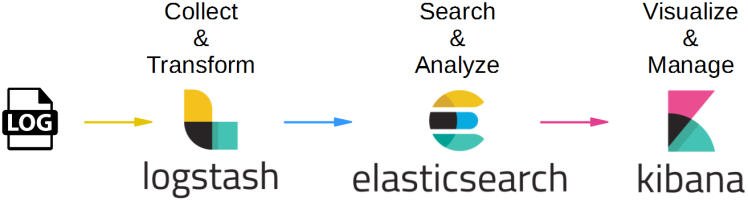

# 📜 Логи (Logging)

Логи — это записи событий, происходящих в информационной системе. Они фиксируют ошибки, предупреждения, информационные сообщения и отладочную информацию. Грамотно настроенное логирование позволяет быстро находить причины сбоев, отслеживать поведение пользователей и контролировать безопасность.

---

## 📊 Уровни логирования

Большинство систем логирования поддерживают стандартные уровни важности сообщений:

| Уровень | Описание |
|--------|----------|
| **DEBUG** | Подробная отладочная информация, полезная при разработке и диагностике. |
| **INFO** | Информационные сообщения о нормальной работе системы (старт, остановка, ключевые операции). |
| **WARN** | Предупреждения о потенциально опасных ситуациях, которые не нарушают работу, но требуют внимания. |
| **ERROR** | Ошибки, из-за которых операция не выполнилась, но система продолжает функционировать. |
| **FATAL** | Критические ошибки, приводящие к остановке приложения или сервиса. |

---

## 🧩 ELK Stack (Elastic Stack)

**ELK** (Elasticsearch, Logstash, Kibana) — это платформа для централизованного сбора, обработки, хранения и визуализации логов и любых других данных в реальном времени. Часто используется для мониторинга, аналитики и оперативного поиска проблем.

Общий поток данных:
1. **Logstash** собирает и обрабатывает логи из разных источников.
2. **Elasticsearch** индексирует и хранит обработанные данные.
3. **Kibana** предоставляет веб-интерфейс для поиска, построения дашбордов и визуализации.

---

## 🔍 Elasticsearch

**Elasticsearch** — распределённый поисковый и аналитический движок на базе Apache Lucene. Он способен:
- Хранить огромные объёмы структурированных и неструктурированных данных.
- Выполнять полнотекстовый поиск и сложные агрегации в режиме реального времени.
- Индексировать логи, делая их доступными для мгновенных запросов.

Именно Elasticsearch является «сердцем» стека, обеспечивая быстрый поиск по миллионам записей.

---

## ⚙️ Logstash

**Logstash** — инструмент для сбора, преобразования и маршрутизации данных. Он принимает логи из множества источников (файлы, базы данных, метрики, сетевые потоки) и может:
- Парсить неструктурированные логи (например, с помощью grok-шаблонов).
- Фильтровать, обогащать и структурировать данные (JSON, key-value).
- Отправлять готовые события в Elasticsearch или другие хранилища.

Logstash играет роль «конвейера», подготавливающего сырые данные к анализу.

---

## 📈 Kibana

**Kibana** — веб-интерфейс для визуализации и исследования данных, хранящихся в Elasticsearch. С её помощью можно:
- Создавать интерактивные дашборды, графики, карты, таблицы.
- Проводить ad-hoc поиск по логам с фильтрацией и временными интервалами.
- Настраивать алерты на основе пороговых значений или аномалий.

Для аналитика Kibana — удобный способ быстро оценить состояние системы и найти нужные события без прямых запросов к базе.

---

## 💡 Зачем аналитику разбираться в логах и ELK?

- Анализ требований к логированию: определение, какие события и с каким уровнем должны фиксироваться.
- Проектирование интеграций: логи могут служить источником данных для систем мониторинга и оповещения.
- Поиск и разбор инцидентов: умение найти нужную информацию в Kibana ускоряет диагностику проблем без привлечения разработчиков.
