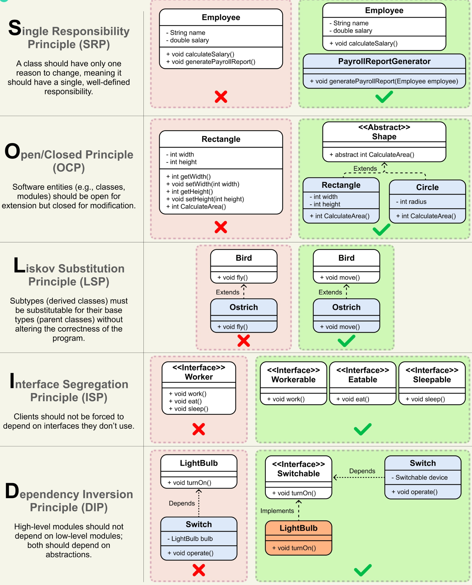

# 📐 Принципы проектирования

Надёжный и сопровождаемый код базируется на проверенных принципах проектирования. Здесь собраны ключевые из них, включая SOLID, а также дополнительные правила, помогающие аналитику и разработчику принимать взвешенные архитектурные решения.

---

## 🧱 SOLID

**SOLID** — это пять принципов объектно-ориентированного проектирования, которые делают систему понятной, гибкой и устойчивой к изменениям.

| Принцип | Описание |
|---------|----------|
| **S** – Single Responsibility (Единственная ответственность) | У класса должна быть только одна причина для изменения, то есть одна чётко определённая задача. |
| **O** – Open/Closed (Открытости/закрытости) | Программные сущности должны быть открыты для расширения, но закрыты для модификации. Новую функциональность добавляем через расширение, не меняя существующий код. |
| **L** – Liskov Substitution (Подстановки Лисков) | Объекты производного класса должны иметь возможность заменять объекты базового класса без нарушения корректности программы. |
| **I** – Interface Segregation (Разделения интерфейсов) | Классы не должны зависеть от интерфейсов, которые они не используют. Лучше много специализированных интерфейсов, чем один универсальный. |
| **D** – Dependency Inversion (Инверсии зависимостей) | Высокоуровневые модули не должны зависеть от низкоуровневых; оба должны зависеть от абстракций (интерфейсов). |

---

## 🧩 Дополнительные принципы

Помимо SOLID, в проектировании часто применяются следующие правила:

- **KISS (Keep It Simple, Stupid)** — «Делай проще». Избегай неоправданной сложности, простое решение легче понимать и сопровождать.
- **DRY (Don't Repeat Yourself)** — «Не повторяйся». Каждая часть знаний должна иметь единственное, непротиворечивое представление в системе. Дублирование кода или логики усложняет поддержку.
- **YAGNI (You Ain't Gonna Need It)** — «Тебе это не понадобится». Не реализуй функциональность, пока она действительно не потребуется. Не трать время на гипотетические сценарии.
- **Separation of Concerns (Разделение ответственности)** — Разделяй систему на отдельные части, каждая из которых решает свою задачу и минимально пересекается с другими.

---

## 💡 Зачем аналитику знать принципы проектирования?

- Помогает формулировать требования, которые не противоречат здравой архитектуре.
- Упрощает общение с разработчиками: аналитик понимает, почему предлагается именно такая структура классов или сервисов.
- Позволяет предвидеть проблемы сопровождаемости и масштабируемости на этапе проектирования.
