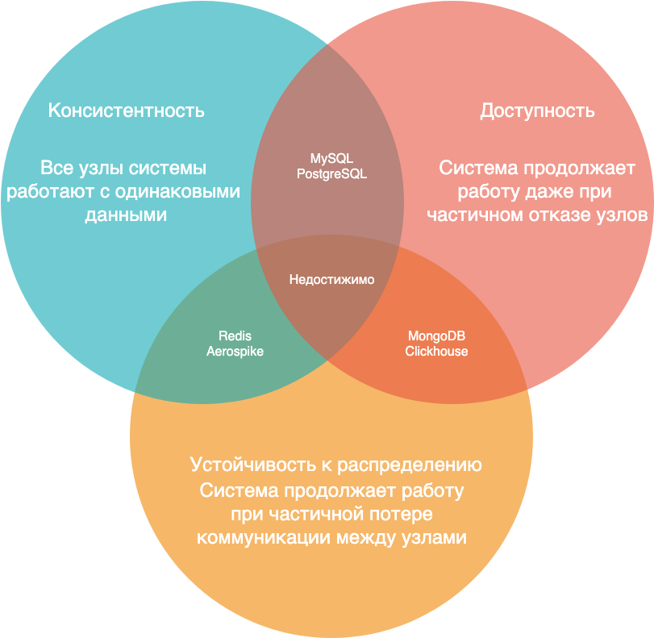

# 📐 CAP-теорема

**CAP-теорема** (теорема Брюера) — это фундаментальный принцип проектирования распределенных систем. Он утверждает, что в любой распределенной системе невозможно одновременно обеспечить более двух из трех следующих свойств:

*   **C**onsistency (Согласованность / Консистентность)
*   **A**vailability (Доступность)
*   **P**artition tolerance (Устойчивость к разделению)

---

## 🔍 Детальный разбор компонентов

### 🔴 C (Consistency) — Консистентность
Все узлы (ноды) системы в один и тот же момент времени работают с одинаковым набором данных. Пользователь может отправить запрос на чтение или запись на любой узел и гарантированно получит одни и те же данные.
*   Каждое чтение возвращает либо самую свежую запись, либо ошибку. Устаревшие данные клиенту не отдаются.
*   **Пример:** Большинство классических реляционных SQL-баз данных (PostgreSQL, MySQL, Oracle) изначально оптимизированы для строгого соблюдения согласованности.

### 🟢 A (Availability) — Доступность
Любой запрос к работающему узлу распределенной системы должен завершаться успешным ответом. Даже если один или несколько узлов вышли из строя, оставшиеся ноды обязаны продолжать отвечать пользователям.
*   Каждый запрос получает ответ (успех или отказ), но данные при этом могут быть не самыми актуальными (устаревшими). Система жертвует свежестью данных ради работоспособности.
*   **Пример:** Многие NoSQL-базы данных (DynamoDB, Cassandra) отдают приоритет доступности, используя концепцию *согласованности в конечном счете (Eventual Consistency)*.

### 🔵 P (Partition tolerance) — Устойчивость к распределению (расщеплению сети)
Система продолжает функционировать, даже если связь между её узлами полностью пропала (произошел разрыв сетевого соединения, задержка пакетов или авария дата-центра). Данные реплицируются между группами узлов так, чтобы они могли автономно работать в периоды сетевых проблем.
*   Система должна уметь выживать при изоляции узлов друг от друга.
*   **Важный нюанс:** В реальном мире физические сети не идеальны. Сетевые сбои происходят всегда, поэтому свойство **P является обязательным** для любой распределенной системы. Мы не можем от него отказаться.

---

## ⚖️ Компромисс: выберите любые два

Поскольку свойство **P** (устойчивость к сбоям сети) в распределенной системе исключить нельзя, реальный выбор архитектора всегда сводится к дилемме: **CP** либо **AP**.

### 1. CP (Согласованность + Отказоустойчивость)
В случае сетевого сбоя система жертвует доступностью ради точности данных. 
*   Если узлы не могут договориться друг с другом о том, какое значение является самым свежим, система заблокирует запросы пользователей или вернет ошибку, чтобы не допустить рассинхронизации.
*   **Где применяется:** Банковские транзакции, биллинг, системы управления конфигурациями (ZooKeeper, etcd).

### 2. AP (Доступность + Отказоустойчивость)
В случае сетевого сбоя система сохраняет доступность, жертвуя консистентностью.
*   Узлы, потерявшие связь с кластером, продолжают принимать запросы от пользователей и отдавать те данные, которые у них есть на данный момент (пусть даже устаревшие). Когда сеть восстановится, узлы синхронизируются.
*   **Где применяется:** Социальные сети (лайки, комментарии), ленты новостей, корзины товаров в интернет-магазинах.

### 3. CA (Согласованность + Доступность)
*   Отлично выглядит на бумаге, но **недостижимо в реальных распределенных системах**. Отказ от свойства P означал бы, что сеть работает абсолютно идеально и никогда не ломается. 
*   Архитектура CA возможна только внутри одной монолитной базы данных, запущенной на одном физическом сервере (где нет сети как таковой).

---

## 💡 Расширение для аналитика: Теорема PACELC

CAP-теорема описывает поведение системы только тогда, когда происходит авария (сетевой сбой — Partition). Но что происходит в **штатном (нормальном) режиме работы**, когда сеть исправна? 

На этот вопрос отвечает теорема **PACELC** (расширение CAP):

> **P**artition **A**vailability / **C**onsistency **E**lse **L**atency / **C**onsistency

Формулируется так: Если есть Разделение сети (**P**artition), выбирай между Доступностью (**A**) и Согласованностью (**C**). Иначе (**E**lse), когда сеть работает нормально, выбирай между Задержкой (**L**atency) и Согласованностью (**C**).

### Два популярных подхода по PACELC:
1.  **PC/EC (например, MongoDB, PostgreSQL c синхронной репликацией):** При аварии выбирают консистентность. В штатном режиме тоже выбирают консистентность (база ждет, пока данные запишутся на все узлы, из-за чего увеличивается задержка/время ответа **Latency**).
2.  **PA/EL (например, Cassandra, DynamoDB, Redis):** При аварии остаются доступными. В штатном режиме работают максимально быстро (**Latency**), отправляя ответ клиенту сразу, а данные между узлами синхронизируются в фоне (жертвуя моментальной **Consistency**).
