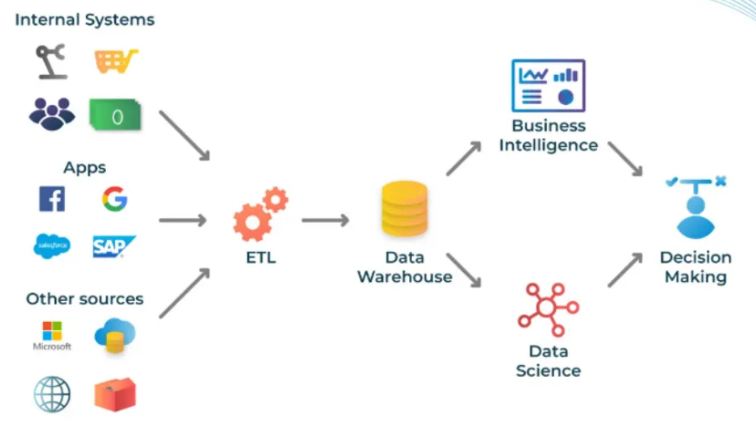
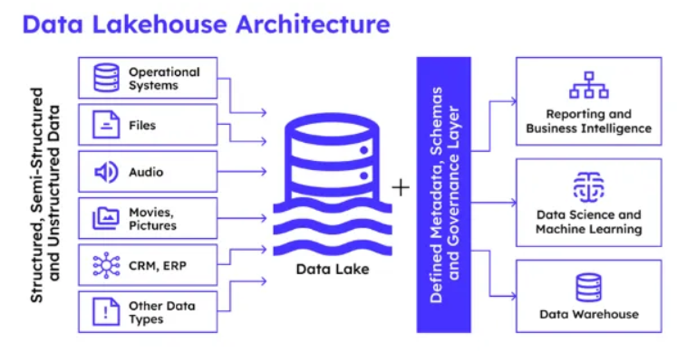
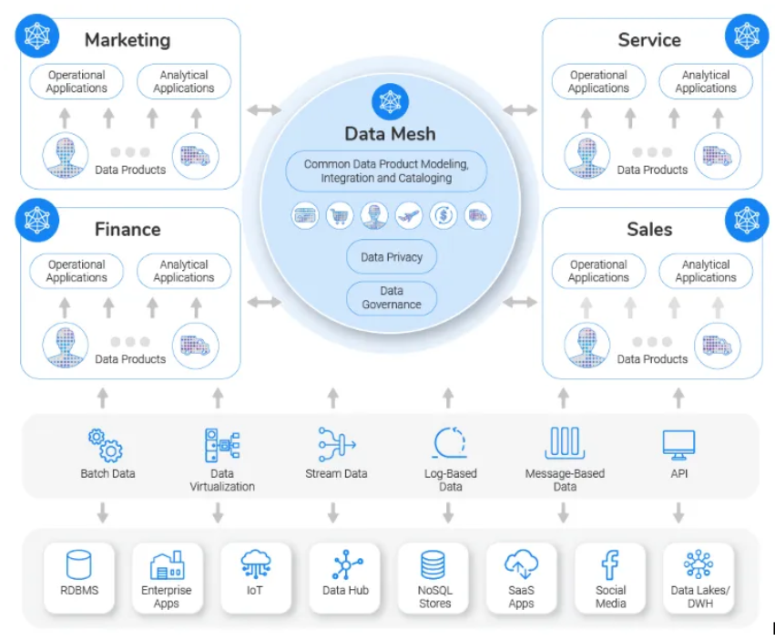

# 🏛️ Архитектуры хранения и управления данными

В современных информационных системах выбор архитектуры данных определяет, как компания будет собирать, очищать, хранить и анализировать информацию. Существует четыре ключевых подхода к организации таких систем.

---

## 🏬 Data Warehouse (Хранилище данных / DWH)

**Data Warehouse** — это централизованная система, созданная специально для бизнес-аналитики (BI) и построения отчетности. Хранилища содержат строго структурированные данные, которые предварительно проходят процесс очистки, трансформации и агрегации (классический ETL/ELT-процесс).

DWH работает по принципу **Schema-on-Write** (схема при записи) — данные нельзя загрузить в хранилище, пока они не будут приведены к жестко заданной структуре таблиц.

*   **Преимущества:**
    *   *Высокопроизводительная отчетность:* Оптимизировано для быстрой генерации сложных аналитических отчетов и выполнения тяжелых SQL-запросов.
    *   *Безопасность и согласованность:* Высокий уровень контроля доступа, строгая типизация и гарантированная чистота данных («единый источник правды»).
    *   *Простота для аналитиков:* Данные хорошо организованы и понятны, дата-аналитикам легко писать запросы без глубокой предобработки.
*   **Недостатки:**
    *   *Только структурированные данные:* Абсолютно непригодно для работы с неструктурированными или полуструктурированными данными (тексты, логи, изображения, видео).
    *   *Высокая стоимость:* Поддержание масштабируемого DWH требует значительных инвестиций как в инфраструктуру (хранилище + мощный вычислительный сервер), так и в команду разработки (ETL-инженеры).

---

## 🌊 Data Lake (Озеро данных)

**Data Lake** — это центральный репозиторий, в котором хранятся абсолютно все типы данных в их первозданном (сыром) виде, независимо от формата или структуры. Сюда входят структурированные таблицы, полуструктурированные файлы (JSON, XML, CSV, логи) и неструктурированный контент (документы, медиафайлы).

В отличие от DWH, здесь применяется принцип **Schema-on-Read** (схема при чтении) — данные просто складываются «как есть», а их структура определяется только в момент, когда аналитик или Data Scientist начинает их читать.

*   **Преимущества:**
    *   *Мультиформатность:* Позволяет хранить разнообразные типы данных в одной системе, обеспечивая максимальную гибкость.
    *   *Высокая масштабируемость и экономичность:* Хранение сырых данных на дешевых дисковых массивах (например, Hadoop HDFS или AWS S3) обходится значительно дешевле, чем в DWH.
    *   *Идеально для Machine Learning:* Data Scientist'ам нужны именно «сырые» исторические данные без искажений и агрегаций для качественного обучения моделей машинного обучения.
*   **Недостатки:**
    *   *Превращение в «Болото данных» (Data Swamp):* Без жесткого контроля, каталогизации и управления метаданными Data Lake быстро превращается в неорганизованную свалку файлов, в которой невозможно что-либо найти.
    *   *Сложное управление безопасностью:* Контролировать доступ и обеспечивать безопасность сложнее из-за огромного разнообразия форматов и отсутствия единой схемы.

---

## 🏠 Data Lakehouse (Озеро-хранилище)

**Data Lakehouse** — это современная гибридная архитектура, которая пытается взять лучшее от двух миров: гибкость и дешевизну *Data Lake* вместе с надежностью, структурированностью и поддержкой ACID-транзакций от *Data Warehouse*.

Lakehouse позволяет компаниям хранить все свои данные (включая неструктурированные) в едином месте, но при этом накладывает поверх Озера данных аналитический слой управления (например, через технологии Delta Lake, Apache Iceberg или Hive). Это позволяет выполнять стандартные SQL-запросы с высокой скоростью прямо поверх файлов в Озере данных.

---

## 🕸️ Data Mesh (Сетка данных)

**Data Mesh** — это не столько технологический стек, сколько распределенная *архитектурно-организационная* концепция управления данными. Вместо того чтобы сливать данные всей компании в одно гигантское централизованное хранилище (DWH или Data Lake), Data Mesh децентрализует управление.

Архитектура строится вокруг бизнес-доменов (команд). Каждый домен (например, «Бухгалтерия», «Логистика», «Продажи») сам отвечает за сбор, хранение и обработку своих данных, предоставляя их остальной компании как готовый продукт (**Data as a Product**). Взаимодействие между доменами часто строится на базе микросервисной архитектуры или витрин данных.

*   **Преимущества:**
    *   *Масштабируемость управления:* Устраняется бутылочное горлышко в виде одной центральной команды дата-инженеров. Каждая команда развивает свои данные независимо.
    *   *Высокое качество на местах:* Доменная команда лучше всех понимает специфику своих данных, поэтому совершает меньше ошибок при их обработке.
*   **Недостатки:**
    *   *Сложность интеграции:* Из-за отсутствия единого централизованного хранилища возрастают риски рассинхронизации данных. Требуется строгий сквозной контроль стандартов (Global Governance).
    *   *Дублирование компетенций:* Каждому бизнес-подразделению требуется иметь в штате собственных аналитиков и инженеров данных, что усложняет рабочие процессы.

---

## 📊 Краткая шпаргалка для аналитика

| Критерий | Data Warehouse (DWH) | Data Lake | Data Lakehouse | Data Mesh |
| :--- | :--- | :--- | :--- | :--- |
| **Тип данных** | Только структурированные | Любые (Сырые, Логи, Медиа) | Любые (с мета-слоем) | Зависит от домена |
| **Подход к схеме** | Schema-on-Write (строгая) | Schema-on-Read | Гибридный (ACID поверх файлов) | Децентрализованный |
| **Основная цель** | BI, Отчеты, Дашборды | Machine Learning, Big Data | BI + ML в одном месте | Масштабирование внутри enterprise |
| **Хранение** | Централизованное | Централизованное | Централизованное | **Распределенное** |
