# 🗄️ Общее

**База данных (БД)** — это набор данных, который как-то структурирован. Например, можно взять сто картинок с котами и отсортировать их по цвету или по позе. Обычно данные в БД записывают в виде таблицы — строк и столбцов. В такой архитектуре каждая строка — это новый элемент, у которого есть некоторые свойства — столбцы.

**Система управления базами данных (СУБД)** — это программное обеспечение для создания и работы с базами данных. Главная функция СУБД — это управление данными (которые могут быть как во внешней, так и в оперативной памяти). СУБД обязательно поддерживает языки баз данных, а также отвечает за копирование и восстановление информации после каких-либо сбоев.

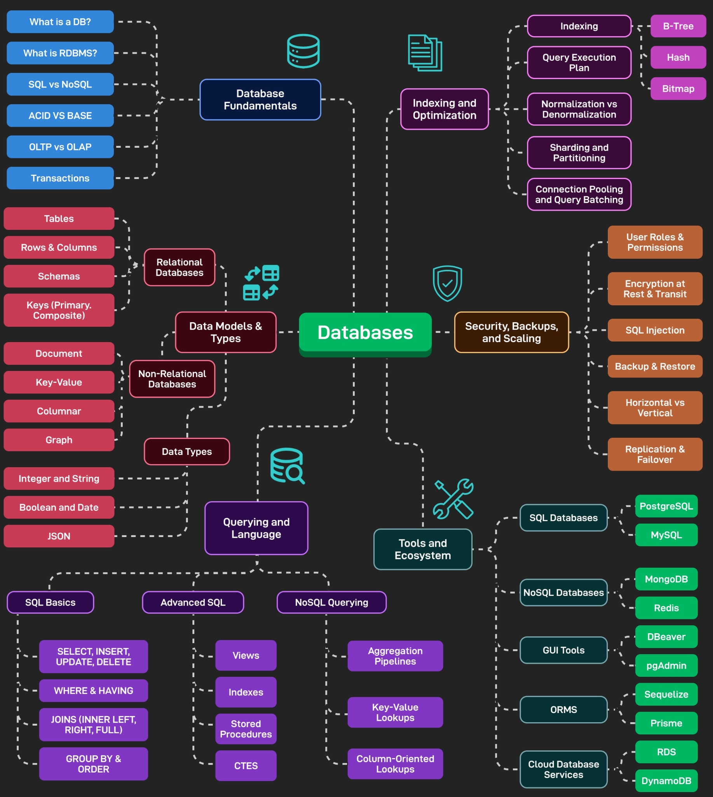

---

## 🧱 Уровни моделирования данных

Процесс проектирования базы данных обычно включает три уровня абстракции:

- **Концептуальный** — общее представление о данных без привязки к конкретной СУБД; определяются сущности и их связи.
- **Логический** — детализированное описание структуры данных с учётом типов данных, ключей и связей, но без физической реализации.
- **Физический** — непосредственная реализация в выбранной СУБД: таблицы, индексы, размещение на диске, настройки производительности.

Понимание этих уровней помогает аналитику последовательно переходить от бизнес-требований к готовой схеме данных.

---

## 🗂️ Классификация баз данных

### По языку запросов

- **SQL-ориентированные** — используют язык SQL (реляционные СУБД).
- **NoSQL-ориентированные** — применяют собственные языки запросов (MongoDB Query Language, Cassandra Query Language и др.).

### По структуре и организации данных

| Тип | Описание | Примеры |
|-----|----------|---------|
| **Реляционные** | Данные в таблицах со строками и столбцами, связи через внешние ключи. У каждой строки есть уникальный идентификатор, помогающий легко находить нужные данные. | MySQL, PostgreSQL, Oracle |
| **Ключ-значение** | Пара «ключ — значение», быстрый доступ по ключу. Данные сохраняются под ключами; чтобы получить объект (изображение, текст), нужно ввести ключ. Часто хранят информацию о состоянии объектов. | Redis, Memcached |
| **Документо‑ориентированные** | Хранят данные в виде готовых «документов» (JSON, XML) без жёсткой схемы. Подходит, когда структура данных может изменяться. Главное преимущество — хранение данных без строгого ограничения по структуре. | MongoDB, CouchDB, Amazon DocumentDB |
| **Графовые** | Объекты (узлы) и связи (рёбра), для анализа взаимосвязей. Используют граф для хранения и организации данных, где каждый узел — объект, а ребра — отношения. Применяются в биоинформатике, соцсетях. Плохо масштабируются, часто требуют особый язык запросов SPARQL. | Neo4j, Amazon Neptune |
| **Колоночные** | Разновидность реляционных СУБД, хранят данные в виде колонок, а не строк. Каждая колонка содержит информацию только одного типа, что экономит размер БД и ускоряет выполнение запросов. | ClickHouse, Vertica |

#### Визуализация типов

- **Реляционная модель**  
  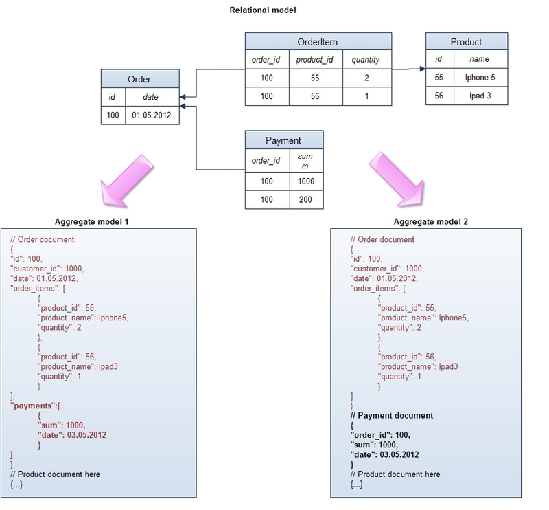

- **Ключ-значение**  
  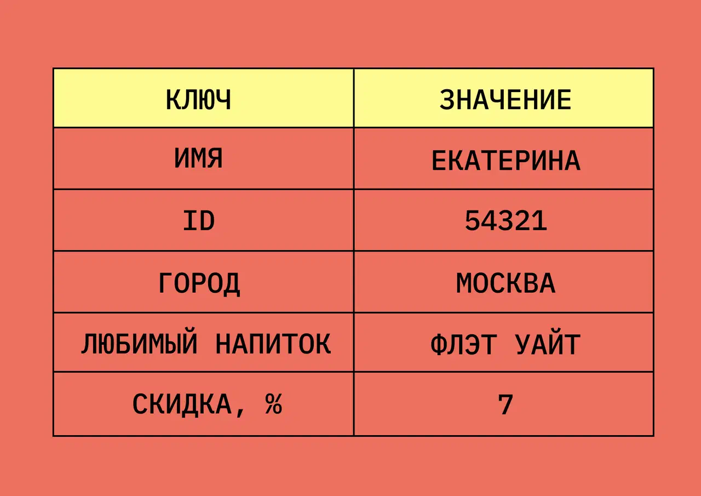

- **Документо‑ориентированная запись**  
  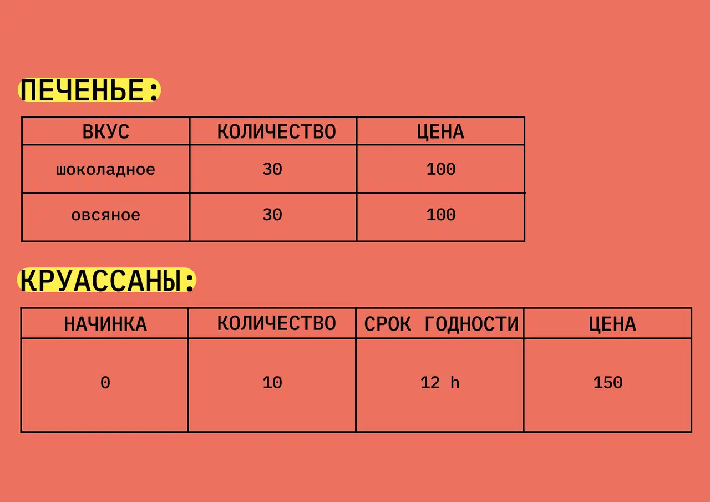

- **Графовая база данных**  
  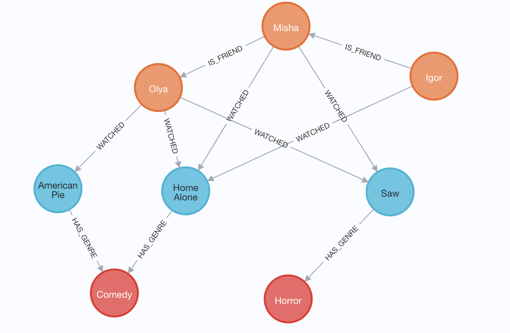

- **Колоночная база данных**  
  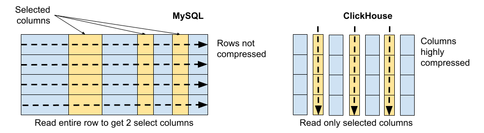

---

## ⚡ Особенности NoSQL

1. **Не используется SQL** — вместо него применяются собственные языки запросов.
2. **Неструктурированные (schemaless)** — структура данных не регламентирована (слабо типизирована). В отдельной строке или документе можно добавить произвольное поле без предварительного декларативного изменения всей таблицы. Если нужно поменять модель данных, достаточно отразить изменение в коде приложения.
3. **Представление данных в виде агрегатов (aggregates)** — в отличие от реляционной модели, которая сохраняет логическую бизнес-сущность в различные физические таблицы для нормализации, NoSQL хранилища оперируют сущностями как целостными объектами.
4. **Слабые ACID свойства** — долгое время консистентность была «священной коровой». С приходом огромных массивов информации и распределённых систем стало ясно, что обеспечить транзакционность и одновременно высокую доступность невозможно. Поэтому NoSQL часто следуют модели BASE (Basically Available, Soft state, Eventually consistent).
5. **Распределённые системы без совместно используемых ресурсов (share nothing)** — главный лейтмотив NoSQL. Обычные реляционные базы не способны решить проблему скорости, масштабируемости и пропускной способности. Единственный выход — горизонтальное масштабирование: несколько независимых серверов соединяются быстрой сетью, каждый владеет/обрабатывает только часть данных. Для повышения мощности достаточно добавить новый сервер в кластер.

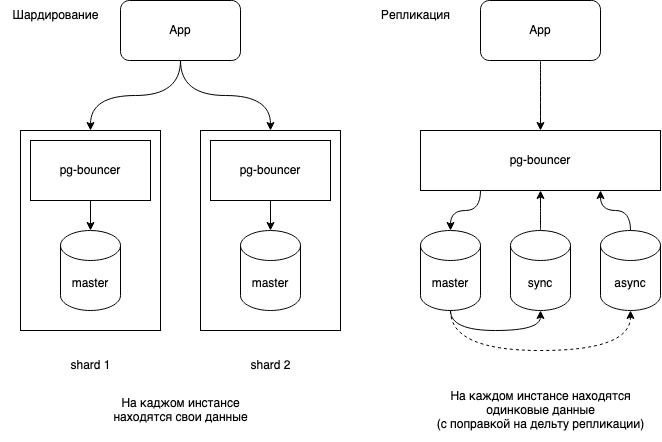

---

## 🆚 MySQL vs PostgreSQL

**MySQL** — система управления реляционными базами данных, с помощью которой можно хранить данные в виде таблиц со строками и столбцами. Это популярная система, на которой работают многие веб-приложения, динамические веб-сайты и встроенные системы.

**PostgreSQL** — система управления объектно-реляционными базами данных, которая предлагает больше возможностей, чем MySQL. Эта система дает большую гибкость касательно типов данных, масштабируемости, параллельного доступа и целостности данных.

| Характеристика | MySQL | PostgreSQL |
|----------------|-------|------------|
| **Тип** | Реляционная | Объектно-реляционная |
| **Наследование таблиц** | Нет | Да |
| **Типы данных** | Ограниченный набор | Расширенный (JSONB, массивы, hstore) |
| **Производительность** | Выше при простых операциях чтения | Лучше при сложных аналитических запросах |
| **Расширяемость** | Подключаемые хранилища | Множество расширений |
| **Стандарты SQL** | Частичная поддержка | Более полная поддержка |

---

## ⚙️ Компоненты СУБД

- **Язык запросов** — используется для создания запросов к БД, например SQL.
- **Ядро СУБД** — основной компонент, обеспечивающий выполнение запросов и доступ к данным.
- **Драйверы** — программное обеспечение для взаимодействия между СУБД и приложениями (например, ODBC).
- **Административная консоль** — графический интерфейс для управления БД, включая создание таблиц, пользователей и управление правами доступа.
- **Библиотеки** — наборы программных модулей для создания приложений, использующих базу данных.
- **Хранилище данных** — физическое устройство или набор устройств, где содержится вся информация (например, жёсткий диск).

---

## 🧩 ORM и ODM

**ORM (Object-Relational Mapping)** — способ (шаблон проектирования) доступа к реляционной базе данных с помощью объектно-ориентированного языка (например, Java, C#, Python). Позволяет работать с таблицами как с объектами.

**ODM (Object-Document Mapper)** — аналогичная концепция для документо‑ориентированных баз данных. **Mongoose** для MongoDB является ODM: позволяет определять объекты со строго-типизированной схемой, соответствующей документу MongoDB.

**Инструменты:**
- **MongoDB Compass** — графический интерфейс для работы с базой данных MongoDB.
- **DBeaver** — универсальный клиент для разных СУБД (например PostgreSQL).

---

## 🔐 ACID и уровни изоляции

**ACID** — набор требований, которые обеспечивают сохранность ваших данных. Что особенно важно для финансовых операций.

### Atomicity (Атомарность)
Гарантирует, что каждая транзакция будет выполнена полностью или не будет выполнена совсем. Не допускаются промежуточные состояния.

### Consistency (Согласованность)
Вытекает из предыдущего. Благодаря тому, что транзакция не допускает промежуточных результатов, база остается консистентной (цельной). Нет такого, что есть запись с контактными данными клиента, но нет записи самого клиента. Это решается благодаря транзакциям: создаётся обязательно и то и другое, или в случае ошибки ничего не создаётся.

### Isolation (Изолированность)
Во время выполнения транзакции параллельные транзакции не должны оказывать влияния на её результат. Если два или более человека работают с одной записью, могут возникнуть проблемы: «Потерянная запись», «Грязное чтение», «Неповторяемое чтение», «Фантомы». Способы борьбы — блокировки (строки или таблицы, на чтение или на запись) и версионность.

### Durability (Надёжность)
Если пользователь получил подтверждение от системы, что транзакция выполнена, он может быть уверен, что сделанные им изменения не будут отменены из-за какого-либо сбоя. Обесточилась система, произошёл сбой в оборудовании? На выполненную транзакцию это не повлияет.

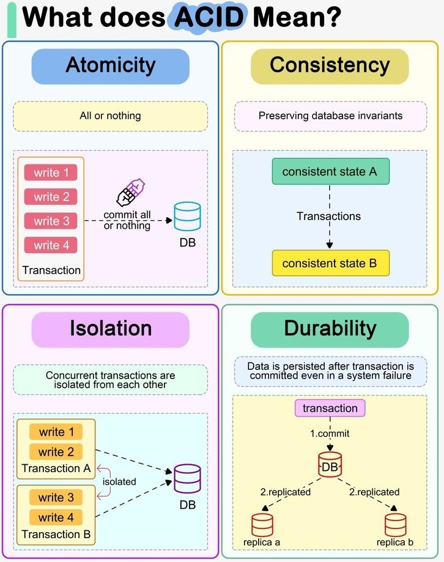

### Уровни изоляции

- **Read uncommitted** — транзакция видит незафиксированные изменения другой транзакции. Справляется с эффектом потерянного обновления, но остаются грязное чтение, неповторяемое чтение, фантомы. Все запросы `SELECT` считывают данные в неблокирующей манере.
- **Read committed** — транзакции видят только зафиксированные изменения других транзакций. Справляется с потерянным обновлением и грязным чтением, остаются неповторяемое чтение и фантомы. Согласованное чтение не накладывает блокировок, считывает данные из свежего снэпшота.
- **Repeatable read** (или snapshot isolation) — транзакция не видит изменения данных, прочитанные ей ранее, однако способна прочитать новые данные, соответствующие условию поиска. Справляется с потерянным обновлением, грязным чтением, неповторяемым чтением, остаётся эффект фантомов. Согласованное чтение не накладывает блокировок и считывает данные из снэпшота, который создаётся при первом чтении в транзакции. В MySQL (InnoDB) это уровень по умолчанию.
- **Serializable** — самый строгий уровень, полностью изолирует транзакции, решая все проблемы, включая фантомы.

---

## 📐 Схема базы данных (Database Schema)

**Схема базы данных** — это формальное описание структуры данных: таблицы, столбцы, типы данных, первичные и внешние ключи, индексы и ограничения. Она определяет, как данные организованы и как между собой связаны. Схема может быть представлена визуально с помощью **ER-диаграммы** (Entity-Relationship Diagram), которая отображает сущности (таблицы) и связи между ними.

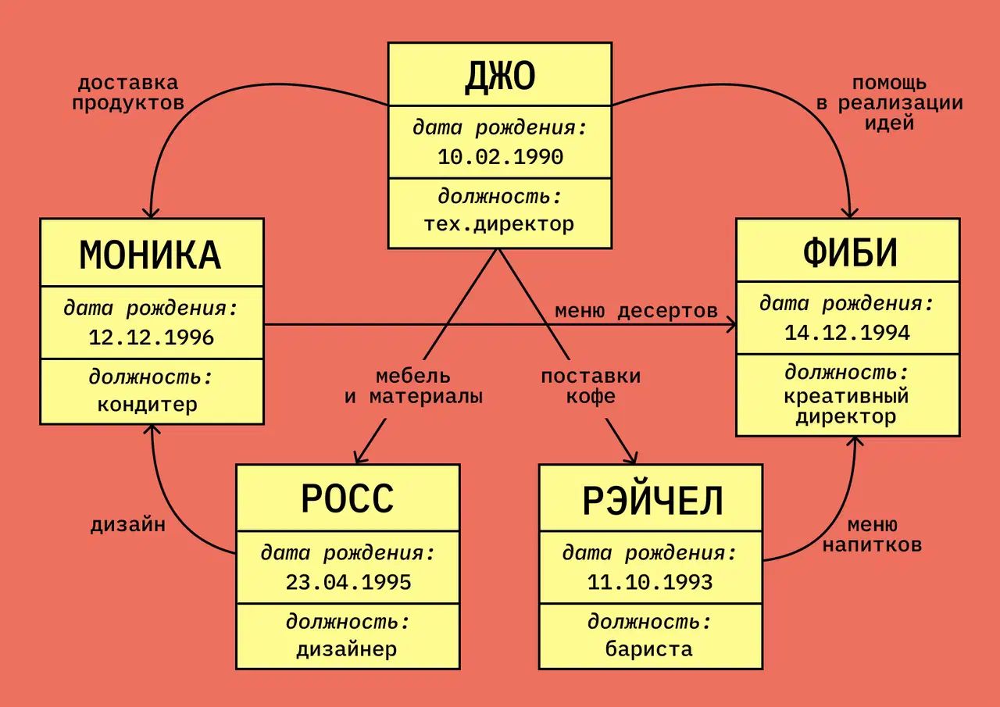

---

## 🔑 Ограничения (Constraints)

| Ограничение | Описание |
|-------------|----------|
| `NOT NULL` | Запрещает `NULL` в столбце |
| `UNIQUE` | Все значения в столбце уникальны |
| `PRIMARY KEY` | Комбинация `NOT NULL` и `UNIQUE`. Уникально идентифицирует каждую строку |
| `FOREIGN KEY` | Предотвращает действия, которые могут разрушить связи между таблицами |
| `CHECK` | Проверяет, что значения в столбце удовлетворяют определённому условию |
| `DEFAULT` | Устанавливает значение по умолчанию, если значение не указано |
| `CREATE INDEX` | Используется для очень быстрого создания и извлечения данных |

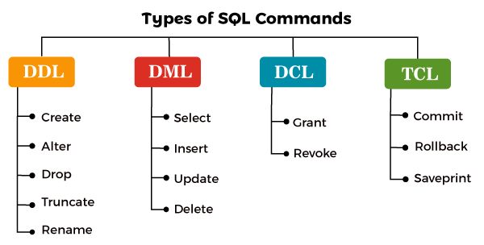

---

## 📥 ETL и OLTP/OLAP

**ETL (Extract, Transform, Load)** — общий термин для процессов переноса данных из нескольких систем в одно хранилище. Используется, когда нужно собрать много разнородных данных, привести к единому виду, загрузить в новую систему.

1. **Extract (Извлечение)** — система берёт данные из одного или нескольких источников, может проводить валидацию.
2. **Transform (Преобразование)** — данные видоизменяются под требования нового хранилища: меняется формат, кодировка, очистка, приведение к единому виду.
3. **Load (Загрузка)** — подготовленные данные загружаются в целевое хранилище, могут передаваться и метаданные.

ETL-системы служат прослойкой между **OLTP** (Online Transaction Processing — системы быстрых, часто повторяющихся транзакций) и **OLAP** (Online Analytical Processing — системы аналитических запросов со множеством параметров). OLAP хорошо работает там, где не справляется OLTP, и наоборот.

Бесплатный ETL-софт: Oracle Warehouse Builder, Scriptella ETL Project, Jaspersoft ETL, Apatar и другие.

---

## 💾 Типы данных

- **Float** — числа с плавающей точкой, хранит приближённое значение (4 байта). Может быть погрешность при вычислениях (например, 2.5 + 2.5 не точно 5).
- **Double** — как Float, но занимает 8 байт, больше диапазон, но погрешность всё равно возможна.
- **Decimal / Numeric** — хранят точное значение, идеально для бухгалтерских данных (цены, зарплаты). Любое число хранится и ищется точно.
- **JSONB (в PostgreSQL)** — бинарное представление JSON, оптимизированное для хранения и обработки (индексация, производительность), в отличие от текстового JSON, который требует разбора при каждой операции.

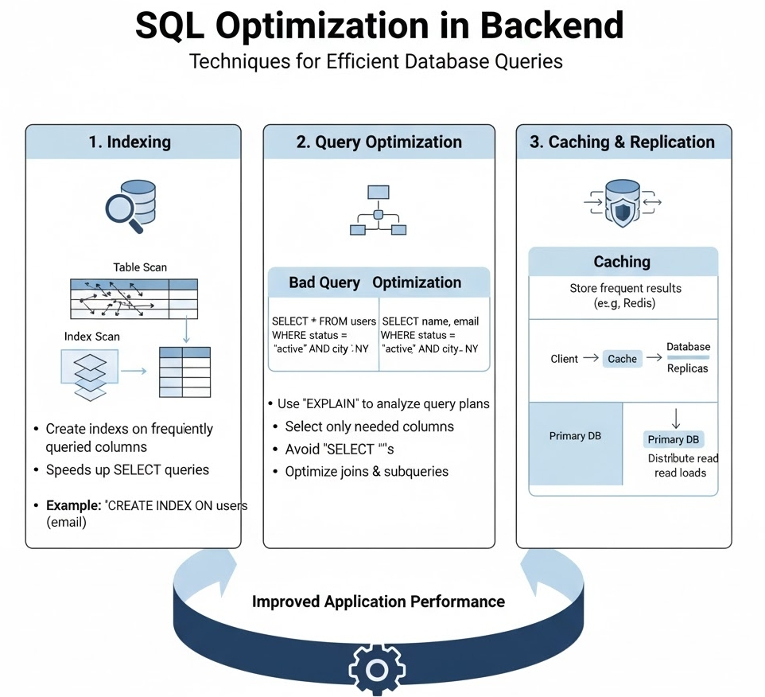

---

## 🔍 Elasticsearch (кратко)

**Elasticsearch** — открытая распределённая система управления данными и поиска по ним, основанная на Apache Lucene. Предоставляет мощные возможности по индексированию, хранению, поиску и анализу больших объемов информации в реальном времени.

---

## 🖥️ Пример работы с БД в Node.js

```javascript
var mysql = require('mysql');

var con = mysql.createConnection({
  host: "localhost",
  user: "yourusername",
  password: "yourpassword",
  database: "mydb"
});

con.connect(function(err) {
  if (err) throw err;
  // можно так же использовать и остальные DML, например UPDATE customers SET address = 'Canyon 123' WHERE address = 'Valley 345'
  con.query("SELECT name, address FROM customers", function (err, result, fields) {
    if (err) throw err;
    console.log(result);
  });
});
```
