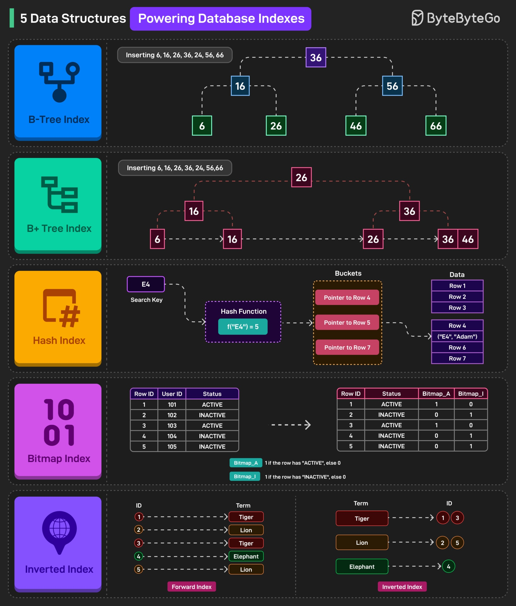

# 📇 Индексы в базах данных

**Индексирование** — это метод структурирования данных, который позволяет максимально быстро находить и извлекать записи из файла базы данных, не прибегая к полному сканированию таблицы (Full Table Scan).

В простейшем виде **индекс** представляет собой небольшую отдельную таблицу, состоящую всего из двух столбцов:
1. **Ключ индекса:** содержит копию проиндексированного столбца (первичного или потенциального ключа таблицы), отсортированную по порядку.
2. **Указатель (Pointer):** содержит адрес дискового блока (ссылку), в котором физически хранится полная строка с этим конкретным значением ключа.



---

## ⚖️ Плата за индексы (когда они вредят?)

Частый вопрос на собеседованиях: *"Если индексы так ускоряют чтение, почему бы не проиндексировать каждую колонку в таблице?"*

Индексы — это не магия, у них есть своя цена:
1. **Замедление записи (INSERT, UPDATE, DELETE):** При каждом добавлении, удалении или изменении проиндексированных данных СУБД вынуждена не только обновлять саму таблицу, но и перестраивать дерево индекса. Чем больше индексов, тем медленнее работает запись.
2. **Потребление памяти:** Индексы — это физические структуры, которые занимают место на жестком диске и в оперативной памяти (RAM) сервера. Иногда размер индексов может превышать размер самой таблицы.

**Вывод:** Индексы нужно создавать только для тех колонок, по которым часто происходит поиск (`WHERE`), фильтрация или объединение таблиц (`JOIN`).

---

## 🏗 Кластеризованные и Некластеризованные индексы

Это два фундаментальных способа организации индексов, разницу между которыми важно понимать.

### Кластеризованный индекс (Clustered Index)
Он определяет **физический порядок** записей в самой таблице. 
* Когда таблица имеет кластеризованный индекс, строки данных хранятся на жестком диске строго в том же самом порядке, что и в этом индексе (как слова в бумажном словаре, отсортированные по алфавиту).
* Таблица может иметь **только один** кластеризованный индекс (так как данные не могут быть физически отсортированы на диске двумя разными способами одновременно).
* Чаще всего он создается СУБД автоматически на столбце первичного ключа (Primary Key).

### Некластеризованный индекс (Non-clustered Index)
Некластеризованный индекс является **отдельной от таблицы** структурой данных (как предметный указатель в конце книги). 
* Он содержит копию выбранных столбцов в отсортированном виде вместе с указателями на фактическое расположение строк.
* Позволяет осуществлять быстрый доступ к данным вне зависимости от того, в каком физическом порядке эти данные лежат на диске.
* Мы можем создать **множество** некластеризованных индексов для одной таблицы.

---

## 🧩 Составные индексы и правило «Левого префикса»

Индекс можно создать не по одной колонке, а сразу по нескольким. Это называется **составным индексом**.
```sql
CREATE INDEX idx_user_name_age ON users (name, age);
```
Важнейшее правило, которое нужно знать при работе с ними — **правило левого префикса**. Индекс работает только тогда, когда в запросе используются колонки индекса слева направо, без пропусков.

Для нашего индекса `(name, age)`:
* Поиск `WHERE name = 'Иван'` — **индекс сработает** (левая часть используется).
* Поиск `WHERE name = 'Иван' AND age = 30` — **индекс сработает** (используются обе части).
* Поиск `WHERE age = 30` — **индекс НЕ сработает** (пропущена левая колонка `name`, база данных будет сканировать таблицу целиком).

---

## 🐘 Какой тип индекса выбрать? (на примере PostgreSQL)

В современных СУБД, таких как PostgreSQL, существует несколько специализированных алгоритмов индексирования под разные задачи:

### 🔹 B-tree (B-дерево)
Используется по умолчанию при создании любого стандартного индекса.
* **📌 Лучший выбор для:** `=`, `<`, `>`, `BETWEEN`, `ORDER BY`.
* **✅ Преимущества:** Поддерживает сортировку.
* **💡 Особенность:** Используется в 90% повседневных случаев.
```sql
CREATE INDEX idx_users_name ON users(name);
```

### 🔹 Hash (Хеш-индекс)
Использует хеш-функции для быстрого поиска по ключу.
* **📌 Лучший выбор для:** Только для точного сравнения на равенство `=`.
* **🚫 Ограничения:** Не поддерживает диапазоны, сортировку, поиск по шаблону `LIKE`.
* **⚠ Особенность:** Редко используется на практике, но в специфических сценариях может работать быстрее B-tree на точное совпадение.
```sql
CREATE INDEX idx_users_email_hash ON users USING hash(email);
```

### 🔹 GIN (Generalized Inverted Index)
Инвертированный индекс.
* **📌 Лучший выбор для:** Поиска по массивам, JSON-объектам (`jsonb`), полнотекстового поиска (Full-text search).
* **💡 Особенность:** Отлично справляется при поиске по сложным вложенным структурам или когда в одной колонке хранится множество значений.
```sql
CREATE INDEX idx_data_tags ON posts USING gin(tags);
```

### 🔹 GiST (Generalized Search Tree)
Обобщенное дерево поиска.
* **📌 Лучший выбор для:** Геоданных (PostGIS), сложных типов данных, поиска по пересекающимся диапазонам, `tsvector`.
* **💡 Особенность:** Более универсален для многомерных данных, но может быть медленнее в некоторых кейсах при чтении, чем GIN.
```sql
CREATE INDEX idx_events_location ON events USING gist(location);
```

### 🔹 BRIN (Block Range Index)
Индекс по диапазонам блоков.
* **📌 Лучший выбор для:** Огромных аналитических таблиц (миллиарды строк), где данные изначально физически упорядочены при записи (например, логи с последовательными таймстампами).
* **💡 Особенность:** Занимает экстремально мало места на диске.
* **⚠ Ограничения:** Не всегда эффективен — сильно зависит от физической корреляции (упорядоченности) данных на диске.
```sql
CREATE INDEX idx_logs_timestamp ON logs USING brin(timestamp);
```
