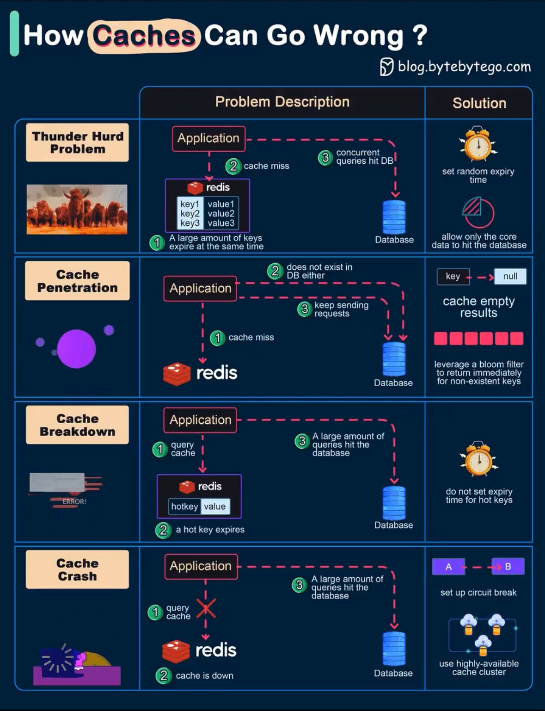

# 🔴 Redis

**Redis** — это высокопроизводительная NoSQL СУБД, работающая по принципу **«ключ-значение» (Key-Value)**. 

Основная особенность Redis заключается в том, что это **In-memory** решение: он хранит абсолютно все рабочие данные в оперативной памяти (RAM), что обеспечивает экстремально высокую скорость чтения и записи (сотни тысяч операций в секунду с задержкой в доли миллисекунд).

---

## 🛠 Основные сценарии использования

Системному аналитику важно понимать, в каких архитектурных слоях применяется Redis:

1.  **Кэширование данных:** Самый частый кейс. Redis разгружает основную реляционную БД (например, PostgreSQL), временно сохраняя результаты «тяжелых» или частых запросов.
2.  **Хранение сессий пользователей (Session Storage):** Быстро сохраняет состояния авторизации пользователей в веб-приложениях. Если один из серверов приложения упадет, пользователь не «разлогинится», так как сессия лежит в общем Redis.
3.  **Брокер сообщений (Message Broker / Pub-Sub):** Позволяет организовывать обмен сообщениями между микросервисами по подписке (через механизмы Pub/Sub или мощный инструмент Redis Streams).
4.  **Ограничение частоты запросов (Rate Limiting):** Благодаря атомарным счетчикам, Redis идеально подходит для защиты API от перегрузок (например, разрешить не более 5 запросов в секунду с одного IP).
5.  **Счетчики и Лидерборды (Leaderboards):** Быстрый подсчет лайков, просмотров или игровых рейтингов в реальном времени.

---

## 📊 Структуры данных Redis

В отличие от простых Key-Value хранилищ (типа Memcached), Redis умеет работать не только со строками, но и со сложными структурами данных:

| Тип данных | Что из себя представляет | Для чего используется системным аналитиком |
| :--- | :--- | :--- |
| **Strings** | Текст, числа или бинарные данные (до 512 МБ). | Кэширование JSON-ответов, простые счетчики, TTL-ключи сессий. |
| **Hashes** | Объекты в формате «поле-значение» (аналог JSON/карты). | Хранение профилей пользователей (например, `user:100` -> `name: "Ivan"`, `age: 30`). |
| **Lists** | Списки строк, упорядоченные по порядку добавления. | Очереди задач (подход FIFO / LIFO), логирование событий. |
| **Sets** | Коллекции уникальных строк (без дубликатов). | Тегирование объектов, отслеживание уникальных IP-адресов, пересечение аудиторий. |
| **Sorted Sets (ZSet)**| Множества, где каждый элемент связан с числовым баллом (Score). | Игровые лидерборды, скоринг задач, очереди с приоритетом. |

---

## 💾 Персистентность (Как Redis сохраняет данные на диск?)

Так как оперативная память энергозависима, при перезагрузке сервера данные могут исчезнуть. Чтобы этого не происходило, Redis поддерживает два механизма сохранения данных на жесткий диск:

*   **RDB (Redis Database Backup / Снапшоты):** База делает моментальный снимок (слепок) всех данных на диск с определенной периодичностью (например, раз в 5 минут).
    *   *Плюсы:* Компактные файлы, быстрый запуск базы после сбоя.
    *   *Минусы:* Если сервер упадет между снапшотами, данные за последние минуты будут потеряны.
*   **AOF (Append Only File / Журналирование):** Redis записывает каждую команду изменения (INSERT/UPDATE) в лог-файл по мере их поступления.
    *   *Плюсы:* Максимальная надежность (минимальная потеря данных).
    *   *Минусы:* Лог-файл быстро разрастается, а восстановление базы занимает больше времени.

> **На заметку аналитику:** Redis можно запустить вообще **без персистентности** (в режиме чистой оперативной памяти). Это идеальный вариант для обычного кэша, потеря которого не критична для системы.

---

## ⚠ Три классические проблемы кэширования

На этапе проектирования интеграций и баз данных системный аналитик обязан закладывать защиту от следующих аномалий:

### 1. Пробитие кэша (Cache Penetration)
Ситуация, когда клиенты запрашивают данные, которых **нет ни в кэше, ни в основной БД** (например, поиск несуществующего товара по ID `id=-999` или атака хакеров). Запрос пролетает сквозь Redis и бьет напрямую по основной базе, перегружая её.
*   *Решение:* Кэшировать в Redis пустые ответы (ключ со значением `null` на короткий срок) или использовать на входе **Фильтр Блума (Bloom Filter)**.

### 2. Лавина кэша (Cache Avalanche)
Происходит, когда у огромного количества популярных ключей в кэше **одновременно истекает время жизни (TTL)**, либо сам Redis временно падает. В этот момент терабайты запросов мгновенно перенаправляются на реляционную БД, намертво вешая её.
*   *Решение:* Использовать **Джиттер (Jitter)** — добавлять случайное количество секунд (рандомный шум) к времени TTL каждого ключа при создании, чтобы они сгорали не одновременно, а плавно.

### 3. Гонка кэша / Собачья свара (Cache Stampede / Dogpiling)
Когда у одного очень «популярного» ключа (например, главная страница маркетплейса) истекает TTL, сотни параллельных потоков одновременно видят, что кэш пуст, и все вместе бегут в основную БД вычислять этот тяжелый запрос заново.
*   *Решение:* Использование механизмов блокировок (Mutex / Distributed Lock в Redis), чтобы только один первый поток пошел в БД за обновлением, а остальные подождали его в очереди.
