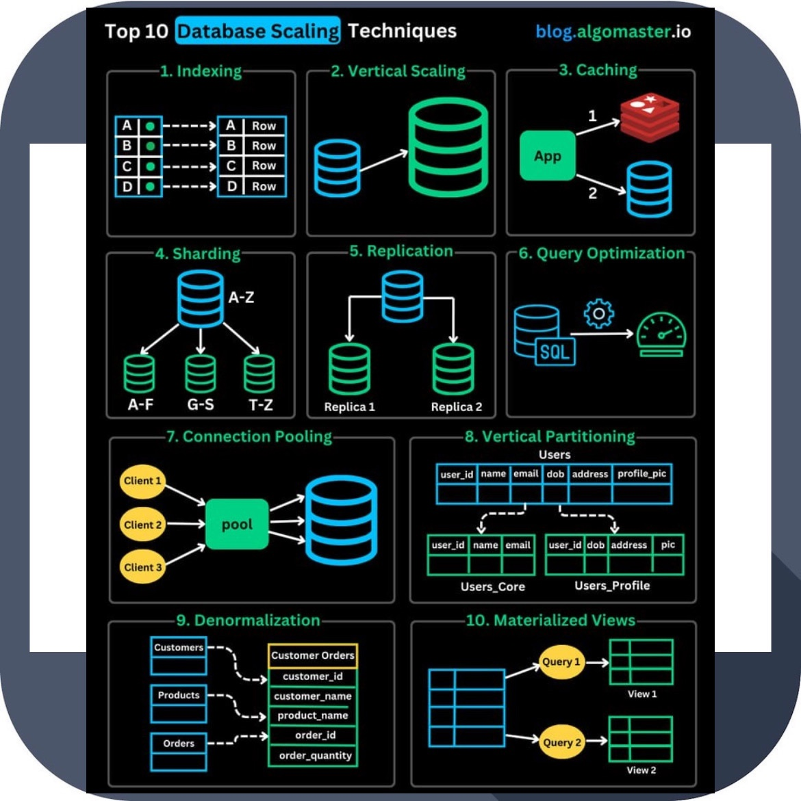
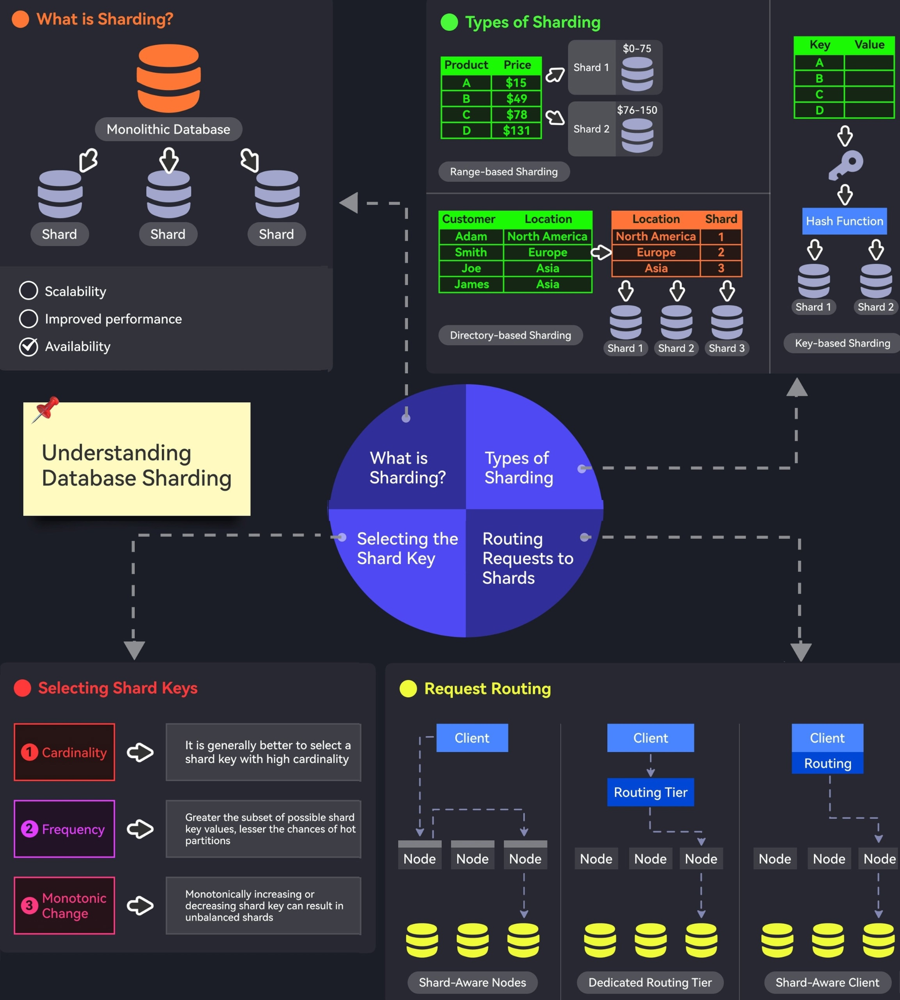
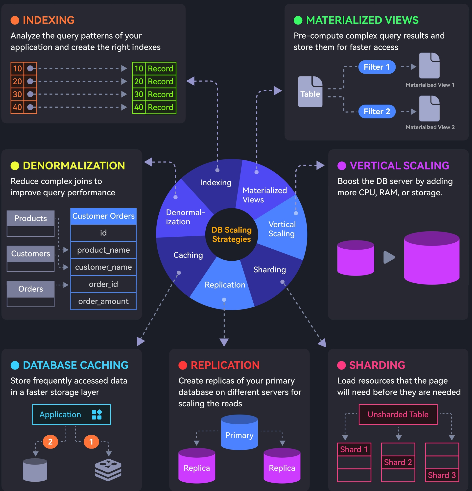
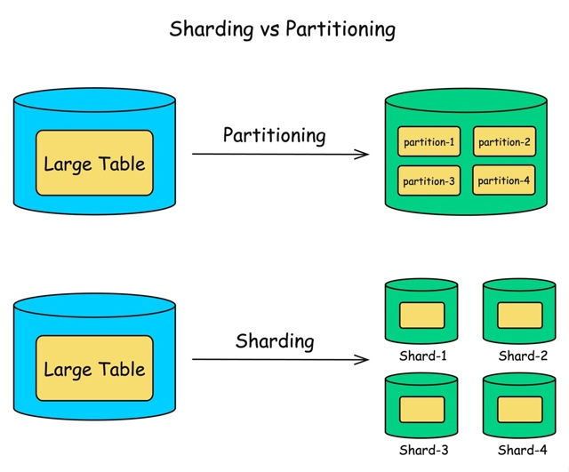
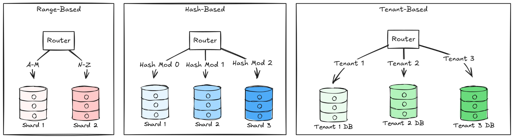

# 📈 Масштабирование (Scaling)

Масштабирование — это процесс адаптации базы данных и серверной архитектуры к возрастающим нагрузкам. Существует два основных подхода к масштабированию: **вертикальное** и **горизонтальное**.

---

## ⬆️ Вертикальное масштабирование (Scale-Up)

**Вертикальное масштабирование** предполагает наращивание мощностей одного сервера (добавление CPU, RAM, более быстрых дисков). 

* **Преимущества:** Основным преимуществом метода является его простота. Нет необходимости переписывать код при добавлении мощностей, а управлять одним крупным сервером намного проще, чем распределенной системой.
* **Недостатки:** Масштабирование ресурсов одного сервера имеет вполне конкретные аппаратные ограничения (физический «потолок»), а также сохраняет единую точку отказа.

---

## ➡️ Горизонтальное масштабирование (Scale-Out)

**Горизонтальное масштабирование** означает увеличение производительности за счёт разделения данных и нагрузки на множество серверов. Такой способ предполагает увеличение производительности без снижения отказоустойчивости. 

Существует три основных типа горизонтального масштабирования на уровне баз данных:

### 1. Репликация (Replication)
Этот термин подразумевает копирование данных между серверами. При использовании такого метода выделяют два типа серверов: **Master** и **Slave** (или Leader/Follower).
* **Мастер (Master)** используется для записи или изменения информации.
* **Слейвы (Slaves)** — для копирования информации с мастера и её чтения. 

Чаще всего используется один мастер и несколько слейвов, так как обычно запросов на чтение гораздо больше, чем запросов на изменение. Главное преимущество репликации — большое количество копий данных и балансировка нагрузки на чтение.

### 2. Партицирование (Partitioning / Разделение)
Разбитие базы данных на секции (например, один вид записей в одной секции, другой — в другой). 
* Разделение большой таблицы на более мелкие части (называемые партициями или разделами).
* Происходит **внутри одного сервера** базы данных.
* Улучшает производительность и упрощает обслуживание.
* *Пример:* разделение гигантской таблицы логов по месяцам в рамках одного экземпляра PostgreSQL.

### 3. Шардинг (Sharding)
Шардинг (или шардирование) — это принцип проектирования базы данных, при котором части таблицы хранятся раздельно, **на разных физических серверах** (шардах, от англ. *shard* — осколок).
* Каждый сервер (шард) содержит только часть полного набора данных.
* Позволяет осуществлять горизонтальное масштабирование, когда одного сервера становится недостаточно.
* Шардинг является наиболее приемлемым решением для крупномасштабных проектов, особенно если его использовать в паре с репликацией. Но стоит отметить, что это достаточно сложно организовать, так как необходимо учитывать межсерверное взаимодействие.

> **Важно:** Не путайте шардирование с репликацией! В случае репликации выделенные экземпляры БД являются полными копиями друг друга, а в случае шардирования — составными частями общего хранилища.

---

## ⚖️ Шардинг vs Партицирование: в чем разница?

Часто эти термины путают, но разница принципиальна:

* **Партиционирование данных** используется для оптимизации производительности внутри *одного* сервера.
* **Шардинг** применяется, когда *одного сервера становится недостаточно* и требуется горизонтальное распределение данных по разным узлам сети.

**Формула:** `Шардинг = Горизонтальное партиционирование + Распределение по серверам`

---

## 🧩 3 типа шардирования базы данных

Существует три основных подхода к распределению данных по шардам:

1. **На основе диапазонов (Range‑based):**
   Разделяет данные исходя из диапазонов значений ключа шардирования (например, пользователи с ID от 1 до 1000 — на первом сервере, от 1001 до 2000 — на втором).
2. **На основе хеширования (Hash‑based):**
   Применяет математическую хеш‑функцию к ключу шардирования, чтобы равномерно определить, в каком шарде хранятся данные.
3. **На основе арендаторов (Tenant‑based):**
   Предоставляет каждому арендатору (клиенту/компании) собственную базу данных или шард. Идеально подходит для B2B SaaS-приложений.

