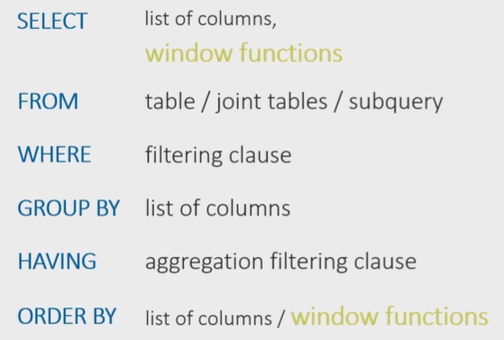
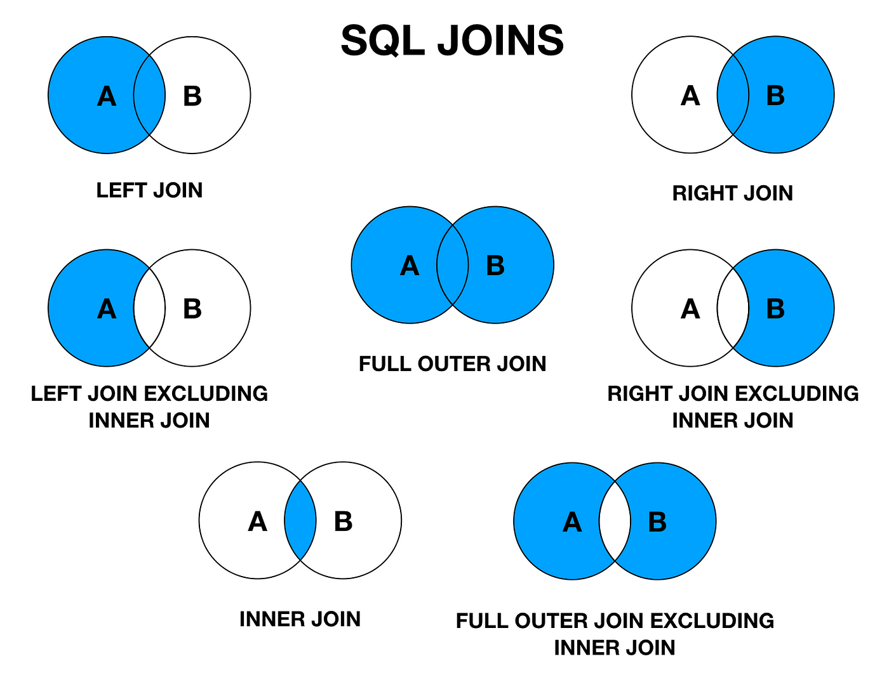
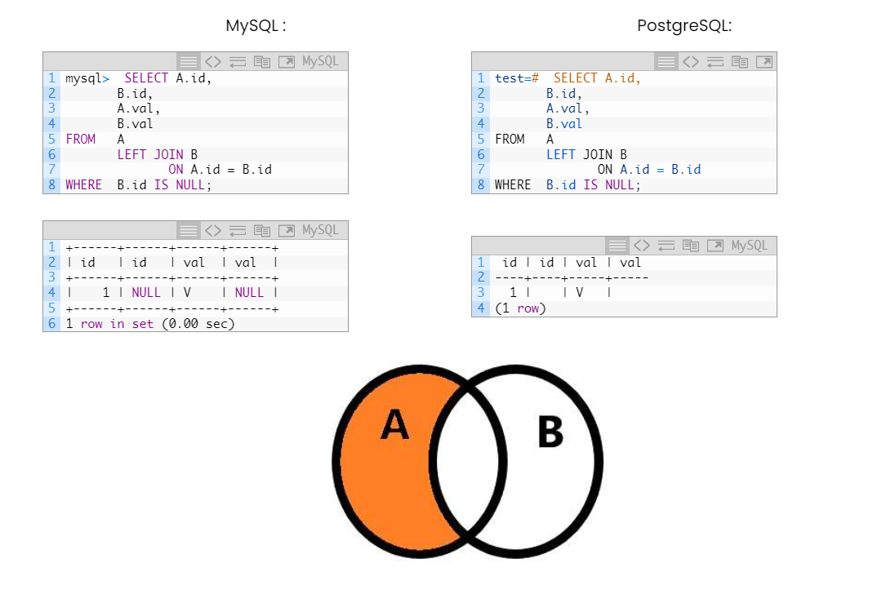
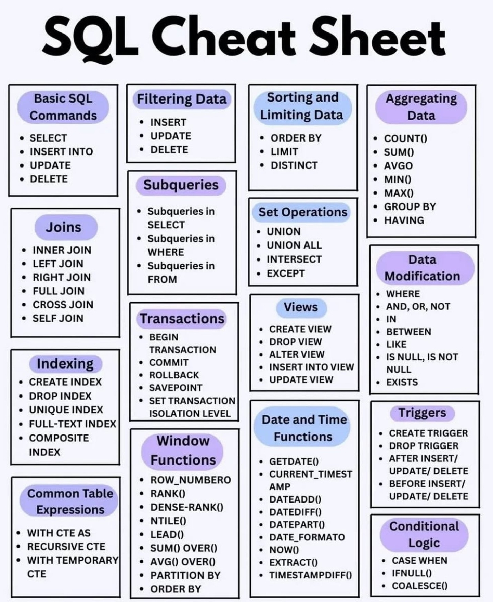

# 🗄️ SQL (Structured Query Language)

**SQL** — язык структурированных запросов, применяемый для создания, модификации и управления данными в реляционных базах данных.

В реляционных базах данных информация обычно хранится в разных таблицах, и SQL позволяет объединять эту информацию для выполнения сложных запросов и анализа больших объемов данных.

---

## 🏗 Базовая структура запроса (SELECT)

Анатомия стандартного запроса:
```sql
SELECT -- 'столбцы или * для выбора всех столбцов; обязательно' 
FROM   -- 'таблица; обязательно' 
WHERE  -- 'условие/фильтрация, например, city = 'Moscow'; необязательно' 
GROUP BY -- 'столбец, по которому хотим сгруппировать данные; необязательно' 
HAVING -- 'условие/фильтрация на уровне сгруппированных данных; необязательно' 
ORDER BY -- 'столбец, по которому хотим отсортировать вывод; необязательно'
LIMIT  -- 'ограничение количества выводимых строк; необязательно'
```
*(Важно: База данных читает запрос не сверху вниз, а в таком порядке: `FROM` ➝ `WHERE` ➝ `GROUP BY` ➝ `HAVING` ➝ `SELECT` ➝ `ORDER BY` ➝ `LIMIT`).*



---

## 🔗 Объединение таблиц (JOIN)

**SQL Join** — это операция, которая используется для объединения строк из нескольких таблиц на основе связанного между ними столбца. 




*   **INNER JOIN** (обычно идет по умолчанию): возвращает только те строки, которые имеют совпадения в обеих таблицах.
*   **LEFT JOIN:** возвращает все строки из левой таблицы и совпавшие строки из правой.
*   **LEFT JOIN EXCLUDING INNER JOIN** (Только уникальные для левой):
    ```sql
    SELECT * FROM TableA A
    LEFT JOIN TableB B ON A.key = B.key
    WHERE B.key IS NULL;
    ```
*   **Синтаксис `USING`:** Синтаксический сахар над `ON`. Если связываемые столбцы в таблицах называются одинаково, можно писать короче:
    ```sql
    -- Эти записи идентичны по смыслу:
    A LEFT JOIN B ON A.id = B.id AND A.name = B.name
    A LEFT JOIN B USING (id, name)
    ```

---

## 🛠 DML: Манипуляция данными

*   **INSERT (Добавление):**
    ```sql
    INSERT INTO Customers (CustomerName, City, Country)
    VALUES ('Cardinal', 'Stavanger', 'Norway');
    ```
*   **UPDATE (Обновление):**
    ```sql
    UPDATE table_name
    SET column1 = value1, column2 = value2
    WHERE condition; 
    ```
*   **DELETE (Удаление строк):**
    ```sql
    DELETE FROM table_name WHERE condition;
    ```
*   **LIMIT (Ограничение вывода):**
    ```sql
    -- Найти 3 продукта с самой большой ценой
    SELECT * FROM Products ORDER BY Price DESC LIMIT 3; 
    ```

---

## 🏗 DDL: Определение структуры данных

*   **CREATE TABLE (Создание):**
    ```sql
    CREATE TABLE Staff (
        -- AUTO_INCREMENT: начальное значение 1, увеличивается на 1
        id INT PRIMARY KEY AUTO_INCREMENT,
        -- NOT NULL: поле обязательно для заполнения
        name VARCHAR(255) NOT NULL,
        position VARCHAR(30),
        birthday DATE,
        -- DEFAULT: значение по умолчанию
        has_child BOOLEAN DEFAULT(0),
        -- UNIQUE: значение уникально в пределах таблицы
        phone VARCHAR(20) UNIQUE NOT NULL,
        -- CHECK: ограничение диапазона значений
        CONSTRAINT staff_chk_birthday CHECK (birthday > '1900-01-01')
    );
    ```
*   **ALTER TABLE (Изменение структуры):**
    ```sql
    -- Добавить внешний ключ (Foreign Key)
    ALTER TABLE Staff ADD FOREIGN KEY (position_id) REFERENCES Positions(id);
    
    -- Переименовать таблицу
    ALTER TABLE old_table_name RENAME TO new_table_name;
    
    -- Переименовать колонку
    ALTER TABLE table_name RENAME COLUMN old_name TO new_name;
    ```
*   **DROP и TRUNCATE (Удаление):**
    ```sql
    -- Удалить таблицу полностью
    DROP TABLE my_table;
    
    -- Удалить колонку
    ALTER TABLE Customers DROP COLUMN Address;
    
    -- Удалить только данные внутри таблицы, но оставить саму структуру
    TRUNCATE TABLE Categories; 
    ```

---

## 🧮 Условия и Фильтрация

*   **LIKE (Поиск по шаблону):** `%` заменяет ноль или более символов, `_` заменяет строго один символ.
    ```sql
    SELECT * FROM Customers WHERE CustomerName LIKE 'a%';
    ```
*   **BETWEEN (Диапазон):**
    ```sql
    SELECT * FROM instructor WHERE salary BETWEEN 50000 AND 100000;
    ```
*   **IN (Множественный выбор):**
    ```sql
    SELECT * FROM student WHERE dept_name IN ('Comp. Sci.', 'Physics');
    ```

---

## 📊 Агрегатные функции и Группировка

Агрегатные функции используются для получения совокупного результата:
*   `COUNT(col)` — количество строк.
*   `SUM(col)` — сумма значений.
*   `AVG(col)` — среднее значение.
*   `MIN(col)` / `MAX(col)` — минимальное / максимальное значение.

### GROUP BY и HAVING
`HAVING` используется **только** для фильтрации по результатам агрегатных функций. Обычный `WHERE` здесь не сработает, так как он выполняется до группировки.
```sql
SELECT username, COUNT(*)
FROM table
WHERE username = 'Anna'
GROUP BY username
HAVING COUNT(*) > 1;
```

---

## ⚙️ Функции, Конвертация и Логика

### Логика (CASE, IF)
```sql
-- Оператор CASE
SELECT OrderID, Quantity,
CASE
    WHEN Quantity > 30 THEN 'Больше 30'
    WHEN Quantity = 30 THEN 'Равно 30'
    ELSE 'Меньше 30'
END AS QuantityText
FROM OrderDetails;

-- Оператор IF
SELECT IF(500<1000, 'YES', 'NO');
```

### Математика и Даты
```sql
-- Округление
SELECT ROUND(235.415, 2); -- Результат: 235.42
SELECT FLOOR(25.75);      -- Результат: 25 (округление вниз)

-- Даты
CURDATE() -- возвращает текущую дату (в MySQL)
CURRENT_DATE -- возвращает текущую дату (стандарт SQL)
SELECT TIMESTAMPDIFF(YEAR,'2012-06-12','2022-12-05'); -- Разница в годах
```

### Преобразование типов (CAST и CONVERT)
```sql
SELECT CAST('2022-06-16 16:37:23' AS DATETIME) AS datetime_1;
SELECT CAST(25.65 AS int); -- Результат: 25

SELECT CONVERT(int, 25.65); -- Результат: 25
SELECT CONVERT(datetime, '2017-08-25'); -- Результат: 2017-08-25 00:00:00.000
```

---

## 🚀 Продвинутые инструменты (Advanced SQL)

### План запроса (Query Plan / EXPLAIN)
План запроса представляет собой информацию о том, как СУБД планирует выполнить запрос и какие операции будут использоваться. Чтение плана помогает понять, какой тип JOIN и какие индексы используются, а также оценить производительность запроса.

### UNION
Объединяет результаты выполнения нескольких SQL-запросов (типы данных столбцов должны совпадать). По умолчанию убирает дубликаты. Для отображения с повторениями используется `UNION ALL`.
```sql
SELECT DISTINCT good_name AS name FROM Goods
UNION
SELECT DISTINCT member_name AS name FROM FamilyMembers;
```

### CTE (Common Table Expressions) / Конструкция WITH
Обобщённое табличное выражение — это временный результирующий набор данных, к которому можно обращаться в последующих запросах. Упрощает чтение сложных запросов.
```sql
WITH Aeroflot_trips AS (
    SELECT TRIP.* FROM Company
    INNER JOIN Trip ON Trip.company = Company.id 
    WHERE name = 'Aeroflot'
)
SELECT plane, COUNT(plane) AS amount 
FROM Aeroflot_trips 
GROUP BY plane;
```

### VIEW (Представление)
Это сохраненный запрос, работающий как «виртуальная таблица». Он упрощает комплексные запросы, но фактически не хранит данных (извлекает их из других таблиц в момент обращения без кэширования), а также не всегда позволяет осуществлять изменение данных.
```sql
-- Создание
CREATE VIEW ActiveEmployees AS SELECT * FROM Staff WHERE status = 'active';
-- Использование
SELECT * FROM ActiveEmployees;
```

### Хранимая процедура (Stored Procedure)
Совокупность команд SQL, сохраненных на сервере базы данных. Предназначены для выполнения сложных операций, модификации данных и обработки сложной бизнес-логики с использованием параметров.
```sql
-- Вызов процедуры
EXEC GetEmployeeDetails @EmployeeID = 5;
```

---


