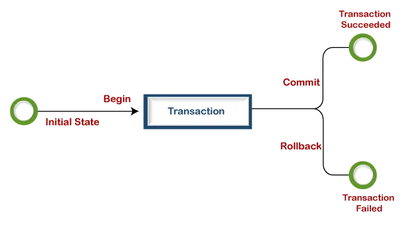

# 🔄 Транзакции в SQL

**Транзакция** — это набор операций по работе с базой данных (БД), объединенных в одну атомарную пачку. 

Транзакции могут мыслиться как обертка вокруг множества операторов SQL, которая гарантирует, что либо все операторы в транзакции выполнятся успешно, либо вообще ни один из них не будет выполнен.

Целью транзакции является обеспечение выполнения транзакции как единой неделимой операции. Если во время выполнения возникает ошибка, все изменения, сделанные вплоть до этого момента, будут отменены (откатятся), т.е. база данных будет восстановлена в состояние, предшествующее началу транзакции. 

Если падает запрос внутри транзакции, база откатывает всю транзакцию. Даже если там внутри было 10 запросов, вы можете спать спокойно — сломался один, откатятся все.



---

## ⚠️ Пример проблемы (зачем нужны транзакции?)
Представьте классическую систему оплаты, если **не использовать** транзакции:
1. Клиент нажимает кнопку «Оплатить»;
2. Выполнился запрос на снятие денег;
3. Упал (завершился с ошибкой) запрос на оформление заказа;

**Вывод:** деньги сняло, а заказ не оформило. Клиент недоволен.

С использованием транзакций, ошибка на третьем шаге приведет к откату шага 2 — деньги вернутся на счет.

---

## 🛡️ Свойства ACID (Важное дополнение)
Говоря о транзакциях, всегда упоминают аббревиатуру **ACID**, которая описывает обязательные требования к транзакционной системе:
* **A (Atomicity — Атомарность):** Транзакция выполняется целиком или не выполняется вовсе (как в примере выше).
* **C (Consistency — Согласованность):** Транзакция переводит БД из одного корректного состояния в другое, не нарушая ограничений базы.
* **I (Isolation — Изолированность):** Параллельно выполняющиеся транзакции не должны влиять друг на друга.
* **D (Durability — Долговечность):** Если транзакция зафиксирована (COMMIT), изменения сохранятся даже в случае сбоя питания сервера.

---

## 🛠 Команды управления транзакциями (TCL)

* `BEGIN TRANSACTION` (или просто `BEGIN`): Начинает новую транзакцию. Любые операторы SQL, которые следуют за этим оператором, рассматриваются как часть транзакции до тех пор, пока транзакция не будет зафиксирована или выполнен откат. 
* `COMMIT TRANSACTION` (или `COMMIT`): Сохраняет сделанные во время транзакции изменения в базе данных. Если транзакция завершается успешно, эти изменения становятся постоянными (фиксируются).
* `ROLLBACK TRANSACTION` (или `ROLLBACK`): Отменяет изменения, сделанные во время транзакции, и восстанавливает базу данных в ее предшествующем состоянии (откат).

---

## 💻 Пример использования

В этом примере мы используем транзакцию для обновления статуса заказа и одновременного уменьшения количества товара в таблице `inventory`. Обе операции должны выполниться вместе, иначе не выполнится ни одна.

```sql
BEGIN TRANSACTION; -- начинаем транзакцию

-- обновление таблицы orders, но пока что это не заносится в базу данных окончательно
UPDATE orders 
SET status = 'shipped' 
WHERE order_id = 123; 

-- обновление таблицы inventory, но пока что это не заносится в базу данных окончательно
UPDATE inventory 
SET quantity = quantity - 1 
WHERE product_id = 456;

COMMIT TRANSACTION; -- коммитим изменения в базу (ROLLBACK отменил бы все апдейты)
```
