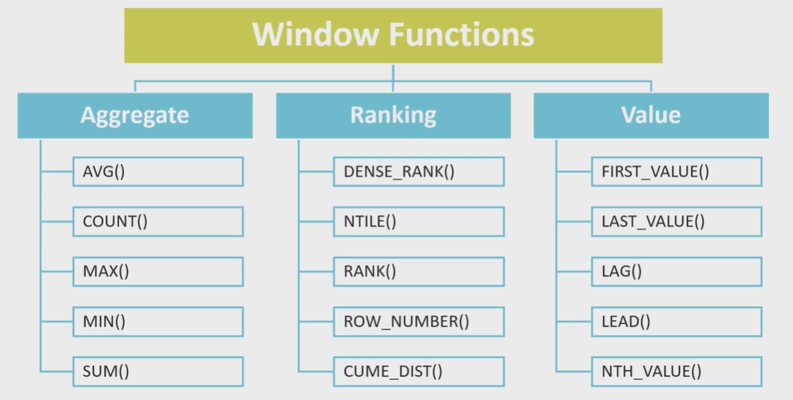
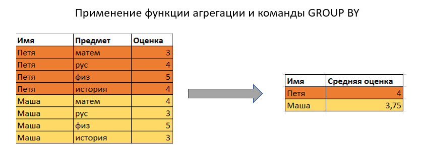
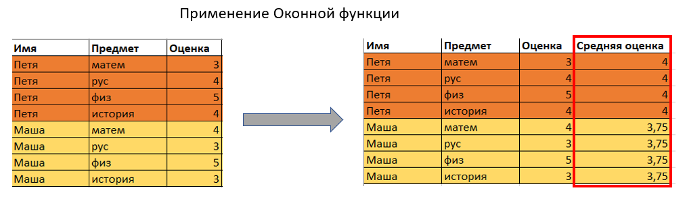
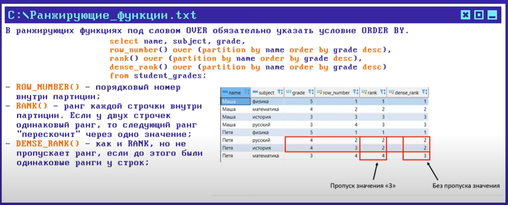
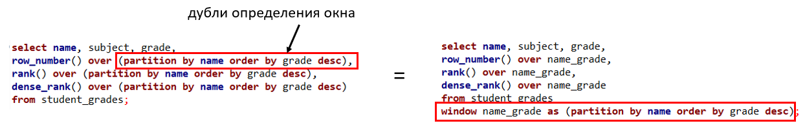
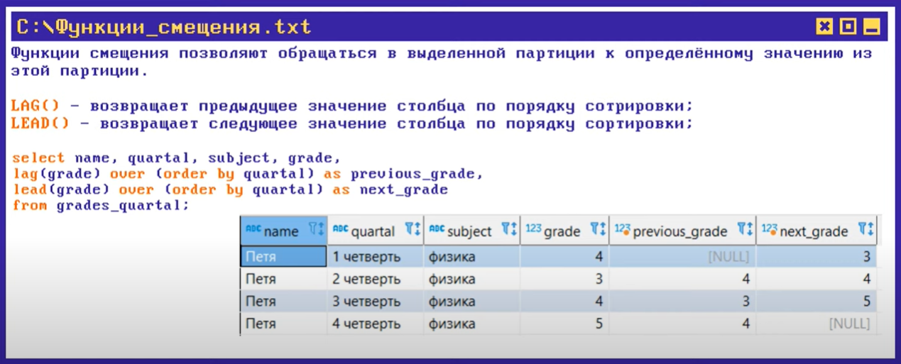

# 🪟 Оконные функции в SQL

**Оконная функция** выполняет вычисления для набора строк, которые каким-либо образом связаны с текущей строкой. 

Главное отличие оконных функций от обычных агрегатных функций с оператором `GROUP BY` заключается в том, что они **не сжимают (не группируют) результат запроса**. На выход возвращается ровно столько же строк, сколько было получено на вход, а результат вычислений просто дописывается новой колонкой к каждой строке.



---

## 🔀 Отличие от GROUP BY

Чтобы раз и навсегда понять разницу между оконными функциями и группировкой, посмотрите на эти схемы:

*   **`GROUP BY`** схлопывает несколько строк в одну. Теряется детализация (вы больше не видите отдельные транзакции или имена сотрудников, только общую сумму по отделу).
*   **Оконная функция** оставляет строки нетронутыми, но позволяет «заглянуть» в другие строки для расчета агрегатов.




---

## 📜 Синтаксис

Оконная функция вызывается с помощью обязательного ключевого слова **`OVER`**, которое и определяет то самое «окно» (набор строк) для вычислений.

```sql
SELECT 
    название_функции() OVER (
        PARTITION BY колонка_для_группировки
        ORDER BY колонка_для_сортировки
        ROWS/RANGE между_какими_строками
    ) AS новое_поле
FROM имя_таблицы;
```



### Основные компоненты конструкции `OVER`:
1.  **`PARTITION BY` (Аналог группировки):** Делит результирующий набор данных на партиции (группы). Вычисления будут производиться отдельно для каждой группы (например, отдельно по каждому департаменту или по каждому клиенту). Если не указать `PARTITION BY`, то вся таблица будет считаться одним большим окном.
2.  **`ORDER BY` (Сортировка):** Определяет порядок строк внутри каждой партиции. Это критически важно для функций ранжирования или для вычисления кумулятивных (накопительных) сумм.
3.  **`ROWS / RANGE` (Фрейм окна):** Ограничивает строки внутри партиции, определяя физические границы окна относительно текущей строки (например: *"взять текущую строку и две предыдущие"*).

---

## 🛠 Существующие функции (Классификация)

Все оконные функции можно разделить на три основные группы:

### 1. Агрегатные функции
Это привычные функции, которые при использовании с `OVER()` превращаются в оконные. Позволяют считать скользящие средние, кумулятивные (накопительные) суммы и промежуточные итоги.
*   `SUM()`, `AVG()`, `COUNT()`, `MIN()`, `MAX()`

**Пример (Накопительная сумма):**
```sql
SELECT date, revenue,
       SUM(revenue) OVER (ORDER BY date) AS running_total
FROM sales;
```

---

### 2. Ранжирующие функции
Присваивают строкам порядковый номер (ранг) внутри их партиции на основе сортировки.

*   **`ROW_NUMBER()`:** Присваивает строго уникальный последовательный номер каждой строке (1, 2, 3, 4...). Если значения одинаковы, номера все равно будут идти подряд.
*   **`RANK()`:** Присваивает ранг. Если значения в `ORDER BY` одинаковы, строки получат одинаковый ранг, но следующий за ними номер **будет пропущен** (например: 1, 2, 2, 4).
*   **`DENSE_RANK()`:** «Плотный» ранг. Если значения одинаковы, строки получат одинаковый ранг, но следующий за ними номер **НЕ будет пропущен** (например: 1, 2, 2, 3).
*   **`NTILE(N)`:** Делит строки внутри партиции на `N` равных групп и возвращает номер группы для каждой строки.



---

### 3. Функции смещения (Навигационные)
Позволяют обращаться к значениям из других строк результирующего набора без использования дорогой операции `JOIN`.

*   **`LAG(column, offset)`:** Заглядывает **назад** на указанное количество строк (`offset`) и вытаскивает значение из прошлого. Идеально для сравнения текущих показателей с предыдущим периодом (например, выручка в этом месяце vs прошлый месяц).
*   **`LEAD(column, offset)`:** Заглядывает **вперед** на указанное количество строк.
*   **`FIRST_VALUE(column)` / `LAST_VALUE(column)`:** Возвращают первое или последнее значение из фрейма окна.



**Пример использования `LAG`:**
```sql
SELECT month, revenue,
       LAG(revenue, 1) OVER (ORDER BY month) AS prev_month_revenue
FROM monthly_report;
```
