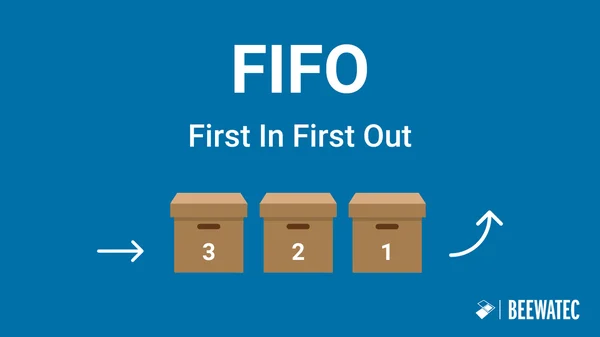

# 🔄 FIFO (First In, First Out)

**FIFO** (First In, First Out) — принцип «первым пришёл — первым ушёл». Элемент, поступивший раньше всех, обрабатывается (или извлекается) первым. Простая аналогия — очередь в магазине: кто первый встал, того первого и обслужат.

---

## 🧩 Где встречается FIFO в реальной жизни и IT

- **Бытовая очередь** — в поликлинике, магазине, банке. Клиенты обслуживаются в порядке прихода (если нет VIP-окон).
- **Печать документов** — задания принтера становятся в очередь и распечатываются по порядку.
- **Колл-центр** — звонки распределяются операторам в порядке поступления.
- **Сетевые пакеты** — в маршрутизаторах пакеты обрабатываются по мере прибытия, если не включены приоритеты QoS.
- **Дисковый ввод-вывод** — запросы к диску могут выстраиваться в очередь FIFO для справедливого доступа.
- **Очереди сообщений в интеграциях** — RabbitMQ, Kafka, AWS SQS FIFO.
- **Бизнес-процессы** — последовательность операций, где важен строгий порядок (например, резервирование товара → оплата → уведомление).

---

## 🐰 RabbitMQ — очередь как FIFO

- **По умолчанию очередь RabbitMQ работает как FIFO** — сообщения доставляются потребителям в порядке публикации.
- **Условия сохранения порядка:**
  - Один потребитель на очередь (несколько — round-robin, порядок теряется).
  - Ручное подтверждение (manual ack) без автоматического requeue.
  - Отсутствие приоритетов сообщений.
- **Что нарушает FIFO:**
  - Параллельные потребители на одной очереди.
  - Автоматическое подтверждение и возврат сообщений (requeue) — сообщение может быть обработано после более новых.
  - Использование приоритетных очередей.
- **Рекомендация:** при ошибке отправлять сообщение в Dead Letter Queue, не возвращая в основную очередь.

---

## ⚡ Apache Kafka — FIFO внутри партиции

- **Порядок гарантирован строго в пределах одной партиции.** Партиция — это упорядоченный лог, каждая запись имеет уникальный offset.
- **Ключ сообщения** определяет партицию (хеш от ключа). Все сообщения с одинаковым ключом попадают в одну партицию и сохраняют очерёдность.
- **Одна партиция обрабатывается только одним потребителем** в группе — это сохраняет порядок при чтении.
- **Глобальный FIFO на весь топик невозможен** без потери параллелизма — это плата за горизонтальное масштабирование.
- **Надёжность:** для строгой последовательности при сбоях используют идемпотентного производителя и транзакции, чтобы избежать дубликатов, способных нарушить логический порядок.

---

## 🆚 Сравнение реализации FIFO

| Характеристика | RabbitMQ | Kafka |
|----------------|----------|-------|
| **Область упорядочения** | Очередь целиком (при одном потребителе) | Одна партиция |
| **Гарантия порядка** | Условная (легко нарушается) | Строгая внутри партиции |
| **Масштабирование** | Один потребитель на очередь | До числа партиций |
| **Ключ для порядка** | Не используется | Ключ сообщения |
| **Обработка ошибок** | Требует ручной настройки (DLQ) | Смещение (offset) управляется потребителем |

---

## 📌 Примеры для собеседования (как ответить системному аналитику)

### 1. «Расскажите, где в вашей работе применяется принцип FIFO?»
> В проектировании интеграций я часто сталкиваюсь с необходимостью строгого порядка обработки событий. Например, при оформлении заказа в интернет-магазине: сначала должен зарезервироваться товар на складе, затем списаться оплата, и только потом отправиться уведомление клиенту. Если перепутать порядок, клиент может получить уведомление до списания денег, что приведёт к путанице.
>
> Для реализации такого порядка я использую брокеры сообщений с гарантией FIFO. В Kafka указываю ключ `order_id`, чтобы все события по конкретному заказу попадали в одну партицию и обрабатывались последовательно. В RabbitMQ — настраиваю одну очередь с одним потребителем и ручным подтверждением, без автоматического requeue.
>
> Также учитываю сценарии сбоев: если обработка события падает, сообщение уходит в отдельную очередь (Dead Letter Queue), чтобы не нарушить основной порядок.

### 2. «Чем отличается FIFO в RabbitMQ от FIFO в Kafka?»
> В RabbitMQ очередь по умолчанию работает как FIFO, но порядок легко нарушается при параллельной обработке несколькими потребителями. Чтобы гарантировать порядок, приходится ограничивать конкуренцию — один потребитель на очередь.
>
> В Kafka порядок гарантирован только в пределах одной партиции. Все сообщения с одинаковым ключом (например, `order_id`) попадают в одну партицию и обрабатываются строго последовательно. При этом масштабирование достигается добавлением партиций, но для одного ключа порядок всегда сохраняется. Поэтому Kafka лучше подходит для сценариев с высокими требованиями к параллелизму и строгой очерёдности по бизнес-сущностям.

### 3. «Почему нельзя сделать глобальный FIFO на весь топик в Kafka?»
> Kafka спроектирован как распределённый лог, состоящий из независимых партиций. Каждая партиция упорядочена, но между партициями порядка нет. Если бы Kafka обеспечивала глобальный порядок, это потребовало бы централизованной точки синхронизации, что убило бы производительность и горизонтальную масштабируемость. Поэтому для бизнес-сценариев, где важен порядок, используют ключи, гарантирующие попадание связанных событий в одну партицию.

### 4. Пример из реальной жизни: банковские проводки
> В банковской системе операции по счёту должны обрабатываться строго в порядке поступления. Если клиент сначала пополнил счёт на 1000 рублей, а затем перевёл 500 рублей, нельзя обработать перевод раньше пополнения, иначе баланс будет отрицательным. Здесь используется FIFO-очередь: все транзакции по одному счёту попадают в одну партицию с ключом `account_id` и обрабатываются последовательно.

---

## 📊 Шпаргалка по реализации FIFO

| Среда | Область FIFO | Как гарантировать | Что нарушает |
|-------|--------------|-------------------|--------------|
| **RabbitMQ** | Очередь (1 consumer) | 1 consumer, manual ack, без приоритетов | Multiple consumers, auto ack, requeue |
| **Kafka** | Партиция | Ключ сообщения → одна партиция, 1 consumer на партицию | Отсутствие ключа, попытка читать партицию несколькими consumer'ами |
| **AWS SQS FIFO** | Очередь (группы сообщений) | Использовать MessageGroupId, не менять порядок вручную | Отправка сообщений с разными GroupId, удаление сообщений |

---

## 💡 Рекомендации для системного аналитика

- При проектировании сценариев с требованием строгого порядка (например, финансовые транзакции) указывайте ключ партиционирования (Kafka) или ограничение на одного потребителя (RabbitMQ).
- Описывайте стратегию обработки ошибок: куда девать сообщения, которые не удалось обработать, без нарушения порядка (Dead Letter Queue, retry с фиксированной задержкой).
- Помните, что глобальный FIFO на весь топик/систему недостижим при параллельной обработке; используйте бизнес-ключи для локализации порядка.
- Для собеседования важно показать понимание компромисса между строгой очерёдностью и масштабируемостью, а также умение выбрать подходящий инструмент под бизнес-требования.
