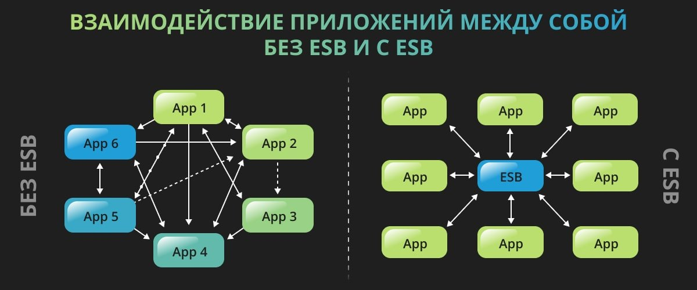
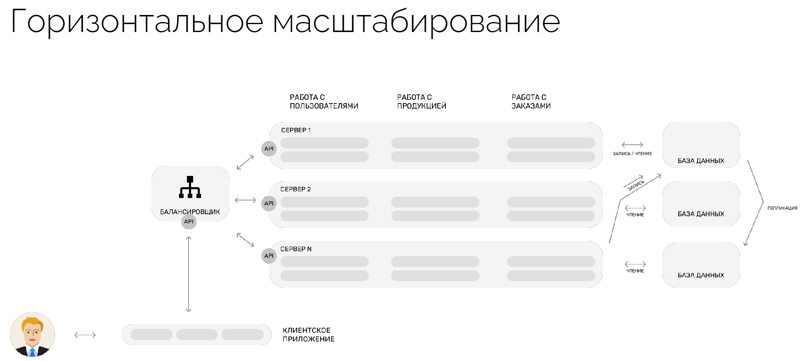

# 🔗 Системная интеграция: Общие понятия

**Системная интеграция** — способ заставить две или несколько программ обмениваться информацией. Тогда функции одной системы появятся в другой. 

> **Пример:** Книжный магазин решил сделать сайт, на котором можно оформить доставку книг. Для этого его интегрируют с курьерской службой и сервисами доставки в постаматы.

---

## 🗂 Классификация и методы

Существуют две классификации методов интеграции: **по иерархии** (вертикальные и горизонтальные) и **по способу взаимодействия** («точка-точка», «звезда» или смешанный метод).

**Пять методов системной интеграции:**
1. Вертикальная интеграция (по уровням).
2. Горизонтальная интеграция.
3. Интеграция «точка-точка».
4. Интеграция «звезда» или «спагетти».
5. Смешанная.

**Типы системной интеграции:**
* Интеграция приложений.
* Интеграция данных.
* Интеграция корпоративных приложений (EAI).
* Интеграция бизнес-процессов (BPI).
* Интеграция между предприятиями (B2B).

### Сравнение основных типов интеграции

| Тип | Особенности | Пример |
| :--- | :--- | :--- |
| **Интеграция данных** | Информацию из разных источников собирают «под одной крышей» — в специальном хранилище данных. Данные могут туда автоматически перемещать или настроить запросы к источникам данных. Когда информация будет нужна, источники будут передавать её в хранилище. | Яндекс Метрика собирает данные об источниках трафика, типах браузеров, уникальных пользователях, кликах по кнопках и формах. Эти данные обрабатываются и хранятся на серверах Яндекса. Маркетологи видят их как отчеты с графиками и диаграммами в интерфейсе сервиса и могут использовать, чтобы, например, настраивать таргетированную рекламу. |
| **Интеграция приложений** | Разные программы и сервисы работают вместе, чтобы конкретным пользователям было удобно.  Для этого используют легковесные технологии вроде API или вебхуков — программного кода, который передаёт изменения из одного приложения в другое. | Почта интегрируется с календарём. Когда приходит письмо с подтверждением бронирования авиабилета или встречи, сервис автоматически создаёт событие в календаре. Это помогает отслеживать планы, не добавляя события вручную. |
| **Интеграция корпоративных приложений** | Нужна, чтобы получить согласованность данных и процессов в масштабе всей компании. Например, чтобы управлять ресурсами, проектами или финансами, взаимодействовать с клиентами.  Нужны более сложные технологии, чем для интеграции приложений. Например, интеграционные платформы — чтобы управлять сложными потоками данных и бизнес-логикой. | SIEM-систему, которая отвечает за безопасность данных и других систем в компании, интегрируют с антивирусом. Обычно он первым сталкивается с вредоносными программами, обезвреживает их, а результаты этой «встречи» передаёт SIEM-системе. Она анализирует такие отчёты и быстрее выявляет потенциальные угрозы. |

---

## 🛠 Способы и технологии интеграции

**Основные способы интеграции:**
1. Веб-сервисы и API.
2. Сервисная шина предприятия (ESB).
3. Брокер сообщений.
4. Файлообмен.
5. Интеграция через базу данных.

### API и Веб-сервисы
* **API** – это механизмы, которые позволяют двум программным компонентам взаимодействовать друг с другом, используя набор определений и протоколов. Например, система ПО метеослужбы содержит ежедневные данные о погоде. Приложение погоды на телефоне «общается» с этой системой через API и показывает ежедневные обновления погоды на телефоне.
* **Веб-сервис** — обладающая уникальным веб-адресом (URL) программная система, построенная на базе открытых протоколов/стандартов и использующаяся для обмена данными между приложениями или системами. Программные приложения, написанные на разных языках программирования и работающие на разных платформах, могут использовать веб-сервисы для обмена данными по сетям, таким как Интернет.

Веб-сервис обеспечивает связь с использованием открытых стандартов:
* **HTML** — для обмена Web-страницами;
* **XML** — для описания данных;
* **SOAP** — для обмена структурированными сообщениями;
* **WSDL** — для описания Web-сервисов и доступа к ним;
* **JSON** — для обмена текстовыми данными.

---

### Middleware и ESB

**Middleware** (посредническое ПО) — посредник между системами, позволяющий им обмениваться данными и взаимодействовать друг с другом. Оно также помогает управлять потоком информации, обеспечивая правильную обработку данных.

**Корпоративная сервисная шина (ESB)** представляет собой промежуточное программное обеспечение, обеспечивающее интеграцию различных приложений и систем в единую информационную среду. 

* **Шина данных** — основная инфраструктура ESB, через которую проходят все данные, обеспечивая их маршрутизацию между системами.
* Основная задача ESB (или единого шлюза) как программного продукта — преобразование сообщений и их маршрутизация для упрощения обмена данными между отдельными информационными системами.
* **Комплект адаптеров** — программные компоненты, которые служат для связи приложений с ESB и преобразуют один интерфейс в другой. Чем больше различных адаптеров заложено в интеграционную шину, тем шире ее функционал.

*В современных ESB-решениях часто реализованы принципы микросервисной архитектуры. В соответствии с ними весь функционал системы распределяется между микросервисами, каждый из которых может работать независимо от других.*

---

### Микросервисная архитектура

**Микросервисная архитектура** (или просто «микросервисы») — это подход к созданию приложения в виде набора независимо развертываемых сервисов, которые являются децентрализованными и разрабатываются независимо друг от друга. Эти сервисы слабо связаны, независимо развертываются и легко обслуживаются. 
*В отличие от монолитного приложения, которое создается как единое и неделимое целое, в микросервисной архитектуре его разбивают на множество независимых модулей, каждый из которых вносит свой вклад в общее дело.*

* **Микросервис** — это веб-сервис, отвечающий за один элемент логики в определенной предметной области. 

Микросервисы взаимодействуют друг с другом через API-интерфейсы, такие как REST или gRPC, но не обладают информацией о внутреннем устройстве других сервисов. Такое согласованное взаимодействие называется микросервисной архитектурой.

*(Основные паттерны микросервисов — тема для дальнейшего изучения).*

---

### Дополнительные инструменты и концепции

* **Брокер сообщений** — инструмент для управления очередностью поступающих сообщений. Брокер выступает в роли посредника между двумя приложениями или сервисами — источником и приемником.
* **Ключ идемпотентности** — это уникальное значение, которое создаётся на стороне клиента и отправляется на сервер вместе с запросом. Ключ является инструментом для идентификации и контроля за повторными запросами. Для него рекомендуется использовать формат UUID.
* **gRPC** — использует вместо JSON бинарный формат Protobuf, благодаря чему размер сообщений становится меньше и увеличивается пропускная способность (скорость передачи в конечном итоге возрастает в 7-10 раз).
* **Прокси-серверы** — это второстепенные серверы, которые располагаются между клиентом и главным сервером. Они обрабатывают HTTP-запросы, а также ответы на них. Чаще всего прокси-серверы используют для кэширования и сжатия данных, обхода ограничений и анонимных запросов.
* **Протокол передачи файлов (FTP)** — это простой и эффективный способ передачи файлов между системами. Это может быть полезно для обмена большими объемами данных или для отправки файлов, которые должны быть обработаны другой системой.
