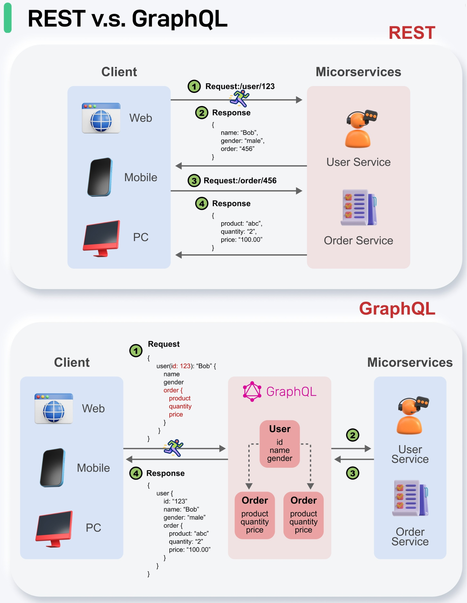

# 🕸️ GraphQL

**GraphQL** — язык запросов к API, в отличие от архитектурного стиля REST. С его помощью разработчик описывает взаимодействие клиента и сервера.

В отличие от REST, в GraphQL **всего одна точка взаимодействия (endpoint)** с бэкендом (как правило, `/graphql`). Т. е. неважно, что вы хотите запросить или изменить: клиент будет взаимодействовать с одной конечной точкой, одним URL.

---

## 🗂 Схема (Schema)

Основная часть GraphQL — **схема (schema)**, которая описывает все типы, запросы и их взаимодействие, которые вы можете использовать в рамках текущего endpoint. 

Схема — не удобное дополнение, как, например, Swagger в REST, а **обязательная начальная точка проектирования** любого GraphQL API (так называемый подход *Schema-First*). Она строго типизирована, что позволяет клиентам (фронтенду или другим сервисам) заранее точно знать, какие данные доступны и в каком формате.

---

## 💡 Ключевые преимущества GraphQL

1. **Решение проблемы Over-fetching (избыточность данных):** В REST сервер часто возвращает огромный объект целиком, даже если вам нужно только одно поле. В GraphQL клиент получает *ровно те данные, которые запросил*, и ничего лишнего.
2. **Решение проблемы Under-fetching (недостаточность данных):** В REST часто приходится делать множество запросов (например, сначала получить пользователя, а потом отдельными запросами его посты). В GraphQL клиент может получить связанные данные из разных сущностей за один единственный запрос.
3. **Строгая типизация:** Валидация запросов происходит "из коробки" прямо на сервере на основе схемы, что снижает количество ошибок.

---

## 🛠 Основные операции

В GraphQL существует три основных типа взаимодействия (операций):
*   **Query** — для получения (чтения) данных (аналог `GET` в REST).
*   **Mutation** — для изменения данных: создание, обновление, удаление (аналоги `POST`, `PUT`, `PATCH`, `DELETE` в REST).
*   **Subscription** — для подписки на обновления данных в реальном времени (обычно работает поверх протокола WebSocket).

---

## 💻 Примеры кода

### 1. Определение схемы (Schema)
На сервере мы определяем типы данных (сущности) и доступные функции для запросов.

```graphql
# Тип сущности "Пользователь"
type User {
  id: ID!
  name: String!
  email: String!
  posts: [Post!]! # Массив постов
}

# Тип сущности "Пост"
type Post {
  id: ID!
  title: String!
  content: String
}

# Доступные запросы на чтение
type Query {
  getUser(id: ID!): User
  allUsers: [User!]!
}

# Доступные запросы на изменение
type Mutation {
  createUser(name: String!, email: String!): User!
}
```

### 2. Запрос на получение данных (Query)
Клиент отправляет запрос к единому endpoint, указывая только те поля, которые ему нужны прямо сейчас. Забираем пользователя и сразу же заголовки его постов за один проход.

```graphql
query {
  getUser(id: "1") {
    name
    email
    posts {
      title
    }
  }
}
```

### 3. Ответ сервера (JSON)
Сервер возвращает предсказуемый ответ в формате JSON. Структура ответа зеркально повторяет структуру отправленного запроса.

```json
{
  "data": {
    "getUser": {
      "name": "Иван Иванов",
      "email": "ivan@example.com",
      "posts": [
        {
          "title": "Введение в GraphQL"
        },
        {
          "title": "GraphQL vs REST"
        }
      ]
    }
  }
}
```

### 4. Запрос на изменение данных (Mutation)
Здесь мы создаем нового пользователя, передавая аргументы, и сразу просим вернуть его `id` и `name` в качестве подтверждения.

```graphql
mutation {
  createUser(name: "Петр Петров", email: "petr@example.com") {
    id
    name
  }
}
```

---


