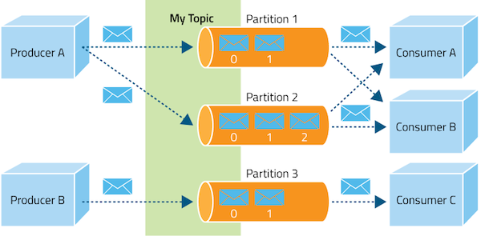

# 🚀 Apache Kafka

**Apache Kafka** — это распределенная система обмена сообщениями между серверными приложениями в режиме реального времени. 

---

## 📚 Основные понятия и терминология

| Термин | Описание |
| :--- | :--- |
| **Topic** | Ключевое понятие в архитектуре Kafka. Это канал, который используется для организации или хранения потоков данных. |
| **Producer** | Приложение или компонент, отправляющие (публикующие) сообщения в topic Kafka. |
| **Consumer** | Приложение или компонент, читающее сообщения из topic Kafka. |
| **Partition** | Физическое и упорядоченное хранилище сообщений внутри topic. Каждый topic может быть разделен на одну или несколько partition. Внутри partition сообщения являются логической последовательностью, упорядоченной по времени или ключам сообщений. |
| **Consumer Group** | Логическая группа, состоящая из одного или нескольких consumers, которые работают совместно для чтения сообщений из topics Kafka. Каждая partition обрабатывается только одним consumer из группы. |

---

## ✉️ Структура данных

### Сообщение
Каждое событие (сообщение) — это пара «ключ-значение». Ключ партицирования может быть любой: числовой, строковый, объект или вовсе пустой. Значение тоже может быть любым — числом, строкой или объектом в своей предметной области, который вы можете как-то сериализовать (JSON, Protobuf, …) и хранить.

### Сегмент
Сегмент удобно представить как обычный лог-файл: каждая следующая запись добавляется в конец файла и не меняет предыдущих записей. Фактически это очередь FIFO (First-In-First-Out), и Kafka реализует именно эту модель.

В контексте сегментов важна их **ротация**. Когда сегмент достигает своего предела, он закрывается, и вместо него открывается новый. Сегмент, в который сейчас записываются данные, называют *активным сегментом* (файл, открытый процессом брокера). *Закрытыми* называются те сегменты, в которых больше нет записи.

Максимальную длину сегмента в байтах можно настроить глобально или индивидуально на каждый топик. Его размер определяет, как часто старые файлы будут сменять новые:
*   Пишете много больших сообщений ➡️ следует увеличивать размер сегмента.
*   Редко пишете маленькие сообщения ➡️ не следует использовать большие сегменты.

Настроенная политика устаревания (Retention policy) не означает, что из топика пропадут события, например, старше 7 дней. Kafka удаляет закрытые сегменты партиций, а число таких партиций зависит от размера сегмента и интенсивности записи. При этом ничто не мешает хранить сообщения дольше или совсем их не удалять — ограничением служит лишь размер дисков и число брокеров.

---

## 🔄 Жизненный цикл сообщений и гарантии доставки

Жизненный цикл сообщений в Kafka в корне отличается от классических брокеров, так как Kafka работает на базе неизменяемого лога (log-based broker):
1. **Producer** отправляет сообщение в топик (и конкретную партицию) на сервере (брокере).
2. Брокер записывает сообщение в конец активного сегмента партиции и присваивает ему уникальный порядковый номер — **смещение (offset)**.
3. **Consumer** запрашивает (pull) пакет сообщений, начиная с последнего известного ему смещения.
4. Consumer обрабатывает сообщения, следуя бизнес-логике.
5. После успешной обработки Consumer отправляет брокеру запрос на **коммит смещения (offset commit)**. Это сигнализирует брокеру о том, что сообщения до этого смещения успешно прочитаны.
6. **Важно:** Сообщение **не удаляется** с сервера после прочтения. Оно остается в логе до тех пор, пока не истечет время его хранения (Retention policy), что позволяет другим потребителям или группам перечитывать одни и те же данные.

### Подтверждения (Acks) и Ошибки (Nacks)
*В традиционных MQ-системах существуют явные механизмы Ack/Nack для консьюмеров. В Kafka:*
*   **Ack (Acknowledgement)** используется в основном на стороне Producer'а для подтверждения успешной записи брокером.
*   **Nack (Negative Acknowledgement)** не существует для консьюмера. Если консьюмер не смог обработать сообщение, он просто *не коммитит* новое смещение. При перезапуске он заново прочитает эти же сообщения.

### Dead Letter Queue (DLQ) в Kafka
В отличие от RabbitMQ, в Kafka нет «коробочной» (встроенной в брокер) очереди недоставленных сообщений (DLQ). Это архитектурный паттерн, который реализуется **на стороне приложения (Consumer)**.
Если консьюмер встречает невалидное сообщение («ядовитую пилюлю»), которое невозможно обработать, он программно публикует это сообщение в отдельный специально созданный топик (например, `orders-dlq`), а основное смещение двигает вперед, чтобы не заблокировать очередь. Разработчики впоследствии анализируют сообщения в DLQ для устранения проблем.

### Гарантии доставки
Существует 3 типа гарантии доставки:
*   **At most once (Максимум один раз):** Событие будет доставлено один раз, но может не быть доставлено вообще.
*   **At least once (Хотя бы один раз):** Событие точно будет доставлено хотя бы один раз, но возможны дубликаты.
*   **Exactly once (Строго один раз):** Событие будет доставлено строго один раз (без дубликатов и потеря данных исключена).

---

## 👥 Группы потребителей (Consumer Groups)

Группы потребителей управляются **координатором группы потребителей** — одним из брокеров, который осуществляет опрос всех потребителей группы. 

Для проверки живости consumers отправляют брокеру **Heartbeat-сообщение**. Если consumer перестает отправлять сигналы heartbeat, координатор инициирует **ребалансировку (rebalancing)** разделов. Это означает, что он переназначает разделы, которые были закреплены за "упавшим" потребителем, другим активным потребителям группы.

Схемы обмена сообщениями базируются на двух основных моделях:

**1. Точка-точка (Point-to-point)**

**2. Публикация-подписка (Publish-subscribe)**

---

## 🆚 Модели доставки: Push vs Pull

*   **Pull-модель (Kafka):** Консьюмеры сами отправляют запрос раз в `n` секунд на сервер для получения новой порции сообщений.
    *   *Плюсы:* Клиенты эффективно контролируют собственную нагрузку; возможность группировать сообщения в батчи (высокая пропускная способность).
    *   *Минусы:* Потенциальная разбалансированность нагрузки между разными консьюмерами; возможна более высокая задержка обработки данных.
*   **Push-модель (RabbitMQ):** Сервер сам делает запрос к клиенту, посылая ему новую порцию данных.
    *   *Плюсы:* Снижает задержку обработки сообщений; позволяет эффективно балансировать распределение.
    *   *Минусы:* Риск перегрузки консьюмеров (приходится использовать функционал QoS и выставлять лимиты).

---

## 🐰 RabbitMQ vs 🚀 Apache Kafka

Обе системы являются популярными брокерами сообщений, но имеют принципиально разные архитектуры и сценарии использования.

### Сводная таблица отличий

| Критерий | RabbitMQ | Apache Kafka |
| :--- | :--- | :--- |
| **Принцип работы (Модель)** | **Push-модель:** брокер сам отправляет (проталкивает) сообщения получателям. | **Pull-модель:** получатели сами вытягивают (забирают) сообщения из топика. |
| **Время задержки** | Благодаря push-модели сокращается время задержки (низкая задержка). | Задержка может быть больше, т.к. получатель должен сам "забирать" сообщения. |
| **Пропускная способность** | До 10 тыс. сообщений в секунду. | Миллионы сообщений в секунду (потоковая обработка в реальном времени). |
| **Хранение сообщений** | Хранятся до прочтения, удаляются после потребления. Нельзя перечитать. | Журнал (Log). Хранятся в течение установленного времени (Retention policy). Можно перечитать. |
| **Поток и использование данных** | Ограниченный поток. Идеально для транзакционных данных (заказы, запросы пользователей). | Неограниченный поток. Лучше для операционных данных (логи, телеметрия, статистика). |
| **Пакетирование сообщений** | Нет явного пакетирования. | Есть явное пакетирование (батчи). |
| **Маршрутизация сообщений** | Сложная маршрутизация. Можно настроить умную маршрутизацию через обменник (Exchange). | Нет встроенной сложной маршрутизации сообщений. |
| **Модель проектирования** | Умный брокер / Тупой консьюмер. Брокер отслеживает статус сообщений. | Тупой брокер / Умный консьюмер. Kafka отслеживает только смещение (offset) для Consumer Group. |
| **Топология** | Exchange-очереди (привязки очередей). | Publish/Subscribe (топики и партиции). |
| **Масштабируемость и нагрузка** | Сложнее масштабировать, выдерживает меньшие нагрузки. | Проще масштабировать (на основе разделов), выдерживает огромные нагрузки. |
| **Поддержка транзакций** | Редко используются из-за сильного падения производительности. | Обеспечивает поддержку транзакций. |
| **Языки и протоколы** | Поддерживает широкий спектр языков и устаревших протоколов. | Имеет мощные официальные библиотеки для Java, Python, Go, C++, JS, C# и др. Использует собственный бинарный протокол поверх TCP. |
| **Приоритезация** | Поддерживает приоритеты сообщений. | Нет приоритета сообщений (строгий FIFO в рамках партиции). |

---

## 🔗 Полезные материалы

*   [Типичные грабли Kafka: что (не)видит аналитик (YouTube)](https://www.youtube.com/watch?v=-AZOi3kP9Js)
*   [Kafka для начинающих (YouTube)](#) *(Ссылка требует уточнения)*
*   [Основы технологии Apache Kafka (Slurm)](https://slurm.io/blog/tpost/pnyjznpvr1-apache-kafka-osnovi-tehnologii)
*   [Статья на Habr от Datanomica](https://habr.com/ru/companies/datanomica/articles/743112/)
*   [Концепции хранилища Kafka (Arenadata)](https://docs.arenadata.io/ru/ADStreaming/current/concept/architecture/kafka/storage_concepts.html#:~:text=at%20least%20once%20%E2%80%94%20%D1%81%D0%BC%D0%B5%D1%89%D0%B5%D0%BD%D0%B8%D0%B5%20%D0%BF%D1%80%D0%B8%D0%BD%D0%B8%D0%BC%D0%B0%D0%B5%D1%82%D1%81%D1%8F,%D0%B2%D1%81%D0%B5%20%D1%81%D0%BE%D0%BE%D0%B1%D1%89%D0%B5%D0%BD%D0%B8%D1%8F%20%D0%BF%D0%BE%D1%81%D1%82%D0%B0%D0%B2%D0%BB%D1%8F%D1%8E%D1%82%D1%81%D1%8F%20%D0%BE%D0%B4%D0%B8%D0%BD%20%D1%80%D0%B0%D0%B7.)
