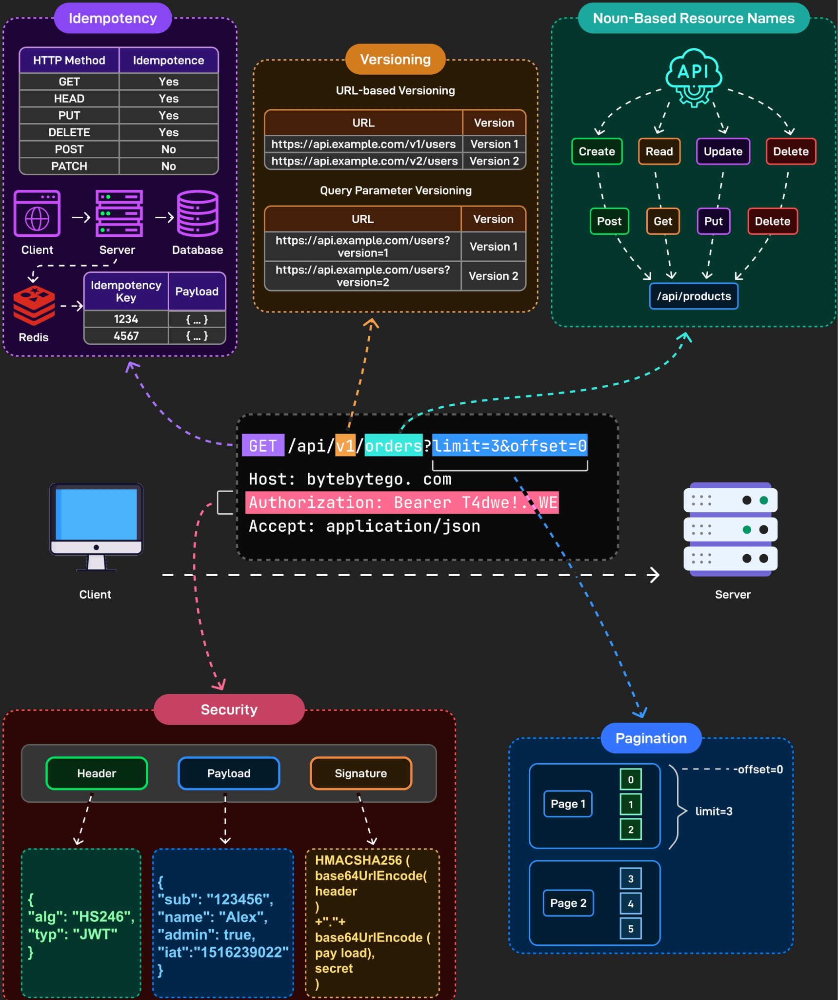
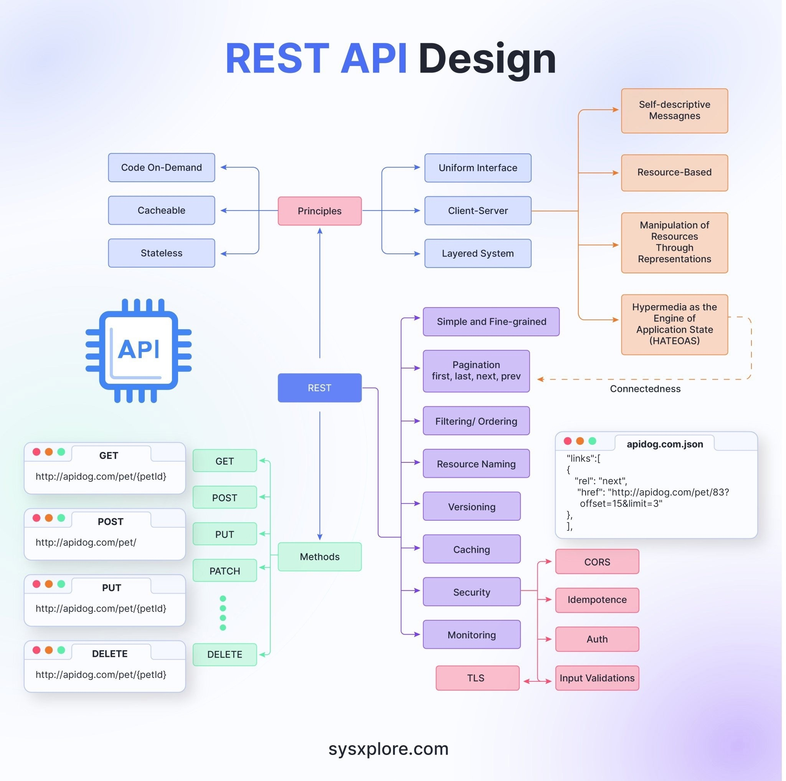
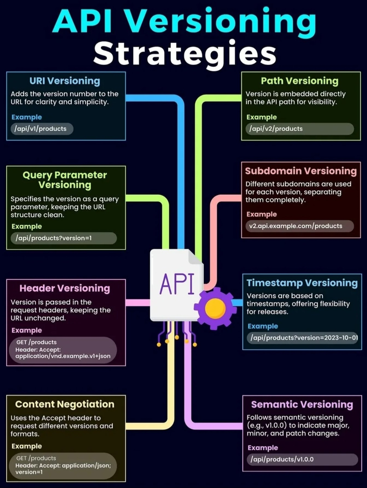

# 🌐 REST (Representational State Transfer)

**REST** — архитектурный стиль взаимодействия компонентов распределённого приложения в сети. Другими словами, REST — это набор правил того, как программисту организовать написание кода серверного приложения, чтобы все системы легко обменивались данными, а само приложение можно было эффективно масштабировать.

На сегодняшний день это самые популярные и гибкие API-интерфейсы в Интернете. Клиент отправляет запросы на сервер в виде данных. Сервер использует этот клиентский ввод для запуска внутренних функций и возвращает выходные данные обратно клиенту.



---

## 🛠 Ключевые принципы REST

1. **Отделение клиента от сервера (Client-Server):** Клиент — это пользовательский интерфейс сайта или приложения. В REST API код запросов остается на стороне клиента, а код для доступа к данным — на стороне сервера. Это упрощает организацию API, позволяет легко переносить UI на другую платформу и повышает масштабируемость серверного хранилища.
2. **Отсутствие записи состояния клиента (Stateless):** Сервер не должен хранить информацию о состоянии (проведенных операциях) клиента. Сессии на сервере отсутствуют. Каждый запрос от клиента должен содержать абсолютно всю информацию, необходимую для его выполнения.
   * *Stateful (противоположность)* — это in-memory кэширование данных и сохранение настроек для реквестов на стороне сервера.
3. **Кэшируемость (Cacheable):** В данных запроса/ответа должно быть указано, подлежат ли данные кэшированию (сохранению в специальном буфере для частых запросов). Если такое указание есть, клиент получает право обращаться к этому буферу, снижая нагрузку на сервер.
4. **Единообразие интерфейса (Uniform Interface):** Все данные должны запрашиваться через один URL-адрес стандартными протоколами (например, HTTP). Должен быть единый способ обращения к каждому ресурсу, что упрощает архитектуру и делает интеграцию понятной.
5. **Многоуровневость системы (Layered System):** В RESTful архитектуре сервера могут располагаться на разных уровнях. При этом каждый сервер взаимодействует только с ближайшими уровнями и не связан напрямую с остальными элементами цепочки.
6. **Предоставление кода по запросу (Code on Demand — необязательный):** Серверы могут отправлять клиенту исполняемый код по требованию (например, скрипты). Так общий код приложения расширяется только при реальной необходимости.



---

## ⚡ HTTP-методы и их свойства

Методы HTTP делятся на несколько категорий в зависимости от их поведения на сервере:

*   **Safe methods (Безопасные):** Никак не изменяют данные на сервере (своеобразный «read only»). `[GET, HEAD, OPTIONS, TRACE]`
*   **Idempotent methods (Идемпотентные):** Повторные идентичные запросы к одному и тому же ресурсу возвращают тот же результат и не изменяют состояние сервера дальше первого вызова. Все безопасные методы по умолчанию идемпотентны. `[GET, HEAD, PUT, DELETE, TRACE, OPTIONS]`
*   **Cacheable methods (Кэшируемые):** Ответы на эти методы можно сохранять в кэш. `[GET, HEAD, OPTIONS, POST, PATCH]`

### Матрица свойств методов

| HTTP METHOD | IDEMPOTENCE | SAFETY |
| :--- | :--- | :--- |
| **GET** | YES | YES |
| **HEAD** | YES | YES |
| **PUT** | YES | NO |
| **DELETE** | YES | NO |
| **POST** | NO | NO |
| **PATCH** | NO | NO |

### Детальный разбор HTTP-методов

*   **GET:** Отвечает за получение данных. В методе GET нет тела запроса (Body/Payload). Данные при необходимости передаются через заголовки или строку пути/запроса.
*   **HEAD:** Проверяет состояние ресурса и заголовки, но не возвращает само тело ответа. Он легче и быстрее, не требует авторизации на чтение данных. Если на HEAD приходит `200 OK`, можно безопасно отправлять полноценный GET.
*   **OPTIONS:** Используется для получения параметров связи с сервером. В ответе сервер возвращает список доступных HTTP-методов, которые он готов обработать для данного URL.
*   **POST:** (Insert) Используется для создания новой сущности (например, создать заказ). Не является идемпотентным: два одинаковых POST-запроса создадут две разные записи.
*   **PUT:** (Update/Replace) Создает сущность либо полностью заменяет её. В адресе четко указывается идентификатор (например, `/books/12`). Первый вызов создает/обновляет объект, последующие дублирующие запросы состояние сервера уже не меняют.
*   **PATCH:** (Partial Update) Частичное обновление сущности (например, изменить только поле `name`, не затрагивая остальные). Также может применяться для триггера логики без передачи явных данных (например, операции «принять заказ» или «отменить заказ»).
*   **DELETE:** Удаляет указанный ресурс или сущность с сервера (обычно по конкретному `id` в URL).

---

## 📈 Уровни зрелости REST (Richardson Maturity Model)

*   **Уровень 0 (Один URI, один HTTP-метод):** HTTP используется только как транспорт для взаимодействия распределенной системы. Из методов обычно используется только POST, а все команды и данные зашиты в тело (примеры: XML-RPC и SOAP).
*   **Уровень 1 (Несколько URI, один HTTP-метод):** Вводится понятие ресурсов. Для действий со специфическими сущностями используются уникальные URL, но метод взаимодействия всё ещё один (например, только POST).
*   **Уровень 2 (Несколько URI, разные HTTP-методы):** Правильное и раздельное использование возможностей протокола HTTP. Для чтения используется GET, для создания — POST, для удаления — DELETE и т.д.
*   **Уровень 3 (Гипермедиа / HATEOAS):** Высший уровень. API предоставляет гипермедиа-управляемые возможности. Ресурсы в ответах сами описывают свои связи и доступные действия с помощью ссылок, позволяя клиенту динамически исследовать API.

---

## 🚦 Коды ответов сервера (Status Codes)

### Классы кодов:
*   **1XX (Informational):** Информационные. Сервер получил и понял запрос, идет обработка, клиенту нужно подождать.
*   **2XX (Success):** Успех. Запрос на доступ к ресурсу или операцию выполнен успешно.
*   **3XX (Redirection):** Перенаправление. Клиент должен совершить дополнительный запрос по другому URL.
*   **4XX (Client Error):** Ошибка клиента. Неверный формат данных, отсутствие авторизации, синтаксическая ошибка в запросе.
*   **5XX (Server Error):** Ошибка сервера. Клиент составил правильный запрос, но сервер не смог его обработать из-за внутренней ошибки.

### Популярные статус-коды:
*   `200 OK` — Данные успешно получены или операция выполнена.
*   `201 Created` — Запрос выполнен успешно, и в результате создан новый ресурс (используется для подтверждения POST/PUT).
*   `202 Accepted` — Запрос принят на обработку, но она ещё не завершена (используется в асинхронных процессах).
*   `204 No Content` — Сервер успешно обработал запрос, но тело ответа пустое (часто возвращается на успешный DELETE или PUT).
*   `301 Moved Permanently` — Запрашиваемый URL-адрес был изменен навсегда.
*   `400 Bad Request` — Неверно сформированный запрос (данные не прошли валидацию или переданы в некорректном формате).
*   `401 Unauthorized` — Для доступа к ресурсу требуется выполнение аутентификации.
*   `403 Forbidden` — Личность клиента известна серверу, но у него нет прав доступа к этому контенту.
*   `404 Not Found` — Запрашиваемый ресурс не найден на сервере.
*   `500 Internal Server Error` — Критическая ошибка на стороне сервера.

---

## 🔄 Получение данных в реальном времени (Polling)

До появления современных протоколов вроде WebSocket, для симуляции Real-Time обновлений использовались следующие подходы:

*   **Short Polling:** Клиент с фиксированной периодичностью отправляет классические HTTP-запросы на сервер, проверяя наличие обновлений.
    * *Плюсы:* Максимально прост в реализации на любом языке.
    * *Минусы:* Крайне неэффективен. Генерирует огромное количество пустых запросов и ответов, создавая высокую паразитную нагрузку на сервер.
*   **Long Polling:** Клиент отправляет HTTP-запрос, а сервер удерживает соединение открытым до тех пор, пока не появятся новые данные или не истечет таймаут. Отправив порцию данных, сервер закрывает соединение, а клиент тут же открывает новое.
    * *Плюсы:* Данные приходят асинхронно по мере появления.
    * *Минусы:* Задержки на переоткрытие соединений, высокая нагрузка при удержании тысяч сессий, неэффективно при плотном непрерывном потоке данных.

---

## 📌 Версионирование API

Для поддержки обратной совместимости при изменении логики приложений используют версионирование:

1. **URI Versioning:** Номер версии пишется прямо в URL. `Пример: /api/v1/products`
2. **Path Versioning:** Версия встраивается непосредственно в путь. `Пример: /api/v2/products`
3. **Query Parameter Versioning:** Версия передается как параметр запроса, URL чистый. `Пример: /api/products?version=1`
4. **Subdomain Versioning:** Разделение версий по поддоменам. `Пример: v2.api.example.com/products`
5. **Header Versioning:** Версия передается в кастомных заголовках запроса. `Пример: GET /products (Header: X-API-Version: 1)`
6. **Content Negotiation:** Использование стандартного заголовка `Accept` для указания версии. `Пример: Accept: application/json; version=1`
7. **Timestamp Versioning:** Версионирование по временным меткам релизов. `Пример: /api/products?version=2026-10-01`
8. **Semantic Versioning:** Использование строгого семантического формата (`vMajor.Minor.Patch`). `Пример: /api/products/v1.0.0`



---

## ⏱ Асинхронный REST

Если тяжелую операцию невозможно обработать быстро, применяется паттерн асинхронного REST:
1. Клиент отправляет запрос на выполнение тяжелой задачи и мгновенно получает ответ `HTTP 202 Accepted`.
2. Клиент начинает периодически отправлять запросы `GET` на специальную конечную точку (endpoint) для проверки статуса. Пока задача выполняется, сервер возвращает статус `HTTP 200` с описанием «в процессе».
3. Как только работа завершена, эндпоинт статуса возвращает код перенаправления `302 Found` со ссылкой на готовый ресурс.
4. Клиент совершает финальный запрос по указанному URL и забирает результат.

---

## 📄 Примеры пагинации (Pagination)

### 1. Offset-based Pagination (Пагинация на основе смещения)
Клиент явно запрашивает конкретную страницу и размер выборки.

```http
GET /api/books?page=3&pageSize=10
```

```json
{
  "page": 3,
  "pageSize": 10,
  "totalItems": 100,
  "totalPages": 10,
  "books": [
    {
      "id": 21,
      "title": "Book Title 21",
      "author": "Author Name",
      "published_date": "2023-01-01"
    },
    {
      "id": 22,
      "title": "Book Title 22",
      "author": "Author Name",
      "published_date": "2023-01-01"
    }
  ]
}
```

### 2. HATEOAS Pagination (Пагинация со ссылками на переходы)
Сервер возвращает не только данные и метаинформацию о страницах, но и готовые ссылки для навигации.

```http
GET /api/v4/customers?firstNameFilter=R&lastNameFilter=S&page=0&size=10&sortList=firstName&sortOrder=ASC
```

```json
{
   "_embedded": {
      "customerModelList": [
         {
            "id": 971,
            "customerId": "de6b8664-ba90-41fc-a9f4-da7d0b89c106",
            "firstName": "Rabi",
            "lastName": "Dufour"
         },
         {
            "id": 339,
            "customerId": "44b5c01d-c379-4f66-b8ed-0fda4837db4e",
            "firstName": "Rachelle",
            "lastName": "Fleischer"
         }
      ]
   },
   "_links": {
      "first": {
         "href": "http://localhost:8080/api/v4/customers?firstNameFilter=R&page=0&size=3"
      },
      "self": {
         "href": "http://localhost:8080/api/v4/customers?firstNameFilter=R&page=0&size=3"
      },
      "next": {
         "href": "http://localhost:8080/api/v4/customers?firstNameFilter=R&page=1&size=3"
      },
      "last": {
         "href": "http://localhost:8080/api/v4/customers?firstNameFilter=R&page=19&size=3"
      }
   },
   "page": {
      "size": 3,
      "totalElements": 60,
      "totalPages": 20,
      "number": 0
   }
}
```
