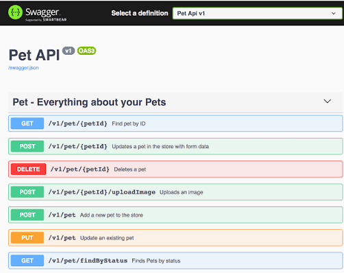

# 📘 Swagger и OpenAPI Specification (OAS)

Очень часто термины **Swagger** и **OpenAPI** используют как синонимы, но между ними есть принципиальная разница. Если говорить коротко: **OpenAPI — это спецификация (стандарт), а Swagger — это инструменты для работы с ней.**

*   **OpenAPI (OpenAPI Specification, OAS)** — это открытый стандарт и формат описания REST API. Это сам «язык» или «чертеж», написанный в формате YAML или JSON. Спецификация описывает, как устроен API: конечные точки (endpoints), форматы запросов, ответы, типы данных и методы аутентификации.
*   **Swagger** — это набор конкретных программных инструментов (изначально от компании SmartBear), которые помогают разработчикам и аналитикам писать, визуализировать и использовать спецификацию OpenAPI.

> **Историческая справка:** Изначально сама спецификация называлась *Swagger Specification*. Но в 2015 году её передали открытому сообществу (в Linux Foundation), после чего стандарт переименовали в **OpenAPI**, а бренд **Swagger** остался закреплен исключительно за инструментами.

### Основные инструменты Swagger:
*   **Swagger Editor:** Редактор для написания спецификаций OpenAPI (YAML/JSON) с подсветкой синтаксиса и валидацией ошибок в реальном времени.
*   **Swagger UI:** Инструмент, который превращает ваш сухой код OpenAPI в красивую интерактивную веб-страницу с документацией. Позволяет прямо из браузера отправлять тестовые запросы к API (кнопка "Try it out").
*   **Swagger Codegen:** Утилита для автоматической генерации клиентских библиотек (SDK) и серверных заглушек на десятках языков программирования на основе файла спецификации.

---

## 🔀 Композиция и полиморфизм (allOf, oneOf, anyOf, not)

В сложных корпоративных системах данных часто возникает необходимость описывать наследование или вариативность объектов. В OpenAPI для этого используются логические операторы комбинирования схем. Это одна из самых частых тем на собеседованиях системных аналитиков:

*   **`allOf` (Логическое И):** Объект должен соответствовать **всем** перечисленным схемам одновременно. Этот оператор чаще всего используется для реализации наследования.
*   **`oneOf` (Строгое ИЛИ / XOR):** Объект должен соответствовать **ровно одной** из перечисленных схем. Если данные подходят под две схемы одновременно, валидация вернет ошибку. Идеально подходит для полей, которые могут быть разных, но строго определенных типов.
*   **`anyOf` (Логическое ИЛИ):** Объект должен соответствовать **одной или нескольким** схемам.
*   **`not` (НЕ):** Объект **не должен** соответствовать указанной схеме.

**Пример использования `allOf` (Наследование):**
Создаем сущность `AdminUser`, которая забирает все поля из базовой схемы `User` и добавляет свое специфическое поле.
```yaml
AdminUser:
  allOf:
    - $ref: '#/components/schemas/User'
    - type: object
      properties:
        adminLevel:
          type: integer
```

---

## ❓ Частые вопросы на собеседованиях

### 1. Какая базовая структура у документа OpenAPI?
Обычно файл спецификации состоит из следующих корневых блоков:
*   `openapi`: Версия спецификации (например, `3.0.3`).
*   `info`: Метаданные API (название, описание, версия, контакты).
*   `servers`: Базовые URL-адреса для разных сред (Dev, Prod, Test).
*   `paths`: Описание всех конечных точек (endpoints) и доступных HTTP-методов.
*   `components`: Переиспользуемые объекты (схемы данных, параметры, ответы, заголовки).

### 2. Что такое `$ref` и для чего он нужен?
`$ref` (Reference) используется для переиспользования кода, чтобы не дублировать описание одних и тех же сущностей в разных запросах. Он позволяет сослаться на схему, описанную в блоке `components`, или даже на внешний файл.

### 3. Какие типы параметров запроса (`in`) существуют в OpenAPI?
*   `query`: Параметры в строке URL (после `?`, например `/users?role=admin`).
*   `path`: Переменные в самом пути URL (например, `/users/{id}`).
*   `header`: Параметры, передаваемые в HTTP-заголовках.
*   `cookie`: Параметры, передаваемые в Cookie.

> **Ловушка на собеседовании:** `body` (тело запроса) **не является** параметром (`in`). Тело POST/PUT запросов описывается в спецификации отдельно — в блоке `requestBody`.

### 4. Какие базовые типы данных (`type`) поддерживает OpenAPI?
*   `string` (строка; с помощью поля `format` может уточняться до `date`, `date-time`, `byte`, `uuid` и др.)
*   `number` (любые числа, включая дробные)
*   `integer` (только целые числа)
*   `boolean` (true/false)
*   `array` (массивы)
*   `object` (структуры ключ-значение)

### 5. Как в спецификации показать, что поле обязательно для заполнения?
В объекте схемы используется специальный массив `required`, в котором **на уровне объекта** перечисляются названия всех обязательных полей (а не внутри описания самого поля).

```yaml
type: object
required:
  - id
  - username
properties:
  id:
    type: integer
  username:
    type: string
  age:
    type: integer # Необязательное поле (так как не включено в required)
```

---


