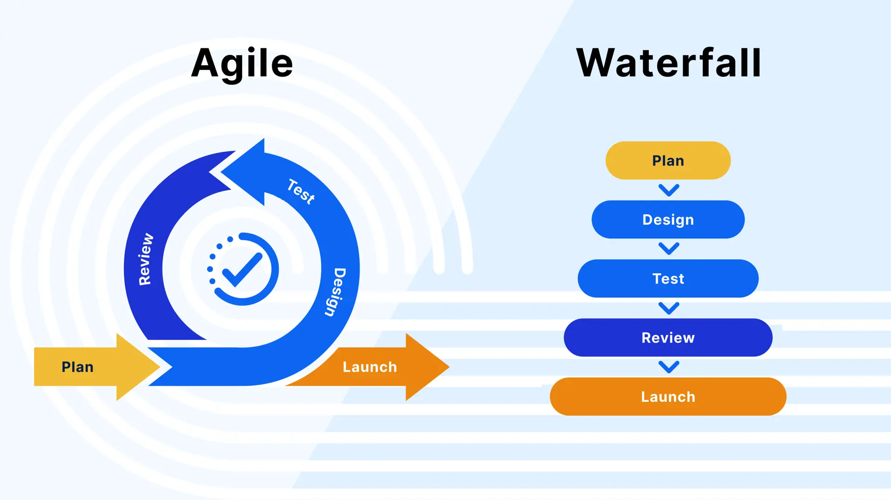

# 🔄 Agile (Гибкая методология)

**Agile** — это целое семейство гибких методологий управления проектами. Agile гораздо моложе, чем Waterfall — основные его принципы сформулировали в 2001 году. Эта методология была разработана специально для IT-сферы, хотя сейчас успешно применяется и в других проектах.

## 📖 Суть методологии

Вся философия Agile содержится в четырёх пунктах его манифеста:
* **Люди и их взаимодействие** важнее процессов и инструментов проектного управления.
* **Рабочее программное обеспечение** (результат проекта) важнее всеобъемлющей документации.
* **Сотрудничество с клиентами** важнее переговоров по контракту.
* **Реагирование на изменения** важнее следования плану.

**В Agile входит несколько методологий:** Scrum, Scrumban, Kanban, Lean, XP, FDD, TDD, SoS, LeSS, SAFe, AgilePM.

На практике работа по Agile означает, что команды трудятся небольшими циклами (итерациями или спринтами) и в результате каждого цикла получают готовую функцию или продукт. В следующем цикле они дорабатывают или улучшают его. Работа часто идёт параллельно, результаты видны ещё до окончания проекта, а в случае появления новых требований их легко включить в следующий цикл работы.

---

## ⚖️ Плюсы и минусы Agile

### ✅ Плюсы
* **Полная гибкость и свобода изменений.** Например, если конкуренты выпустили новую функцию, её можно быстро разработать в уже начатом проекте.
* **Низкие риски.** Прямо в процессе команда получает обратную связь от бизнеса и пользователей, поэтому в итоге проект вряд ли провалится.
* **Устойчивость к срывам сроков.** Даже если какой-то цикл растянется, следующие можно будет адаптировать под изменившиеся сроки и условия.
* **Ориентация на людей.** Фокус на команду даёт большую вовлечённость сотрудников в проект.

### ❌ Минусы
* **Нет чёткого плана** и жесткой структуры от начала до конца проекта.
* **Высокая потребность в коммуникации.** Сотрудники и заказчики со стороны бизнеса должны сотрудничать более тесно, постоянно требуются обсуждения и обратная связь.
* **Сложность замены участников.** В процессе работы сложнее заменить команду или отдельного специалиста, так как от всех требуется большая вовлечённость в задачу и глубокое понимание текущего контекста.
* **Сложность внедрения.** Настроить процессы по этой проектной методологии бывает непросто — потребуется отдельный сотрудник либо менеджер проекта (например, Scrum-мастер или Agile-коуч), который хорошо в этом разбирается.

---

## 🖼 Иллюстрации

