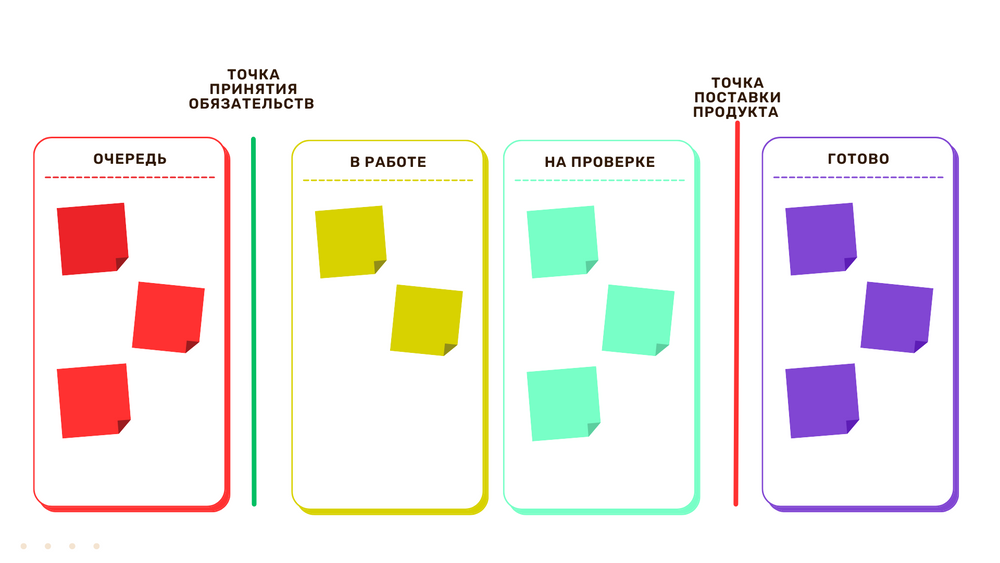
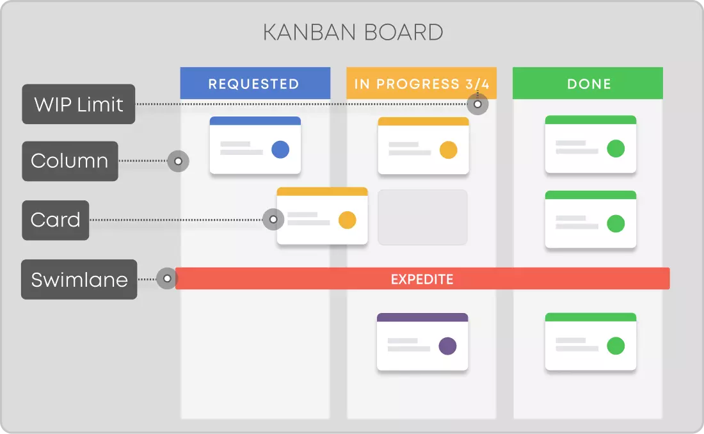

# 📋 Kanban

**Kanban** — это не подход и не фреймворк, а метод (или инструмент), который можно использовать для улучшения производственной эффективности. Он изначально базируется на принципах Lean (бережливого производства), в основе которых лежит устранение потерь в работах. 

> **Примечание:** Этот метод особенно хорошо подходит для проектов на стадии саппорта (поддержки и обслуживания), где задачи поступают непрерывным потоком.

---

## ⚙️ Основные принципы

*   **Визуализация рабочего процесса:** Все задачи представляются в виде карточек на канбан-доске, разбитой на колонки, которые обозначают этапы работы (например, «В работе», «Выполнено»).
*   **Ограничение незавершенной работы (WIP):** Для каждого этапа работы устанавливается лимит количества задач, которые могут находиться в нем одновременно. Это помогает предотвратить перегрузку команды и выявлять «бутылочные горлышки» в процессе.
*   **Управление потоком:** Контролируется перемещение задач по доске, чтобы обеспечить их плавное продвижение от начала до конца рабочего процесса.
*   **Непрерывное совершенствование:** Команда регулярно анализирует свой процесс, используя метрики (например, время прохождения задачи, скорость потока), чтобы найти возможности для улучшения.

---

## 🛑 Понятие WIP

Для успешного применения Kanban критически важно понимать концепцию незавершенной работы:

*   **WIP (Work In Progress):** Количество задач, которое в данный момент находится в работе.
*   **WIP-лимит:** Это строгое ограничение количества задач, которые могут одновременно находиться в работе на определенном этапе.

---

## ✅ Преимущества

*   **Улучшенная прозрачность:** Все участники команды (и заказчики) могут видеть текущий статус всех задач.
*   **Повышенная эффективность:** Метод помогает оптимизировать процесс и сократить время, необходимое для завершения задач.
*   **Гибкость:** Канбан позволяет легко адаптироваться к изменениям в приоритетах, поскольку задачи могут поступать в очередь непрерывно.
*   **Снижение стресса:** Ограничение WIP и равномерное распределение нагрузки помогают сделать рабочий процесс более предсказуемым и снизить уровень стресса в команде.

---

## ⚖️ Сравнение подходов: Scrum vs Kanban

| Критерий | Scrum | Kanban |
| :--- | :--- | :--- |
| **Источник** | Разработка программного обеспечения | Бережливое производство |
| **Основная идея** | Учиться на собственном опыте, самоорганизовываться и расставлять приоритеты, анализировать свои победы и поражения, чтобы постоянно совершенствоваться. | Повышать качество выполняемой работы с помощью наглядных материалов |
| **График** | Регулярные спринты фиксированной продолжительности (например, 2 недели) | Непрерывный процесс |
| **Методы** | Планирование спринтов, спринт, ежедневное Scrum-совещание, обзор спринта, ретроспектива спринта | Визуализация процесса работы, ограничение объемов незавершенной работыNormally I can help with things like this, but I don't seem to have access to that content. You can try again or ask me for something else.

---

## 🖼 Иллюстрации

