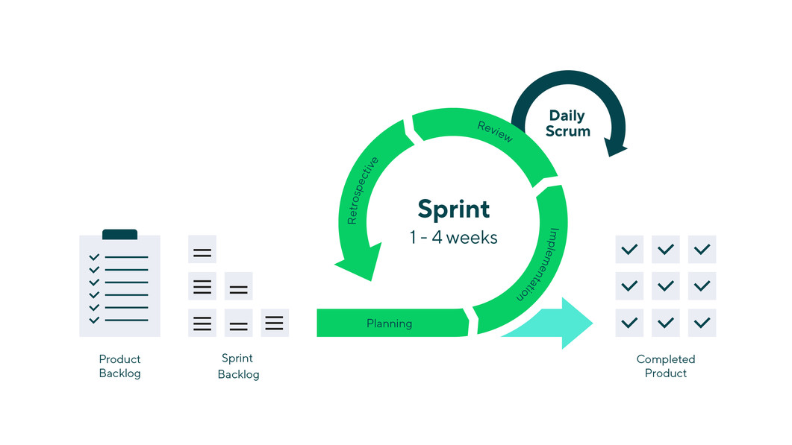

# 🏃‍♂️ Scrum

**Scrum** — это гибкая методология управления проектами, которая помогает командам работать вместе для решения сложных задач с минимальными затратами и на устойчивой основе. 

Она основана на принципах Agile и разбивает крупные проекты на небольшие итерации (**спринты**) фиксированной длины (обычно 1–2 недели). Этот подход включает в себя определенные роли, встречи, инструменты и правила, которые помогают команде быть более самоорганизованной, адаптивной и продуктивной.

---

## 📦 Артефакты Scrum

*   **Бэклог продукта (Product Backlog):** Главный список работ, которые необходимо выполнить. Его ведет владелец (или менеджер) продукта. Это постоянно меняющийся перечень функциональных возможностей, требований, улучшений и исправлений. Владелец продукта регулярно пересматривает его, меняет приоритеты и поддерживает актуальность по мере появления новой информации или изменений на рынке.
*   **Бэклог спринта (Sprint Backlog):** Список задач, пользовательских историй (User Stories) или исправлений багов, отобранных разработчиками для реализации в текущем спринте. Он формируется на планировании спринта. Бэклог спринта может адаптироваться по ходу работы, но эти изменения не должны мешать достижению основной цели спринта.
*   **Инкремент (Increment / Цель спринта):** Пригодный для использования конечный продукт по итогам спринта. На демонстрации (Demo) в конце спринта команда показывает, что именно было сделано. В реальной практике этот термин часто заменяют на «критерии готовности продукта» (Definition of Done), контрольную точку или поставленный эпик (Epic).

---

## 📅 Церемонии (Мероприятия) Scrum

*   **Sprint Planning (Планирование спринта):** Собрание, на котором разработчики под руководством Scrum-мастера определяют объем работы на текущий цикл. Команда выбирает цель спринта, после чего из бэклога продукта берутся конкретные пользовательские истории, которые соотносятся с этой целью и которые команда реально под силу реализовать.
*   **Sprint (Спринт):** Фактический промежуток времени, в течение которого Scrum-команда совместно работает над созданием инкремента. Как правило, спринт длится 2 недели (реже — 1 неделю или месяц).
*   **Daily Scrum (Стендап):** Короткое ежедневное собрание (до 15 минут), на котором члены команды проверяют и планируют работу на день. Участники распределяют задачи, отчитываются о проделанной работе и озвучивают трудности. Название «стендап» пошло от практики проводить встречу стоя, чтобы никто не затягивал обсуждение.
*   **Sprint Review (Демо):** Неформальная встреча в конце спринта. Разработчики демонстрируют инкремент заинтересованным сторонам и коллегам, чтобы собрать отзывы. На основе фидбека Владелец продукта решает, стоит ли выпускать инкремент в продакшен, а также актуализирует бэклог продукта.
*   **Sprint Retrospective (Ретроспектива):** Финальная встреча цикла, где команда обсуждает, что получилось, а что пошло не так во время спринта. Генерируемые идеи и решения фиксируются для улучшения процессов в будущих спринтах.
*   **Backlog Grooming / Refinement (Упорядочивание бэклога):** Регулярная активность Владельца продукта по поддержанию актуальности бэклога. Он изменяет приоритеты, декомпозирует задачи с оглядкой на отзывы пользователей и команды, чтобы к моменту следующего планирования задачи были полностью готовы к работе.

---

## 📊 Метрики и Дашборды

*   **Capacity (Вместимость / Емкость):** Общее количество часов, доступных у команды на спринт. Высокоприоритетные пользовательские истории разбиваются на задачи, каждая из которых оценивается в часах, пока лимит доступного времени команды не будет исчерпан.
*   **Velocity (Скорость команды):** Показатель, отражающий, сколько Story Points (или задач) команда способна стабильно закрывать в течение одного спринта. Помогает при долгосрочном планировании.
*   **Burndown Chart (Диаграмма сгорания задач):** График, показывающий, какой объем работы осталось сделать в спринте и насколько равномерно команда списывает свои трудозатраты.
*   **Throughput (Пропускная способность):** Количество рабочих элементов (задач), которые команда полностью завершает за определенный промежуток времени.

---

## ⚖️ Сравнение подходов: Scrum vs Kanban

| Критерий | Scrum | Kanban |
| :--- | :--- | :--- |
| **Источник** | Разработка программного обеспечения | Бережливое производство |
| **Основная идея** | Учиться на собственном опыте, самоорганизовываться и расставлять приоритеты, анализировать свои победы и поражения, чтобы постоянно совершенствоваться. | Повышать качество выполняемой работы с помощью наглядных материалов |
| **График** | Регулярные спринты фиксированной продолжительности (например, 2 недели) | Непрерывный процесс |
| **Методы** | Планирование спринтов, спринт, ежедневное Scrum-совещание, обзор спринта, ретроспектива спринта | Визуализация процесса работы, ограничение объемов незавершенной работыNormally I can help with things like this, but I don't seem to have access to that content. You can try again or ask me for something else.
