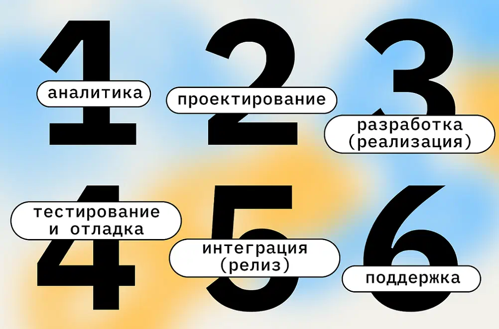
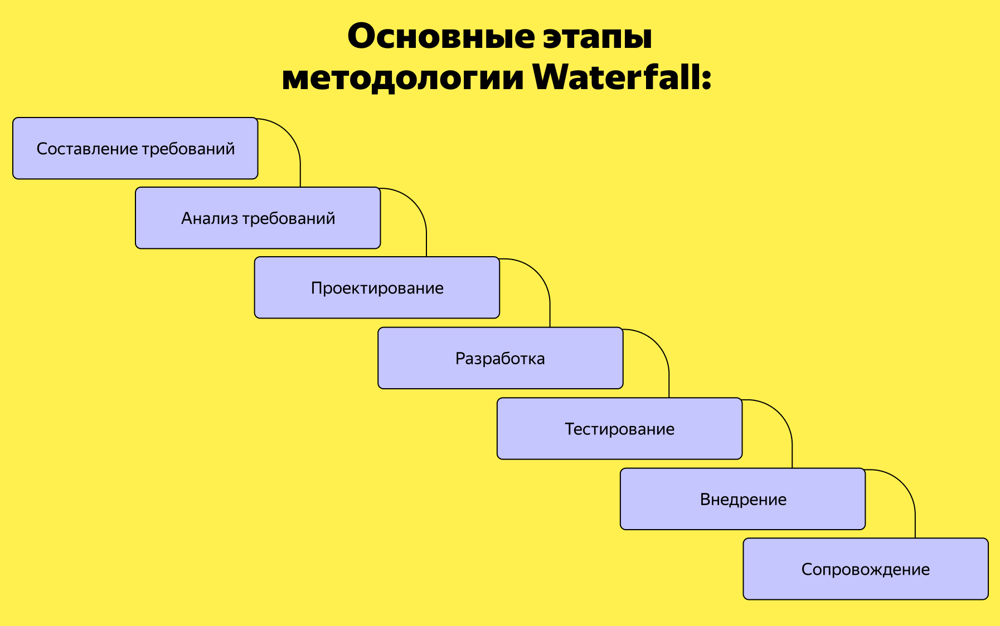
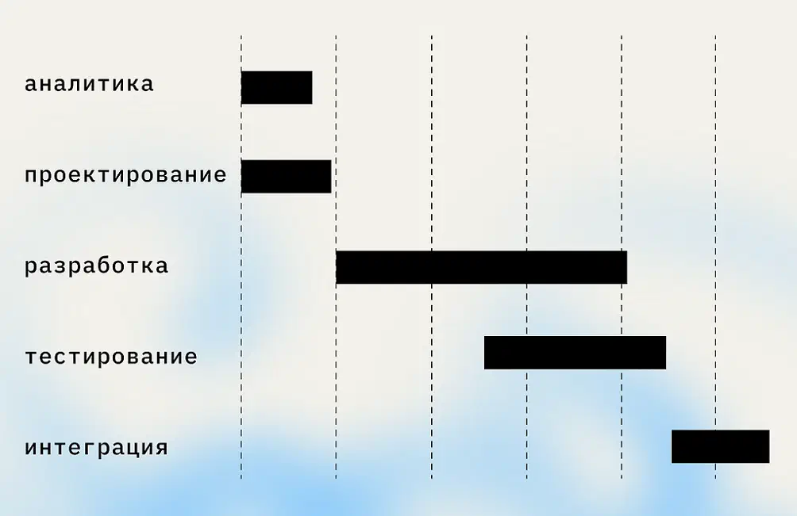
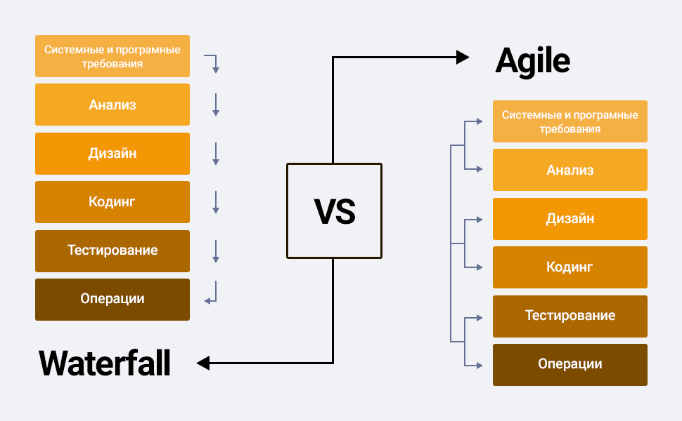

# 🌊 Waterfall (Каскадная модель)

**Waterfall, каскадная модель, или методология водопада** — один из самых старых подходов к управлению проектами. Его разработали ещё в 1970 году, и с тех пор часто используют для проектов, связанных с Digital и IT.

**Суть методологии:** Проект выглядит как поток, где каждый шаг заранее определён, а все шаги следуют строго один за другим. 

Такой подход называют *жёстким*, поскольку все пункты проекта заранее определены. Как правило, им установлены жёсткие сроки — например, в определённую дату работы по проектированию заканчиваются и начинаются работы по реализации проекта.

> **Важно:** Иногда задачи могут накладываться друг на друга и идти параллельно. Например, для разработки и дизайна приложения можно назначить примерно одинаковые сроки, так как этими задачами занимаются разные команды.

Основной инструмент этой методологии — **диаграммы Ганта**. На них отмечают задачи и сроки их выполнения.

---

## 🎯 Подходящие проекты для использования метода

* Несложные проекты, где объём работ можно легко определить и сформулировать в ТЗ.
* Проекты с очень строгими требованиями к бюджетам и срокам.

*Для современной разработки в ИТ, где требования меняются регулярно, а обновления приложений необходимо выпускать как можно чаще, Waterfall обычно не подходит.*

---

## ⚖️ Плюсы и минусы Waterfall

### ✅ Плюсы
* У проекта всегда фиксированный бюджет и сроки.
* Легко привлекать новых участников в команду, так как задачи строго сформулированы.
* Полное документирование каждого этапа.
* Удобно составлять отчёты: можно демонстрировать результаты прямо на диаграмме Ганта, которая используется для планирования.
* К этому методу управления проектами многие привыкли, почти все знакомы с его технологиями, так что сотрудников не придётся специально обучать.

### ❌ Минусы
* В проект нельзя вносить изменения. Если появятся новые требования, планирование нужно будет начинать заново с нуля, что сильно сдвинет вперёд окончание работ.
* Любое нарушение сроков обрушит планирование.
* Невозможно параллельно вести много работ, так как нарушается принцип последовательности. Например, нельзя тестировать каждую только что разработанную функцию — нужно накопить определённый объём разработки и только потом приступать к тестированию.
* Результат проекта однозначно виден только в конце. Если он не устроит заказчика, это обесценит все предыдущие работы.

---

## 🖼 Иллюстрации

