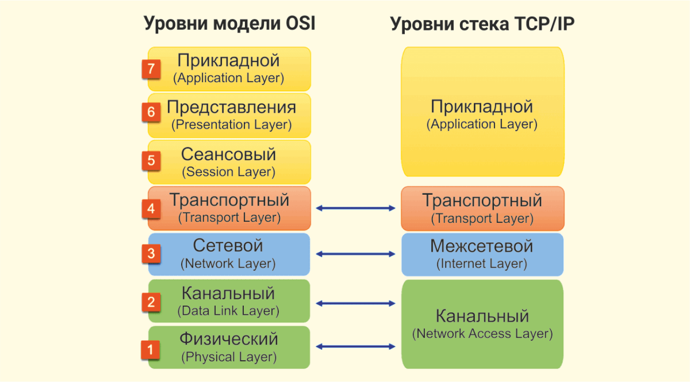

# 🌐 Общее

## Уровни модели OSI

Модель OSI (Open Systems Interconnection) — это концептуальная модель, стандартизирующая функции телекоммуникаций или вычислительных систем без привязки к конкретной внутренней технологии. Она делит процесс сетевого взаимодействия на семь логических уровней, каждый из которых выполняет свою задачу.

| Уровень                | Функции                                                                 | PDU             | Примеры                             |
|------------------------|-------------------------------------------------------------------------|-----------------|-------------------------------------|
| 7. Прикладной         | Высокоуровневое API для приложений                                      | Данные          | HTTP, FTP, SMTP                     |
| 6. Представительский  | Представление и преобразование данных между сетевым сервисом и приложением (кодировка, сжатие, шифрование) | Данные          | ASCII, EBCDIC, JPEG, SSL/TLS        |
| 5. Сеансовый          | Управление сеансами связи: установка, поддержка и завершение продолжительного обмена информацией между узлами | Данные          | RPC, PAP, NetBIOS                   |
| 4. Транспортный       | Надёжная (или ненадёжная) передача сегментов между конечными узлами, контроль потока и исправление ошибок | Сегменты/Датаграммы | TCP, UDP                          |
| 3. Сетевой            | Маршрутизация и логическая адресация: определение пути передачи пакетов от источника к получателю через множество промежуточных узлов | Пакеты          | IPv4, IPv6, ICMP, OSPF              |
| 2. Канальный          | Надёжная передача кадров (фреймов) между двумя узлами, непосредственно соединёнными физическим каналом; обнаружение и коррекция ошибок на физическом уровне | Кадры (фреймы)  | Ethernet, PPP, IEEE 802.11 (Wi-Fi)  |
| 1. Физический         | Передача необработанного потока битов через физическую среду: электрические сигналы, оптические импульсы, радиоволны | Биты            | USB, витая пара, оптоволокно, Bluetooth |

