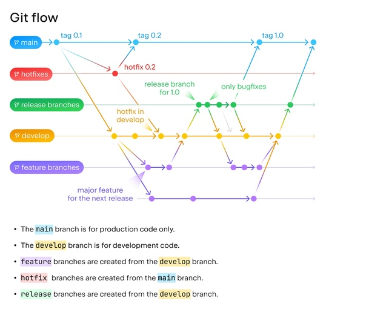

# 🔀 Git

**Git** — наиболее распространённая распределённая система управления версиями. Она отслеживает изменения в файлах и позволяет команде разработчиков эффективно работать над общей кодовой базой, не теряя историю и не создавая конфликтов.

---

## 🌿 Gitflow

**Gitflow** — популярная модель ветвления, которая задаёт чёткие правила именования и жизненного цикла веток. Основные типы веток:

- **master/main** — стабильная production-версия.
- **develop** — интеграционная ветка для объединения готовых фич.
- **feature/** — создаются от `develop` для каждой новой функции и сливаются обратно.
- **release/** — готовятся к релизу: стабилизация, исправление багов. После слияния в `master` и `develop`.
- **hotfix/** — срочные исправления критических проблем на production. Создаются от `master` и после фикса вливаются в `master` и `develop`.

Gitflow помогает упорядочить параллельную работу нескольких разработчиков и снизить риск попадания нестабильного кода в production.

---

## ⚙️ CI/CD и автоматизация

Git тесно интегрируется с практиками непрерывной интеграции и доставки, ускоряя выпуск обновлений.

- **Continuous Integration (CI)** — практика регулярного слияния изменений в общую ветку с автоматической сборкой и прогоном тестов. Позволяет быстро выявлять конфликты и ошибки.
- **Continuous Delivery (CD)** — расширение CI: после успешных тестов код автоматически развёртывается в staging-окружении. Релиз в production остаётся ручным, но полностью готовым.
- **Continuous Deployment (CD)** — дальнейшая автоматизация: каждый прошедший тесты коммит автоматически попадает в production без участия человека.

Эти подходы превращают Git в основу DevOps-конвейера: код коммитится → автоматически собирается → тестируется → доставляется пользователям.

---

## 📋 Git Cheatsheet — основные команды для разработчиков

### Настройка репозитория и работа с изменениями

| Команда | Описание |
|---------|----------|
| `git init` | Инициализировать новый Git-репозиторий в текущей папке |
| `git clone <url>` | Склонировать удалённый репозиторий |
| `git config --global user.name "<Имя>"` | Задать имя пользователя для всех коммитов |
| `git config --global user.email "<email>"` | Задать email |
| `git status` | Показать состояние рабочей директории и индекса (staging area) |
| `git add <file>` | Добавить конкретный файл в индекс (подготовить к коммиту) |
| `git add .` | Добавить все изменения в текущей директории в индекс |
| `git commit -m "<сообщение>"` | Зафиксировать подготовленные изменения с сообщением |
| `git commit -am "<сообщение>"` | Добавить все отслеживаемые файлы и сразу закоммитить (сокращение для `git add .` + `git commit`) |
| `git log` | Показать историю коммитов (полный вывод) |
| `git diff` | Показать различия между рабочим каталогом и индексом (неподготовленные изменения) |

### Ветвление (Branching)

| Команда | Описание |
|---------|----------|
| `git branch` | Список локальных веток (текущая выделена звёздочкой) |
| `git branch -a` | Список всех веток (локальных и удалённых) |
| `git branch <имя>` | Создать новую ветку с указанным именем (без переключения) |
| `git checkout <ветка>` | Переключиться на другую ветку |
| `git checkout -b <имя>` | Создать новую ветку и сразу переключиться на неё |
| `git merge <ветка>` | Влить изменения из указанной ветки в текущую |
| `git branch -d <имя>` | Удалить локальную ветку (если она уже слита) |

### Работа с удалёнными репозиториями (Remote)

| Команда | Описание |
|---------|----------|
| `git remote` | Список подключённых удалённых репозиториев |
| `git remote -v` | Показать URL-адреса удалённых репозиториев (для fetch и push) |
| `git push <remote> <ветка>` | Отправить коммиты из локальной ветки в удалённый репозиторий |
| `git pull <remote> <ветка>` | Получить изменения из удалённой ветки и объединить их с текущей (fetch + merge) |
| `git fetch` | Загрузить изменения из удалённого репозитория, но не сливать с текущей веткой |

### Отмена изменений (Undo)

| Команда | Описание |
|---------|----------|
| `git reset <file>` | Убрать файл из индекса (отменить `git add`), но сохранить изменения в рабочем каталоге |
| `git reset --hard` | Сбросить все изменения в рабочем каталоге и индексе до последнего коммита (опасно!) |
| `git checkout <file>` | Отменить локальные изменения в файле, вернув его к состоянию последнего коммита |
| `git revert <коммит>` | Создать новый коммит, который отменяет изменения указанного коммита (безопасная отмена для общих веток) |

### Продвинутые возможности (Advanced)

| Команда | Описание |
|---------|----------|
| `git stash` | Временно спрятать незакоммиченные изменения (чтобы переключить ветку или сделать pull) |
| `git stash pop` | Вернуть последние спрятанные изменения и удалить их из стеша |
| `git rebase <ветка>` | Перенести коммиты текущей ветки поверх указанной ветки (переписывает историю) |
| `git tag <имя>` | Создать тег (метку) для текущего коммита (например, для версий) |
| `git log --oneline` | Показать историю коммитов в сжатом виде (каждый коммит в одну строку) |
