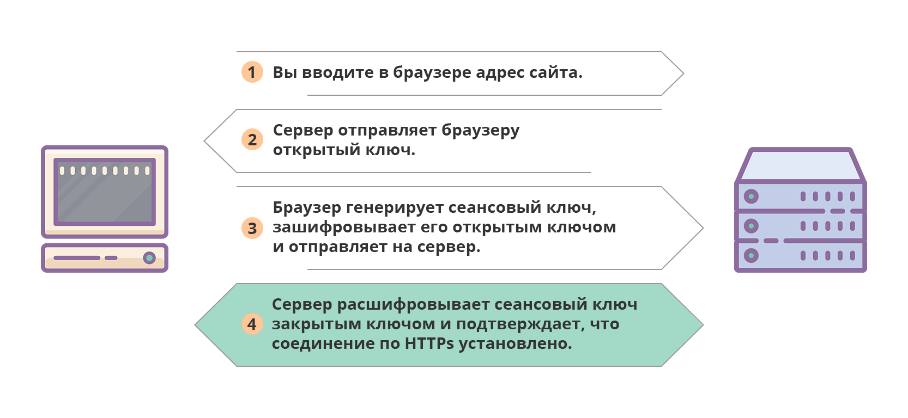
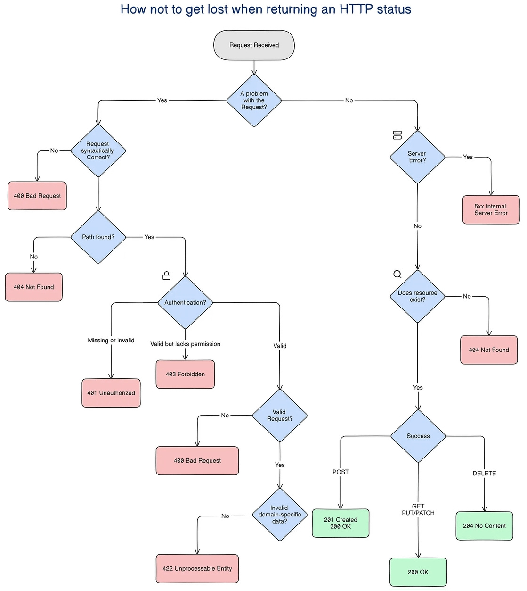

# 🌍 HTTP и HTTPS

**HTTP** (HyperText Transfer Protocol) — протокол передачи гипертекста, лежащий в основе Всемирной паутины. Именно благодаря ему браузер может запрашивать и получать веб-страницы, изображения, видео, отправлять данные форм и взаимодействовать с серверными приложениями.

Протокол работает по модели «клиент-сервер»: клиент (обычно браузер) формирует запрос, сервер его обрабатывает и возвращает ответ.

---

## 📄 Структура HTTP-запроса и ответа

**Запрос** состоит из:
- строки запроса: метод (GET, POST и др.), путь, версия протокола;
- заголовков (headers): дополнительная информация (тип контента, авторизация и т.д.);
- тела (body) — опционально, используется в POST, PUT, PATCH.

**Ответ** включает:
- статус-код (200, 404, 500…) и текстовое описание;
- заголовки;
- тело ответа (HTML, JSON, изображение и т.п.).

---

## 🔒 HTTPS — безопасный HTTP

**HTTPS** (HyperText Transfer Protocol Secure) — это расширение HTTP, которое добавляет шифрование передаваемых данных. По умолчанию HTTP передаёт информацию в открытом виде, что делает её уязвимой для перехвата. HTTPS решает эту проблему, объединяя HTTP с криптографическим протоколом **TLS** (ранее SSL).

### Как устанавливается безопасное соединение (упрощённо):
1. Клиент подключается к серверу по HTTPS (обычно порт 443).
2. Сервер предъявляет цифровой сертификат, подтверждающий его подлинность.
3. Клиент и сервер договариваются о **сеансовом ключе** — временном симметричном ключе, которым будут зашифрованы все данные текущей сессии.
4. Дальнейший обмен идёт по защищённому каналу.

Сеансовый ключ используется, потому что симметричное шифрование быстрее асимметричного и требует меньше вычислительных ресурсов. Для каждого нового соединения генерируется новый уникальный ключ.

---

## 🔍 Отличия HTTP и HTTPS

| Характеристика | HTTP | HTTPS |
|----------------|------|-------|
| **Шифрование** | Нет, данные передаются открытым текстом | Данные зашифрованы TLS |
| **Порт по умолчанию** | 80 | 443 |
| **Целостность данных** | Не гарантируется (легко изменить) | Гарантируется проверкой подлинности |
| **Сертификат** | Не требуется | Требуется SSL/TLS-сертификат |
| **Идентификация сервера** | Отсутствует | Подтверждается сертификатом |
| **Влияние на SEO** | Нейтральное | Поисковые системы предпочитают HTTPS |
