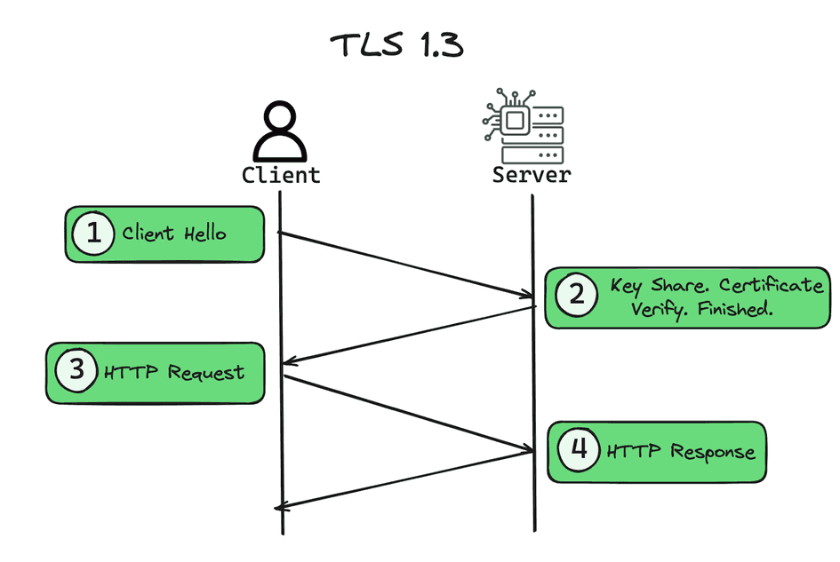
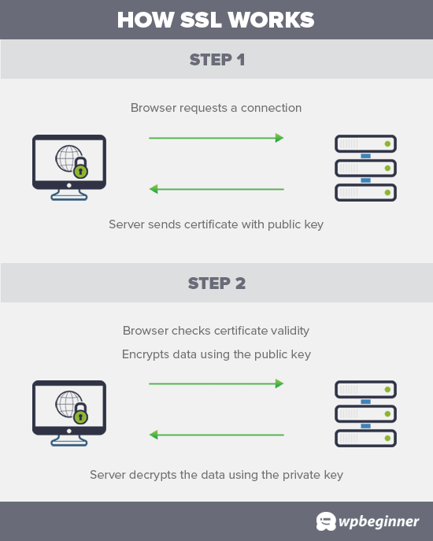
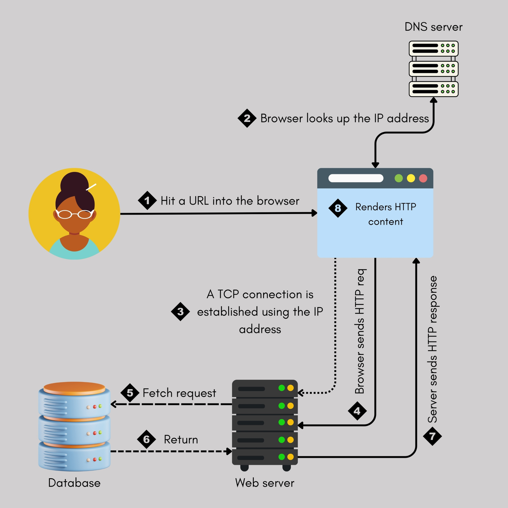

# 🔐 SSL/TLS

**SSL** (Secure Sockets Layer) и **TLS** (Transport Layer Security) — это криптографические протоколы, обеспечивающие защищённую передачу данных по сети. Они работают на транспортном уровне модели OSI и создают зашифрованный канал между клиентом (браузером) и сервером, предотвращая перехват и подделку информации.

Хотя оба протокола решают одну задачу, сегодня SSL считается устаревшим, и повсеместно используется его преемник — TLS.

---

## 🔄 Как работает защищённое соединение

Когда браузер заходит на сайт по HTTPS, он инициирует процедуру «рукопожатия» (handshake):

1. Клиент и сервер согласуют версию протокола (TLS) и набор шифров.
2. Сервер предъявляет цифровой сертификат для подтверждения своей подлинности.
3. Стороны вырабатывают общий **сеансовый ключ**, который будет использоваться для симметричного шифрования данных в рамках текущей сессии.
4. После этого весь обмен данными зашифрован и защищён от посторонних.

---

## 📜 SSL — предшественник

SSL был разработан компанией Netscape и прошёл несколько версий (1.0, 2.0, 3.0). Уязвимости, обнаруженные в SSL 3.0, привели к созданию нового стандарта. Сегодня использование SSL не рекомендуется, и большинство систем поддерживают только TLS.

---

## 🚀 TLS — современный стандарт

TLS (Transport Layer Security) — прямое развитие идей SSL. Версии TLS 1.2 и 1.3 являются текущими стандартами безопасности. Основные улучшения по сравнению с SSL:

- Более надёжные алгоритмы шифрования и хеширования.
- Уменьшено время handshake (особенно в TLS 1.3).
- Удалены устаревшие и небезопасные компоненты.
- Обязательная поддержка Perfect Forward Secrecy (PFS) — компрометация долговременного ключа не раскрывает прошлые сессии.

Визуально для пользователя наличие TLS отображается значком замка и префиксом `https://` в адресной строке.

---

## ⚖️ Сравнение SSL и TLS

| Характеристика | SSL | TLS |
|----------------|-----|-----|
| **Статус** | Устарел, небезопасен | Актуален, рекомендуется |
| **Последняя версия** | SSL 3.0 (1996) | TLS 1.3 (2018) |
| **Безопасность** | Уязвим к атакам (POODLE, BEAST и др.) | Устойчив к известным атакам |
| **Скорость handshake** | Медленнее | Быстрее (особенно TLS 1.3) |
| **Алгоритмы** | Ограниченный набор, многие взломаны | Современные, эффективные |
| **Forward Secrecy** | Не поддерживается (в большинстве случаев) | Поддерживается (обязательно в TLS 1.3) |
