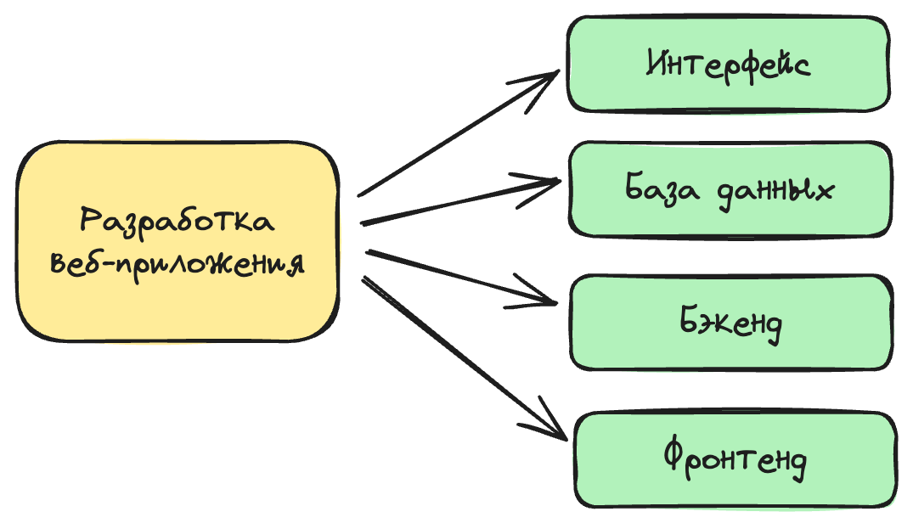
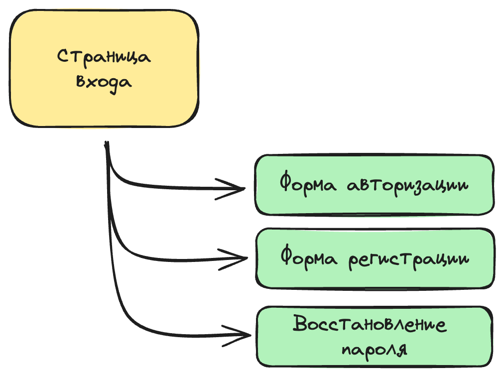
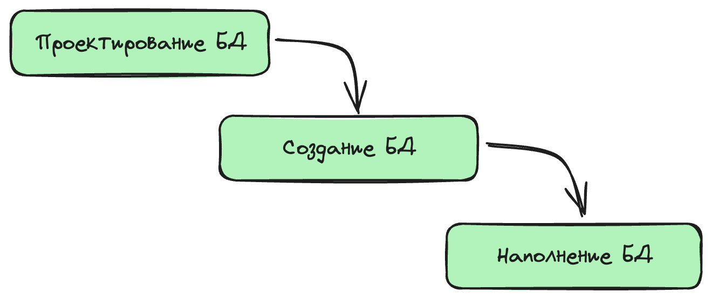
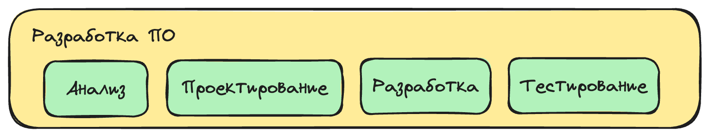

# 🧩 Декомпозиция (Decomposition)

**Декомпозиция** — это процесс разбиения сложной задачи или проекта на более мелкие и управляемые части. 

> 🍕 **Простыми словами:** Это как разделение большого куска пиццы на маленькие кусочки, чтобы их было легче съесть. 

Декомпозиция задач — критически важный шаг при планировании проекта или выполнении работы, поскольку он помогает улучшить прозрачность, управляемость и точность оценки времени выполнения. Когда задача разбивается на меньшие части, её становится легче понять, планировать, распределять между членами команды и выполнять.

---

## ⚙️ Особенности декомпозиции рабочих задач

В контексте управления проектами и разработки программного обеспечения декомпозиция имеет ряд ключевых особенностей:

1. **Атомарность**
Разделение на конкретные и понятные шаги, которые могут быть выполнены независимо друг от друга (в разное время). 
> *Пример неатомарной задачи:* Управление автомобилем. Водитель не может сначала позаниматься рулёжкой, а позже — переключением передач. Эти процессы тесно связаны и производятся строго одновременно. Атомарная задача должна быть неделимой.

2. **Зависимость**
При декомпозиции определяются взаимосвязи между различными шагами, что позволяет правильно установить порядок выполнения работ и избежать блокировок или задержек.
> *Пример:* Чтобы начать управлять автомобилем, нужна подготовка: получение прав, техническое обслуживание и заправка авто. Только сделав эти шаги, можно будет приступить к поездке.

3. **Учет времени и ресурсов**
Каждая подзадача может быть оценена в отдельности с точки зрения времени и ресурсов, необходимых для её выполнения, что облегчает планирование и управление бюджетом проекта.
> *Пример:* Для получения прав необходимо время на обучение с преподавателем автошколы, а для сдачи экзамена потребуется инспектор, готовый принять экзамен на полигоне.

4. **Назначение ответственных**
Каждая мелкая задача может быть назначена конкретному исполнителю или команде, что улучшает ясность в отношении зон ответственности и ролей.
> *Пример:* Очень целесообразно доверить техническое обслуживание мастеру автосервиса, а параллельно с этим самостоятельно заняться планированием маршрута поездки. Здесь ответственный за ТО — мастер, а за маршрут — вы.

5. **Отслеживание прогресса**
Поскольку все рабочие задачи представляют собой чётко определенные шаги, их выполнение легко отследить для обеспечения своевременного завершения проекта.
> *Пример:* Сдавая автомобиль на техобслуживание, вы интересуетесь, сколько времени это займет, и к назначенному часу возвращаетесь в мастерскую, чтобы забрать машину и принять результат работы.

6. **Простота коммуникации**
Декомпозиция способствует улучшению коммуникации в команде, поскольку каждый член команды четко понимает свои конкретные обязанности и личный вклад в общий результат.

### 💡 Принцип для Agile-команд:
7. **Равномерность**
Чем более похожими по времени и ресурсам будут финальные задачи на самом нижнем уровне декомпозиции, тем более продуктивно и предсказуемо будет работать ваша команда за счет простоты планирования.

---

## 🗂️ Виды декомпозиции

Выбор вида декомпозиции зависит от структуры проекта и целей, которые стоят перед аналитиком или менеджером.

### 1. Функциональная декомпозиция
Разбиение проекта или системы на отдельные функциональные блоки, компоненты, модули или подсистемы по принципу «что делает этот блок».

### 2. Иерархическая декомпозиция
Процесс разделения проекта сверху вниз на строгие уровни и подуровни (например, от Эпика к Пользовательским историям и подзадачам).

### 3. Последовательная декомпозиция
Разделение крупной задачи на последовательные шаги, этапы или хронологические цепочки выполнения.

### 4. Процессная декомпозиция
Разбиение проекта на конкретные бизнес-процессы, регламентированные шаги или стадии жизненного цикла, необходимые для его успешного завершения.

