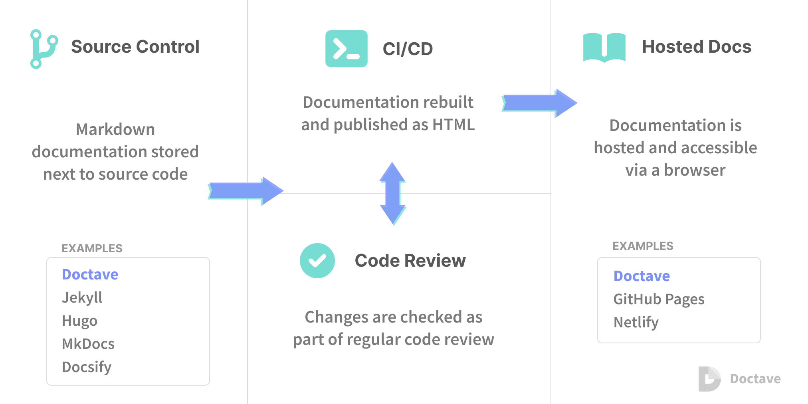

# 📄 Docs as Code

**Docs as Code** — это подход к созданию и ведению технической документации, при котором к ней применяются те же практики и инструменты, что и к разработке программного кода: хранение в системе контроля версий (Git), написание в текстовых форматах (Markdown, AsciiDoc), автоматическая сборка, рецензирование через Pull Requests и непрерывная публикация.

Проще говоря, **документация живёт рядом с кодом и развивается вместе с продуктом**.

---

## 🔄 Основные принципы Docs as Code

1. **Всё в Git** — документация хранится в том же репозитории, что и код (или в отдельном, но под версионным контролем). История изменений, blame, откат версий работают так же, как для исходников.

2. **Текстовые форматы** — контент пишется на легковесных языках разметки (Markdown, AsciiDoc, reStructuredText), которые легко читать и редактировать в любом текстовом редакторе. Никаких бинарных файлов (Word, PDF) в репозитории.

3. **Автоматическая сборка (CI/CD)** — при каждом коммите запускается пайплайн, который собирает статический сайт с документацией (MkDocs, Sphinx, Hugo, Antora) и публикует его на веб-сервер или GitHub Pages. Это устраняет ручную выкладку и гарантирует актуальность.

4. **Ревью через Pull Requests** — любые изменения в документации предлагаются через отдельную ветку и проходят обязательное рецензирование командой (разработчиками, аналитиками, техническими писателями). Обсуждение ведётся построчно, как для кода.

5. **Единый источник правды** — документация максимально приближена к коду, поэтому разработчик, меняя API, сразу обновляет и спецификацию в том же PR. Аналитик видит актуальную версию без рассинхронизации.

---

## 🧰 Типовой инструментарий

| Назначение | Инструменты |
|------------|-------------|
| **Формат разметки** | Markdown, AsciiDoc, reStructuredText |
| **Генератор статического сайта** | MkDocs (Material), Sphinx, Hugo, Docusaurus, Antora |
| **Хостинг** | GitHub Pages, GitLab Pages, Netlify, внутренний сервер |
| **CI/CD** | GitHub Actions, GitLab CI, Jenkins |
| **Диаграммы** | Mermaid, PlantUML (как код), встроенные в Markdown/AsciiDoc |
| **Линтеры** | vale, markdownlint — для проверки стиля и орфографии |

---

## 🧠 Зачем это системному аналитику

- **Синхронизация требований и реализации** — когда документация (спецификация, API-описание) находится в том же репозитории, что и код, разработчик не может «забыть» обновить требования — это становится частью Definition of Done.
- **Прозрачность и отслеживаемость** — Git хранит полную историю: кто, когда и зачем изменил требование. Легко ответить, почему отказались от какого-то сценария.
- **Участие в процессе разработки** — аналитик работает в том же окружении (Git, CI/CD), что и команда. Pull Request становится основным механизмом согласования требований, заменяя бесконечные цепочки писем и правки в Word.
- **Автоматическая публикация** — документация всегда доступна команде и заказчику в актуальном виде, без ручной выгрузки в Confluence или SharePoint.
- **Качество и единый стиль** — линтеры проверяют орфографию и форматирование, а шаблоны генераторов обеспечивают единый внешний вид всех страниц.

---
