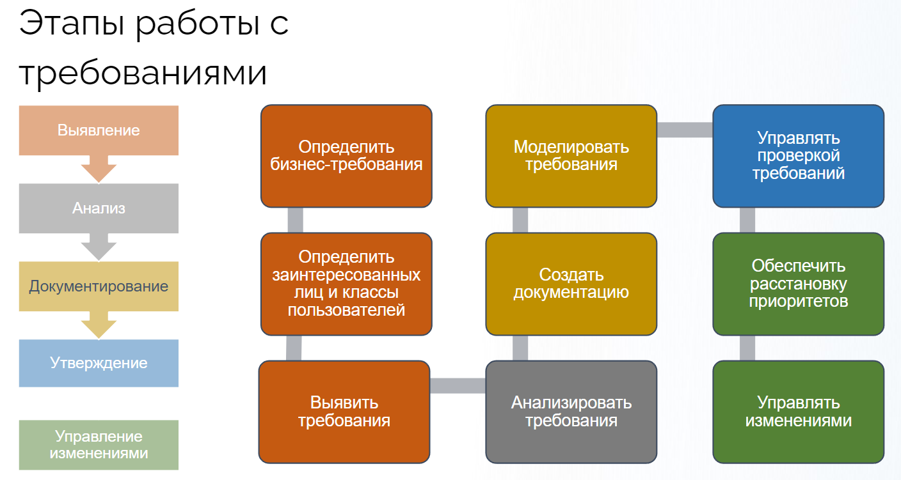
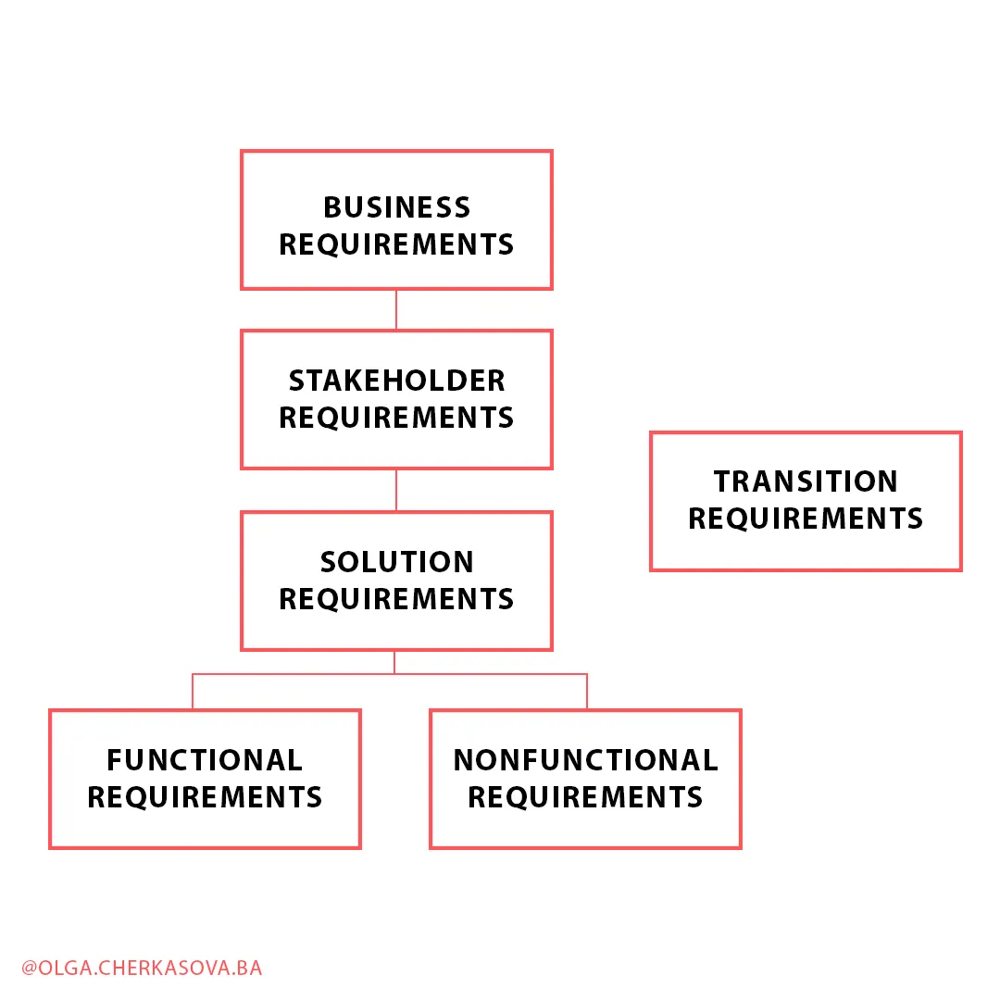
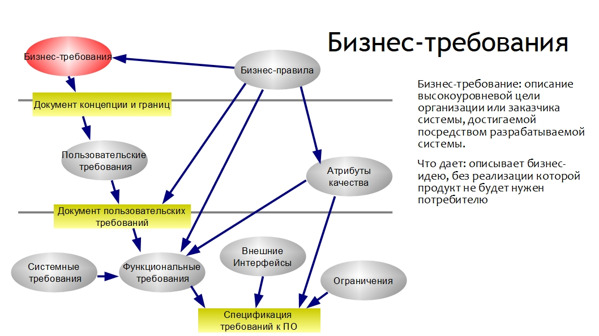
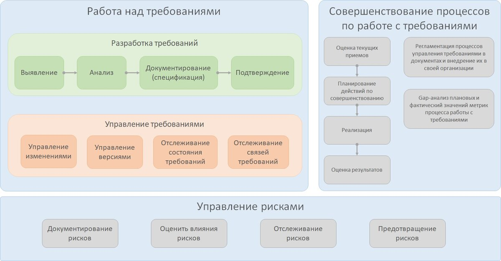
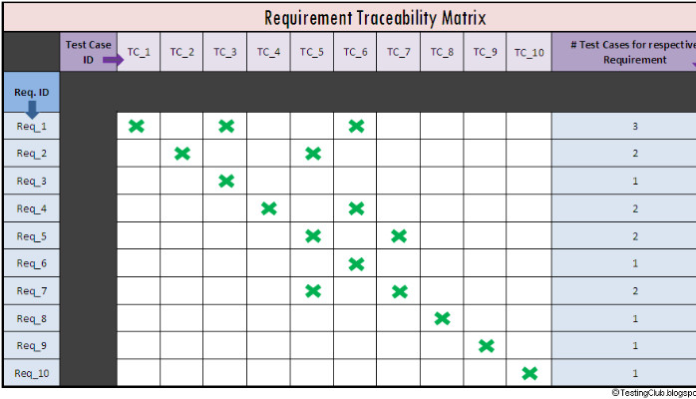
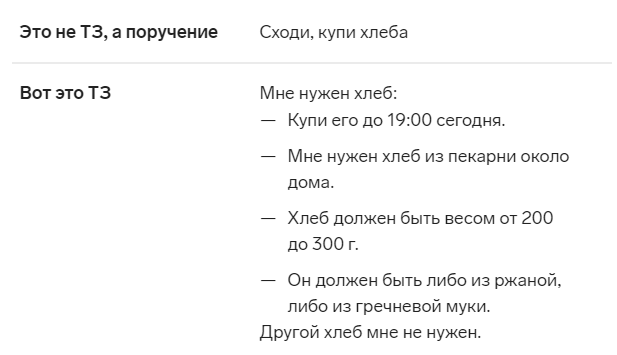
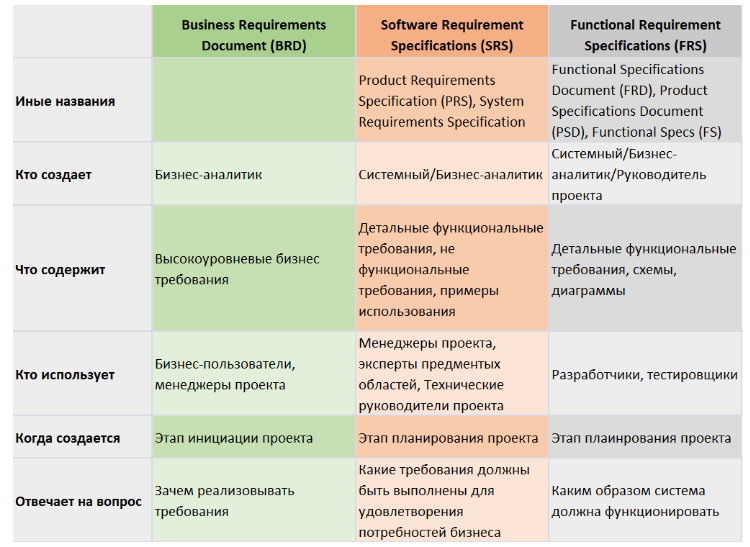
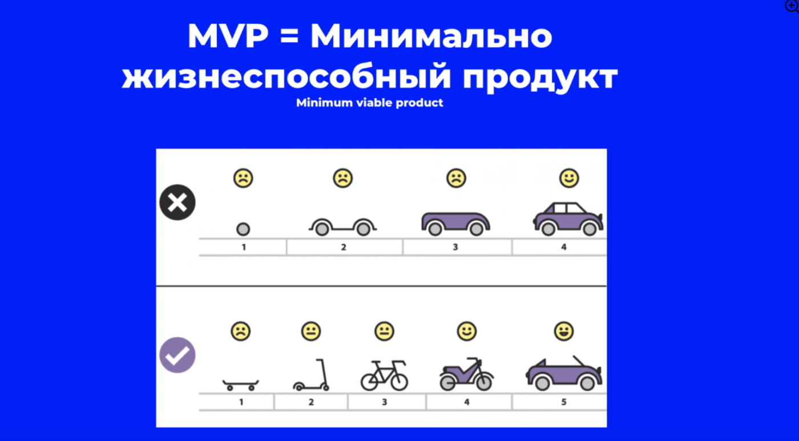

# 📚 Общие понятия и основы работы с требованиями

**Требования** — это конкретные (пригодные для использования) утверждения о том, что нужно сделать.

**Зачем необходимо документировать требования?**
* Определение рамок проекта и объема работы для его выполнения.
* Фиксация договоренностей с заказчиком.
* Определение критериев приемки проекта.
* Расстановка приоритетов и планирование работы.

---

## 🛠 Методы сбора требований

1. **Анкетирование:** Составление опросника (анкеты, брифа) с открытыми и закрытыми вопросами. 
   * *Плюсы:* Высокая скорость, малые затраты. 
   * *Минусы:* Не подходит для неявных требований, нельзя учесть все вопросы, человеческий фактор (люди не любят анкеты).
2. **Интервью:** Беседа «по душам» с заинтересованным лицом тет-а-тет.
   * *Плюсы:* Гибкость (вопросы в любой последовательности), использование доп. материалов, анализ невербальной реакции.
   * *Минусы:* Отнимает много времени и сил.
3. **Изучение существующей документации:** Анализ текущих документов Заказчика.
   * *Плюсы:* Быстрое получение информации.
   * *Минусы:* Не работает, если документации нет или она неактуальна.
4. **Мозговой штурм:** Генерация множества идей от разных стейкхолдеров в кратчайшие сроки (подходит для новых/плохо изученных направлений).
   * *Плюсы:* Нестандартные решения, развитие идей друг друга.
   * *Минусы:* Нужна высокая мотивация участников, сложно провести в распределенных командах.
5. **Фокус-группа:** Получение обратной связи по процессам и идеям от предварительно отобранных заинтересованных лиц.
6. **Анализ интерфейсов:** Деконструкция взаимодействия систем друг с другом и конечными пользователями. Позволяет выявить ограничения и проблемы взаимодействия оборудования/систем.
7. **Наблюдение за работой специалистов:** Выявление требований на основе наблюдений за реальными рабочими процессами и обстановкой.

---

## 🎯 Постановка целей по SMART

Система постановки целей, где каждая буква — критерий качества.
* **Specific (Конкретная):**
  **\- Цель должна быть сформулирована так, чтобы каждый понимал её одинаково и не пришлось углубляться в детали;
  **\-Содержать точный ответ на вопрос «Что делать?» — например, повысить средний чек при заказе через сайт;
  **\-Подразумевать один конкретный результат, а не несколько разных: например, повысить средний чек — это одна цель, а повысить средний чек и увеличить продажи — две разные цели.
* **Measurable (Измеримая):** Результат должен иметь критерии для оценки (KPI).
* **Achievable (Достижимая):** Опирается на объективные показатели, укладывается в реалистичные сроки.
* **Relevant (Значимая):** Соответствует глобальной стратегии и миссии компании.
* **Time bound (Ограниченная во времени):** Имеет четкие сроки (оптимально 3, 6 или 12 месяцев).

### Примеры постановки задач

| ❌ Нет | ✅ Да (по SMART) |
| :--- | :--- |
| Улучшить результаты продаж. | Сделать так, чтобы сотрудники к концу года заключали на 50% больше договоров с новыми клиентами благодаря новым скриптам для продаж. |
| Изменить отношение сотрудников к работе. | Провести опрос и выяснить, каких стимулов не хватает сотрудникам, поменять систему мотивации и сравнить результаты через три месяца. |
| Купить квартиру в Москве. | Купить квартиру за 10 млн рублей, в районе СЗАО и уложиться в 3 месяца. |
| Похудеть на 30 кг за две недели. | Похудеть на 15 кг за полгода, проконсультировавшись с диетологом и добавив три тренировки в неделю. |

---

## 🗂 Классификация требований

### По BABOK

1. **Бизнес-требования (Business Requirements):** Цели и задачи, описывающие, *почему* инициирован проект. Задают главные ориентиры.
2. **Требования заинтересованных сторон (Stakeholder Requirements):** Потребности стейкхолдеров. Мостик между бизнесом и системой. *(Пример: Подписчик должен иметь возможность читать новый пост каждый день).*
3. **Требования к решению (Solution Requirements):** Возможности и качества решения. Делятся на:
   * **Функциональные:** Что решение должно делать. *(Пример: Количество символов в посте не должно превышать 2200 знаков).*
   * **Нефункциональные:** Качества и условия работы (производительность, масштабируемость, надежность, доступность, безопасность, локализация и т.д.). *(Пример: Система должна восстанавливаться после сбоя не более чем за 5 минут).*
4. **Переходные требования (Transition Requirements):** Временные требования для перехода из текущего состояния в будущее. *(Пример: Пользователи должны пройти тренинг).*

### По Вигерсу (дополнения)

* **Бизнес-правила (Business rules):** Корпоративные политики, законы, стандарты. Находятся вне системы, но налагают ограничения.
* **Атрибуты качества:** Характеристики продукта (например, скорость загрузки не более 3 сек).
* **Внешние интерфейсы:** Описание взаимодействия с другими системами (например, API платежного шлюза).
* **Ограничения (Constraints):** Ограничения при выборе способа разработки.
* **Системные требования:** Взаимодействие подсистем, оборудования и персонала.

---

## 🔍 Качество и Управление требованиями

**Верификация (Verification)** — проверка того, что объект полностью удовлетворяет установленным требованиям (обнаружение ошибок, противоречий).
**Валидация (Validation)** — верификация, при которой требования связаны с реальным предполагаемым использованием (решает ли это бизнес-проблему).

### Критерии качественного требования (Верификация):
* **Атомарность** (одно требование = одна мысль).
* **Полнота** (достаточный уровень детализации).
* **Согласованность** (непротиворечивость).
* **Краткость** (отсутствие воды).
* **Понятность** (ясная терминология по глоссарию).
* **Однозначность** (отсутствие двойных трактовок).
* **Реализуемость** (выполнимо в рамках бюджета/времени).
* **Тестируемость** (можно измерить, например, SLA 99,99%).
* **Приоритезируемость** (можно оценить важность).

### Процесс управления требованиями
Включает трассировку, поддержание (отслеживание состояния), приоритизацию и управление изменениями.
**Процесс управления изменениями:** Идентификация ➔ Оценка ➔ Принятие решений ➔ Внедрение ➔ Контроль и мониторинг.

*Как БА видит связи?* Через матрицы трассировки, системы управления требованиями (RMS) и теги.

---

## 📄 Документация и Стандарты

* **ТЗ (Техническое задание):** Документ, фиксирующий требования к проекту/продукту.
* **ЧТЗ (Частное ТЗ):** Подвид ТЗ, фокусирующийся на узком аспекте или детали проекта.
* **ГОСТы:** **ГОСТ 34** (определяет структуру, состав и виды документов АС), **ГОСТ 19** (ЕСПД, определяет правила оформления). *На практике часто используются вместе.*

### Виды спецификаций

1. **BRD (Business Requirements Document):** Бизнес-требования, приоритеты, ограничения и причины их необходимости.
2. **SRS (Software Requirements Specification):** Детальная спецификация программного обеспечения (дорожная карта проекта). Включает функциональные/нефункциональные требования и варианты использования.
3. **FRS (Functional Requirements Specification):** Низкоуровневый документ, описывающий исключительно функциональные требования.

---

## 💡 Полезные термины и концепции

* **MVP (Minimal Viable Product):** Минимально жизнеспособный продукт с базовым набором функций для проверки гипотез и получения обратной связи.

* **PoC (Proof of Concept):** Доказательство концепции. Инструмент для быстрой демонстрации жизнеспособности идеи (не идёт в продакшен).
* **As is / To be:** Текущее состояние процесса («как есть») и целевое состояние в конце проекта («как будет»).
* **TBD (To be determined / discussed):** Пометка в требованиях, когда не хватает информации и она будет определена/обсуждена позже.
* **PEST-анализ:** Инструмент оценки внешней среды (Politics, Economics, Socio-culture, Technology).
* **DFD (Data Flow Diagrams):** Графическое представление потоков данных. Состоит из: *Процессов* (преобразование), *Внешних сущностей* (участники), *Хранилищ данных* (БД) и самих *Потоков* (маршрутов).
