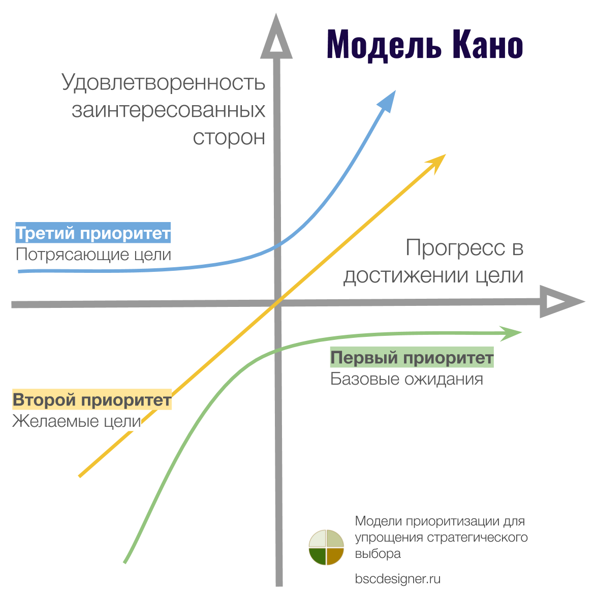
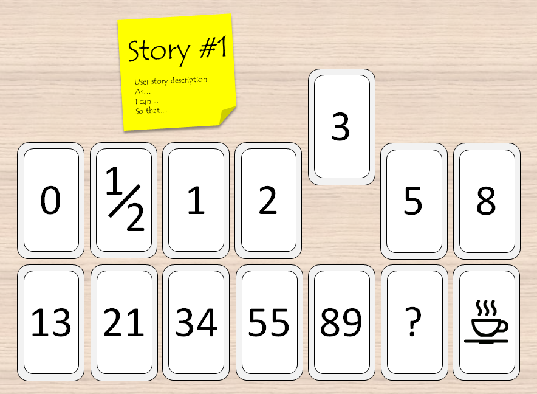
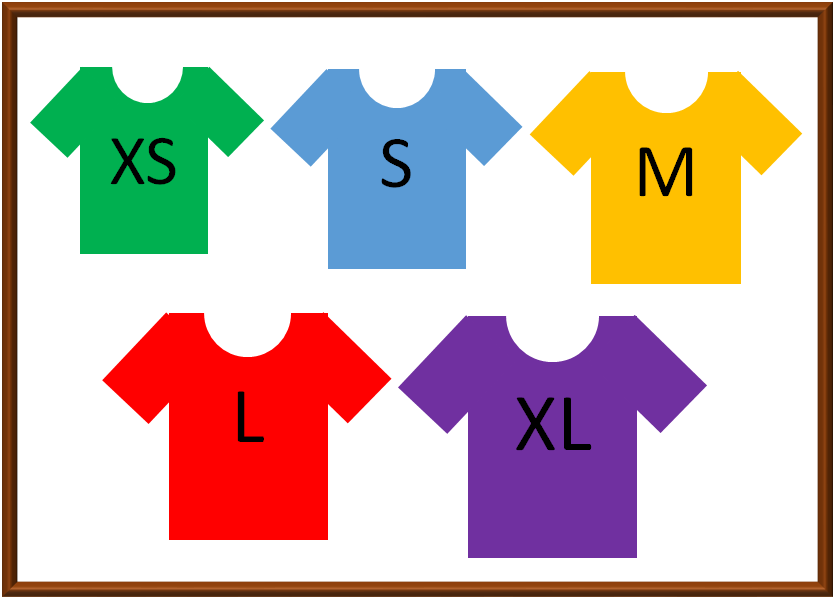
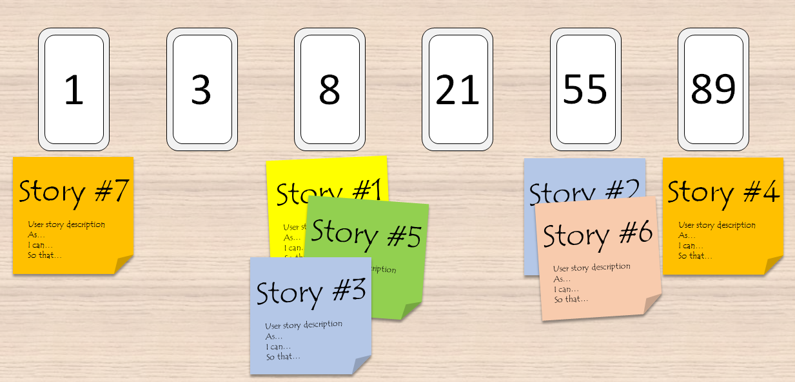
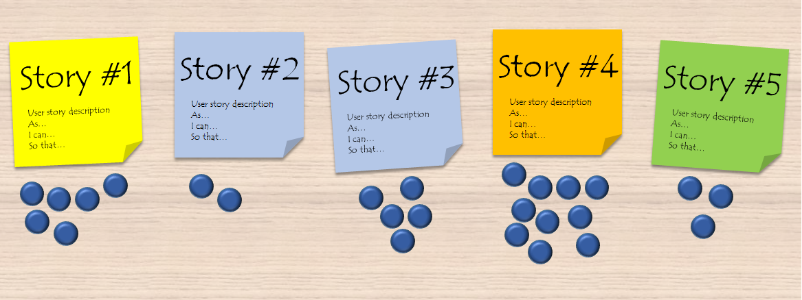

# Приоритизация и оценка задач

## Методы приоритизации

### MoSCoW
Метод приоритизации требований и задач. Аббревиатура делит всё на четыре категории:
* **M (Must-have)** — обязательно должно быть сделано (критично для релиза).
* **S (Should-have)** — должно быть сделано (важно, но есть обходные пути).
* **C (Could-have)** — могло бы быть сделано (желательно, если останется время).
* **W (Won't-have)** — не будет сделано (не входит в рамки текущего релиза/спринта).

### Модель Кано (Kano Model)
Помогает определить, какие функции продукта приносят наибольшую ценность. Основная идея: не все атрибуты одинаково влияют на удовлетворенность клиентов. 

Атрибуты делятся на 5 категорий:
1. **Базовые (Must-Be):** Воспринимаются как должное (например, безопасность). Их наличие не вызывает эйфории, но отсутствие приводит к резкому негативу.
2. **Линейные / Перформансеры (Performance):** Чем лучше реализовано, тем выше удовлетворенность. Отсутствие вызывает разочарование (например, скорость работы).
3. **Привлекательные (Attractive):** Неожиданные фичи, вызывающие восторг (wow-эффект). Если их нет, клиент не расстроится, так как не ожидал их.
4. **Индифферентные (Indifferent):** Никак не влияют на удовлетворенность (например, цвет невидимой детали).
5. **Обратные (Reverse):** Избыточные функции. Их наличие (или чрезмерная сложность) вызывает раздражение пользователей.

  
Показать матрицу модели Кано

  

### RICE и ICE
Фреймворки для приоритизации идей и фич на основе балльной оценки.

**RICE** включает 4 фактора:
* **Reach (Охват):** Какое количество пользователей затронет фича за определенный период.
* **Impact (Влияние):** Насколько сильно фича повлияет на пользователей или бизнес-метрики.
* **Confidence (Уверенность):** Насколько вы уверены в своих оценках (обычно в процентах), если нет точных данных.
* **Effort (Трудозатраты):** Оценка ресурсов на реализацию (в человеко-месяцах или часах).

  
Показать формулу RICE

  

**ICE** — это упрощенная вариация RICE, где охват не выделяют отдельно. Это актуально, когда фича нацелена на узкий, но критически важный сегмент пользователей (охват низкий, но влияние огромное). ICE = Impact × Confidence × Ease (Легкость реализации, обратная Effort).

  
Показать формулу ICE

  

---

## Методы оценки (Эстимации) задач

### Story Points (Стори Поинты)
Это не метод оценки, а **относительная единица измерения**. В Story Points оценивают не время (часы или дни), а совокупность сложности, объема работы и рисков. Это позволяет понять, насколько одна задача сложнее другой. Для оценок в SP чаще всего используется ряд Фибоначчи: 0, 1, 2, 3, 5, 8, 13, 21 и т.д.

Чтобы оценить задачи в Story Points, команды используют различные методы:

### 1. Planning Poker (Покер планирования)
Самая популярная техника. Участники используют карты с числами Фибоначчи для скрытого голосования за оценку User Story. Затем карты открываются одновременно. Если оценки сильно расходятся, команда обсуждает задачу и голосует заново, пока не придет к консенсусу.

  
Показать карты Planning Poker

  

### 2. T-Shirt Sizes (Размеры футболок)
Используются понятные размеры: XS, S, M, L, XL. Команда в ходе открытого обсуждения решает, к какому «размеру» отнести задачу. Отлично подходит для быстрой и грубой оценки крупных эпиков на ранних этапах.

  
Показать метод маек (T-Shirt Sizes)

  

### 3. Bucket System (Система ведерок)
Похожа на покер планирования, но быстрее для большого бэклога:
1. На столе (или виртуальной доске) выстраивается ряд «ведерок» (номиналы Фибоначчи).
2. Команда берет 3–5 случайных задач, обсуждает их и раскладывает по ведрам, создавая «эталоны» (шкалу).
3. Оставшиеся задачи делятся поровну между участниками.
4. Каждый молча раскидывает свои задачи по ведрам, ориентируясь на эталоны. Если кто-то сомневается, он передает карточку другому.

  
Показать систему ведерок (Bucket System)

  

### 4. Dot-voting (Голосование точками)
Используется для оценки или приоритизации:
1. Задачи выписываются на карточки.
2. Каждый участник получает одинаковое количество «точек» (стикеров/голосов).
3. Участники распределяют точки между задачами: чем сложнее задача (или чем она приоритетнее), тем больше точек ей ставят.
4. Задачи ранжируются по итоговому количеству точек.

  
Показать процесс Dot-voting

  

### 5. Big/Small/Uncertain (Большой/Малый/Неопределенный)
Упрощенная версия «Системы ведерок». Используется всего три корзины. Идеально для самого первого грубого просеивания бэклога, чтобы быстро отделить понятные и мелкие задачи от крупных и тех, которые требуют дополнительного исследования (Uncertain).

  
Показать схему Big/Small/Uncertain

  

