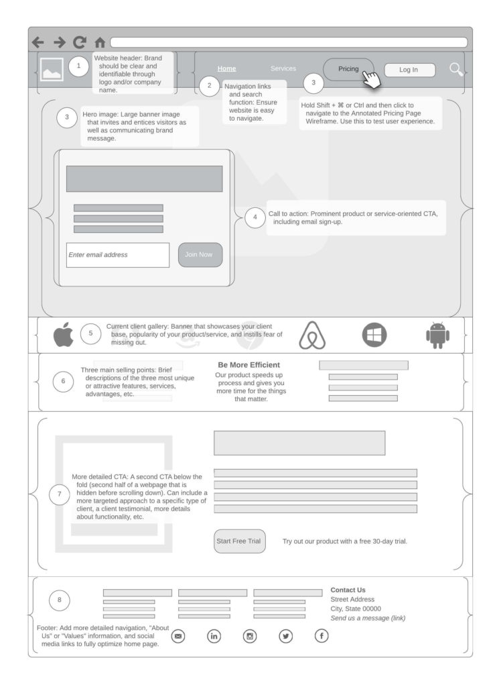
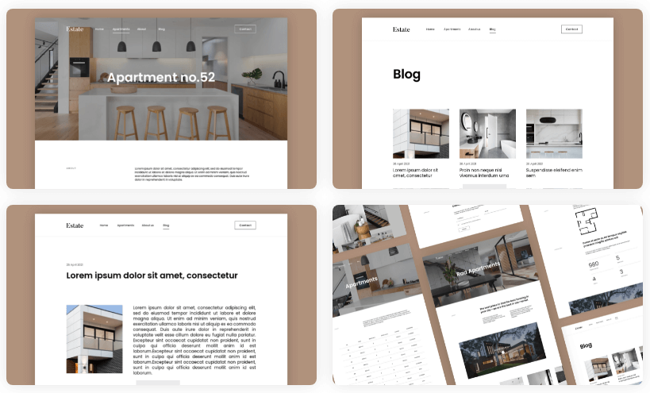
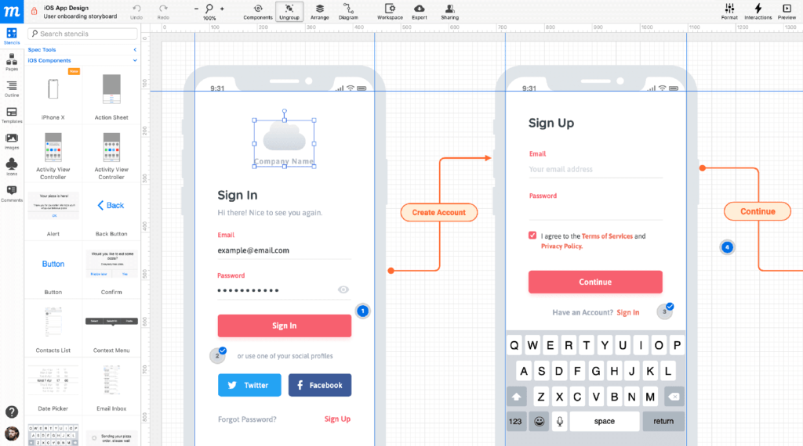

# 🎨 Прототипирование и визуализация интерфейсов

В процессе проектирования интерфейсов и согласования требований используются разные уровни визуализации. Важно понимать разницу между ними, чтобы говорить с дизайнерами, разработчиками и заказчиками на одном языке.

---

## 1. Скетч (Sketch)
Набросок от руки. Карандашом или пером, на доске или салфетке — не так важно. Дешево, быстро, сердито. 

В скетче можно наметить какие-то детали интерфейса или нарисовать креативную фишку сайта.

* **Зачем нужен:** Для быстрой передачи идеи из головы дизайнера/аналитика в головы окружающих. Чтобы зафиксировать и не потерять идею. Часто используется на брейнштормах: когда дело касается визуальных фишек, намного проще сделать набросок карандашом, чем объяснять идею на пальцах.
* ⚠️ **Важно:** Показывать скетч можно не всякому заказчику. Некоторые просто не поймут, что вы пытаетесь до них донести. Вы их только смутите и спровоцируете возражения по поводу и без. В таком случае лучше сразу перейти к вайрфрейму или прототипу.

---

## 2. Вайрфрейм (Wireframe)
Черно-белый подробный план страницы сайта. Здесь намечается расположение элементов: кнопок, изображений, текстов.

Вайрфрейм можно сравнить с планом здания — на него будут ориентироваться при постройке (в нашем случае — при разработке сайта или приложения), но «жить» в нем невозможно. Никаких реальных функций сайта он не выполняет. Результаты взаимодействий, фишки, анимации нужно описывать дополнительно в комментариях.

* **Зачем нужен:** Чтобы определить, где какой контент будет находиться. Вайрфрейм и комментарии к нему можно использовать для составления Технического задания (ТЗ) для разработчиков.

  
Показать пример вайрфрейма

  

---

## 3. Мокап (Mockup)
Красивый, детализированный вариант вайрфрейма. Тут уже появляются цвета, подбираются изображения, продумывается типографика. Получается красивая картинка приложения или сайта.

*Есть версия, что более привычный синоним мокапа — макет. Но это не точно — помним, что у каждого свой вариант определения в зависимости от компании.*

* **Зачем нужен:** Чтобы создать стиль и настроение проекта. Продумать визуальные мелочи и окончательно согласовать внешний вид (UI) с заказчиком до начала верстки.

  
Показать пример мокапа

  

---

## 4. Прототип (Prototype)
Интерактивный вариант вайрфрейма или мокапа. Часто тоже черно-белый, но умеет намного больше. 

Повторяя аналогию с домом, прототип — это модель из картона и палок. Убогая, но действующая: если куда-то кликнуть, что-то откроется, как на настоящем сайте. На прототипе уже не нужны пометки, что и как работает. Чтобы понять это, нужно просто покликать по местам, к которым у вас есть вопросы.

* **Зачем нужен:** Чтобы согласовывать с заказчиком флоу (поведение), расположение блоков и кнопок, а также проводить юзабилити-тестирования на реальных пользователях. А еще по прототипу удобнее, чем по вайрфрейму, писать ТЗ.

  
Показать пример прототипа

  

