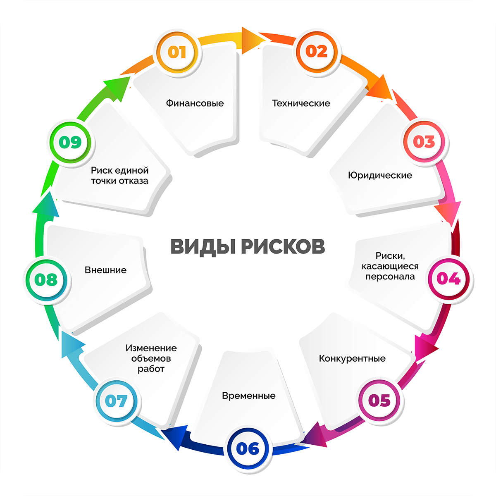

# ⚠️ Риски

**Риск** — это негативное событие, которое может произойти, а может и не произойти. Риски нужно отличать от проблем: риск станет проблемой, только если негативное событие произойдёт.

---

## 📊 Виды рисков по уровню

- **Низкий** — незначительное влияние на проект, маловероятен.
- **Средний** — ощутимое влияние, но управляемое.
- **Высокий** — критическое влияние, требует немедленного плана реагирования.

---

## 🗂️ Категории рисков

1. **Технические** — связаны с технологиями, архитектурой, производительностью, интеграцией, безопасностью.
2. **Бизнес-риски** — неверная оценка рынка, изменение требований заказчика, отсутствие спроса.
3. **Организационные** — нехватка ресурсов, уход ключевых сотрудников, конфликты, недостаток компетенций.
4. **Внешние** — изменения законодательства, экономическая ситуация, форс-мажоры.

---

## 🔄 Процесс управления рисками

1. **Идентификация** — выявление и описание всех возможных рисков.
2. **Анализ** — оценка вероятности и потенциального влияния (часто используется матрица рисков).
3. **Планирование реагирования** — выбор стратегии и действий для каждого риска.
4. **Мониторинг и контроль** — отслеживание статуса рисков, корректировка планов.

---

## 📈 Матрица вероятности и влияния

| Вероятность \ Влияние | Низкое | Среднее | Высокое |
|------------------------|--------|---------|---------|
| **Высокая** | Средний | Высокий | Критический |
| **Средняя** | Низкий | Средний | Высокий |
| **Низкая** | Минимальный | Низкий | Средний |

---

## 🛡️ Стратегии реагирования на риски

- **Избегание** — изменить план, чтобы полностью исключить риск.
- **Передача** — перенести ответственность на третью сторону (страхование, аутсорсинг).
- **Снижение** — уменьшить вероятность или последствия (дополнительное тестирование, резервирование).
- **Принятие** — осознанно принять риск и разработать план действий на случай его реализации.

---

## 📌 Примеры рисков в IT-проектах

- Технология выбрана без достаточного опыта команды.
- Заказчик меняет требования на поздних этапах.
- Ключевой разработчик покидает проект.
- Интеграция с внешним сервисом задерживается из-за недоступности API.
- Нагрузка на систему превышает расчётную.

---

## 👥 Роль аналитика в управлении рисками

- Выявлять и документировать риски на этапе сбора и анализа требований.
- Оценивать влияние рисков на функциональные и нефункциональные требования.
- Фиксировать риски в документах (Vision & Scope, спецификации, план проекта).
- Предлагать меры по снижению рисков и отслеживать их исполнение.
- Коммуницировать риски команде и заинтересованным лицам.

