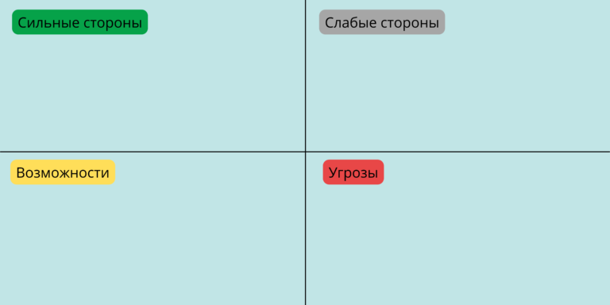

# 📊 SWOT-анализ

**SWOT-анализ** — это метод стратегического планирования, который помогает оценить перспективы развития компании, продукта или проекта. Суть метода заключается в разделении факторов на внутренние (те, на которые компания может повлиять) и внешние (те, что происходят на рынке и от компании не зависят).

---

## 🧩 Четыре элемента SWOT

| Факторы | Благоприятные (Помогают достичь цели) | Неблагоприятные (Мешают достичь цели) |
| :--- | :--- | :--- |
| **Внутренние** *(Внутри компании)* | **S — Strengths (Сильные стороны)** Уникальные характеристики, преимущества и ресурсы, которые отличают компанию от конкурентов. | **W — Weaknesses (Слабые стороны)** Недостатки, ограничения, слабые места продукта или нехватка ресурсов. |
| **Внешние** *(На рынке)* | **O — Opportunities (Возможности)** Факторы и тренды во внешней среде, которые создают условия для роста и развития. | **T — Threats (Угрозы)** Внешние риски, форс-мажоры и изменения на рынке, способные навредить бизнесу. |

---

## 🔍 Вопросы для проработки матрицы

Чтобы качественно заполнить матрицу, команде или аналитику необходимо ответить на ключевые вопросы по каждому квадранту:

### 💪 Сильные стороны (Strengths)
* Какие конкурентные преимущества есть у компании или продукта?
* Какие уникальные методики, технологии или ресурсы используются в работе?
* Какие бизнес-процессы внутри команды считаются наиболее успешными?
* Как компания привлекает клиентов и почему они выбирают именно нас?

### ⚠️ Слабые стороны (Weaknesses)
* В чем конкуренты объективно сильнее нас?
* Что именно клиентам не нравится в текущих продуктах или услугах?
* Какие внутренние процессы требуют улучшения или автоматизации?
* Теряет ли компания сотрудников и каких ресурсов (людских, финансовых) сейчас не хватает?
* Что сильнее всего тормозит развитие бизнеса?

### 🚀 Возможности (Opportunities)
* Какие зарождающиеся тренды в индустрии можно использовать в свою пользу?
* Наблюдается ли рост спроса на наши услуги или продукты?
* Уходят ли с рынка крупные конкуренты, освобождая нишу?
* Появились ли новые технологии, которые упростят или удешевят производство?
* Есть ли возможность получить государственную поддержку или гранты?

### ⚡ Угрозы (Threats)
* Происходят ли критические изменения в индустрии или экономике страны?
* Появились ли новые законы и регуляторные правила, усложняющие работу?
* Какие новые или потенциальные конкуренты заходят на рынок?
* Наблюдается ли снижение интереса и платежеспособности клиентов?
* Появились ли на рынке более дешевые товары-заменители (суррогаты)?

---

## 📋 Пример: Базовая матрица 2х2 для студии танцев

Для проведения анализа чертится таблица, куда выписываются все найденные факторы.

| Сильные стороны (S) | Слабые стороны (W) |
| :--- | :--- |
| • Преподаватели пользуются уважением в проф. среде, на их мастер-классы приезжают из других городов. • Авторские курсы по развитию танцевальной пластики для любого уровня подготовки. • Помещение в Москве с хорошей транспортной доступностью и выгодными условиями аренды. | • Необходимость формировать совершенно новую команду для открытия филиала. • Недостаточно стабильная прибыль для быстрого развития нового филиала студии. • Маленький рекламный бюджет на продвижение новой локации. |
| **Возможности (O)** | **Угрозы (T)** |
| • В Москве проводится всё больше крупных тематических мероприятий. • Отсутствие сильных прямых конкурентов в нише танцевальной пластики. • Помещение, в котором будут проходить занятия, расположено в крупном жилом комплексе. | • Появление новых конкурентов, о стратегиях которых пока мало известно. • Сложности с поиском преподавателей: все сильные специалисты уже заняты. • Общее снижение уровня экономики и платежеспособности целевой аудитории. |

---

## 🔀 Перекрестная матрица решений (TOWS)

Заполнить базовую матрицу недостаточно. Главная ценность SWOT-анализа — **поиск взаимосвязей** между квадрантами для формирования стратегии. Для этого сопоставляют внутренние факторы с внешними.

| Сопоставление | Возможности (O) | Угрозы (T) |
| :--- | :--- | :--- |
| **Сильные стороны (S)** | **Комбинация S–O (Линия роста):**  *Как использовать силу для реализации возможностей?* 💡 **Пример:** Участие в крупных мероприятиях позволит расширить присутствие студии в танцевальном комьюнити Москвы, повысить известность преподавателей и укрепить их репутацию. | **Комбинация S–T (Линия защиты):**  *Как использовать силу для нейтрализации угроз?* 💡 **Пример:** Активно привлекать текущих авторитетных преподавателей к скаутингу и поиску новых кадров. Предлагать кандидатам помощь в подготовке их собственных авторских курсов. |
| **Слабые стороны (W)** | **Комбинация W–O (Линия исправления):**  *Как за счет возможностей преодолеть слабости?* 💡 **Пример:** Участие в городских мероприятиях не требует значительных бюджетов (решается проблема нехватки денег на рекламу), но отлично поможет повысить узнаваемость студии и привлечь клиентов. | **Комбинация W–T (Линия выживания):**  *Как минимизировать слабости, чтобы не попасть под удар угроз?* 💡 **Пример:** Из-за нестабильной прибыли у студии нет возможности предложить новым преподавателям высокую фиксированную зарплату на старте. Нужно разрабатывать гибкую систему мотивации (% от пришедших учеников). |
