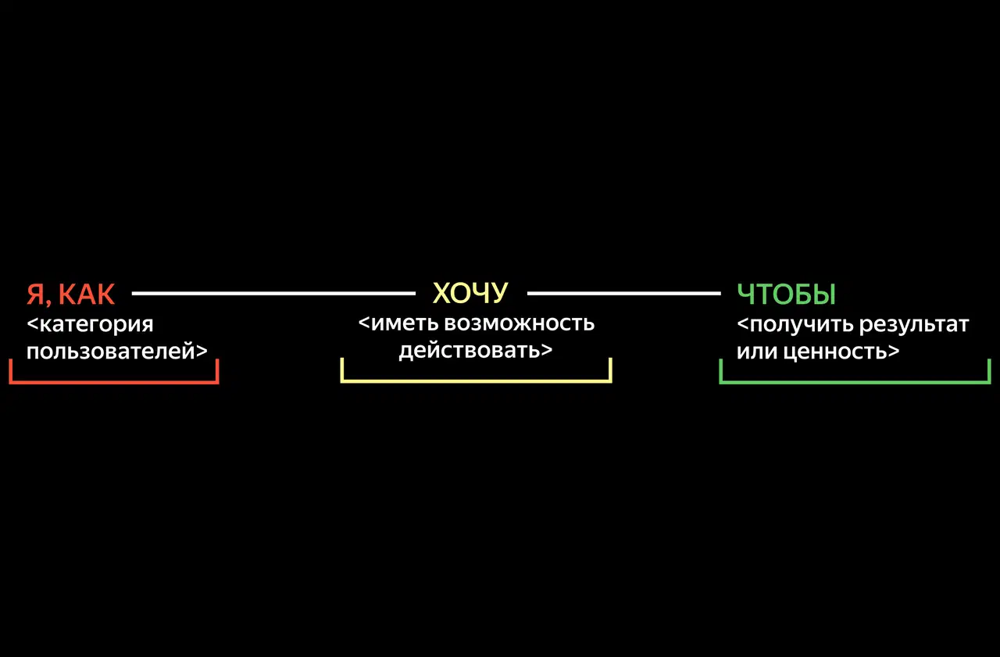
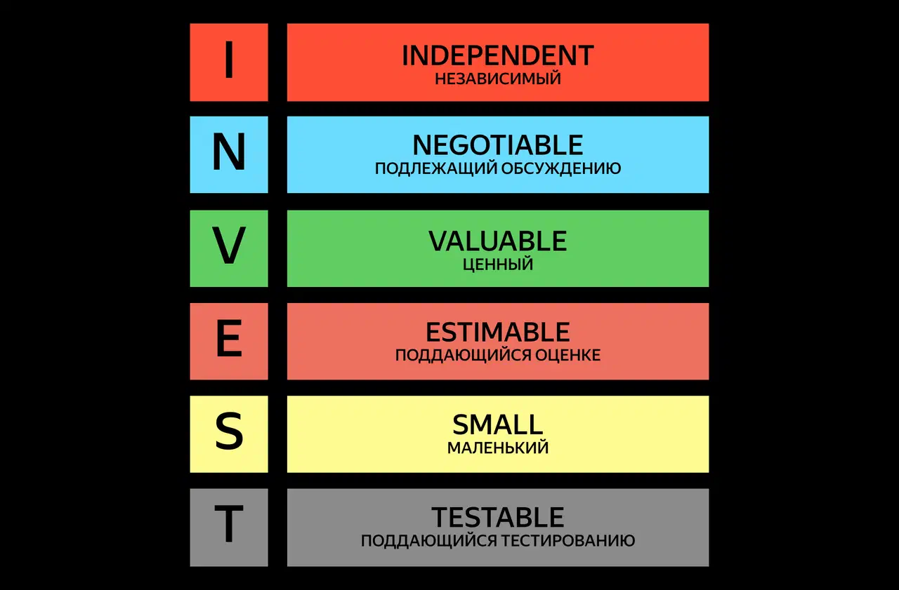
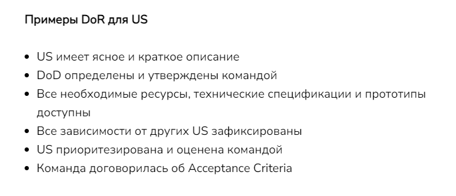
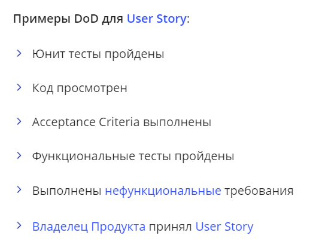

# 👤 User Story (Пользовательская история)

**User Story** помогает увидеть функции продукта глазами конечного потребителя. Основную часть истории пишут кратко, без технических деталей и лишних подробностей. Главное — сделать фокус на целях и потребностях людей.

В основной части User Story обычно указывают:
1. **Кто?** — Категорию/роль пользователя.
2. **Что?** — Действие, которое он хочет совершить.
3. **Зачем?** — Результат (ценность), который ожидает получить пользователь.

> **Шаблон:** Как `[тип пользователя]`, я хочу `[действие]`, чтобы `[ценность/результат]`.



### Плюсы и минусы формата
* **Преимущества:** Простота и краткость, жесткий фокус на пользователе, гибкость (истории легко менять или добавлять в ходе разработки).
* **Недостатки:** Отсутствие технических деталей (описывается "что", а не "как"), не всегда подходит для описания сложной системной логики или алгоритмов.

### Отличие от Use Case
User Story сосредоточена на том, **что** пользователь хочет получить и зачем. 
Use Case (сценарий использования) — это детальное пошаговое описание того, **как** система и пользователь взаимодействуют друг с другом для достижения цели.

> 💡 **Можно ли использовать User Story для нефункциональных требований (NFR)?**
> Да, допускается. Однако часто NFR удобнее выносить в критерии приёмки или отдельные технические таски.

---

## 📏 Критерии INVEST

Чтобы пользовательская история была качественной, она должна соответствовать шести критериям INVEST:



* **Independent (Независимая):** В истории описывается функция, которая решает проблему пользователя без обязательной привязки к другим инструментам. Историю можно разработать и протестировать самостоятельно.
* **Negotiable (Обсуждаемая):** User Story — это приглашение к диалогу. Её обязательно обсуждают в команде, чтобы разработчики поняли контекст. (После финального обсуждения история фиксируется).
* **Valuable (Ценная):** Функция должна нести реальную, ощутимую пользу для конечного потребителя или бизнеса.
* **Estimable (Оцениваемая):** Команда должна понимать её сложность, чтобы оценить сроки, стори-поинты и ресурсы на разработку.
* **Small (Компактная):** История должна быть краткой и ёмкой. Слишком большие истории (Epic) сложнее оценить, их необходимо делить на мелкие.
* **Testable (Тестируемая):** Должно быть понятно, как проверить успешность выполнения задачи. Для этого пишутся чёткие критерии приёмки.

---

## ✅ Критерии приёмки (Acceptance Criteria)

Критерии приёмки — это условия, которые должны быть выполнены, чтобы история считалась завершённой. Это требования к системе, которые помогают разработчикам и QA создавать и проверять нужные функции.

**Пример из жизни:** *User Story:* «Из-за работы я постоянно в разъездах. Как хозяин кота, я хочу иметь приложение, которое позволит видеть моего питомца, чтобы я мог убедиться, что он выглядит счастливым и здоровым».

Описывать критерии приёмки можно двумя основными способами:

### Способ 1. Bullet points (Маркированный список)
* **Плюсы:** Пишется просто и быстро. Можно держать функциональные и нефункциональные требования в одном месте.
* **Минусы:** Менее структурирован, может трактоваться двояко.

**Пример:**
> **US2:** Как Пользователь, я хочу видеть ближайшие ко мне парковки, чтобы быстро найти место без переключения на карту.
> **Acceptance Criteria:**
> * AC2.1: Система должна сортировать парковки по расстоянию (от 0 до 9).
> * AC2.2: Пользователь может выбрать опции сортировки: «По популярности», «По расстоянию», «По цене».
> * AC2.3: Система должна применять сортировку менее чем за 2 секунды (NFR).

### Способ 2. Язык Gherkin (BDD)
* **Плюсы:** Строго структурированная информация. Является готовым тест-кейсом и основой для автотестов.
* **Минусы:** Нефункциональные требования (например, время отклика) плохо ложатся в этот формат, их лучше выносить отдельно.

**Пример:**
```gherkin
Given user sees the list of parking structures for their current location
When user clicks on the "Sort by" text
Then application shows next options: "Most popular", "Distance", "Price"

Given user sees next options of sorting available to select: "Most popular", "Distance", "Price"
When user clicks on the "Distance" option
Then application sorts parking structures based on the direction 0-9
And it takes no longer than 2 seconds to do the sorting
```

## 🏁 DoR и DoD (Готовность и Завершённость)

В гибких методологиях (Agile/Scrum) для управления качеством задач и снижения рисков используют два важных чек-листа: **Definition of Ready (DoR)** и **Definition of Done (DoD)**. Они помогают команде одинаково понимать, когда задачу можно брать в работу, а когда — считать полностью выполненной.

### Definition of Ready (DoR) — Критерии готовности к разработке
Это чек-лист, который проверяет, достаточно ли проработана User Story (или задача), чтобы команда могла взять её в спринт. Если задача не соответствует DoR, брать её в разработку нельзя — это приведёт к блокировкам и срыву сроков.

**Типичные критерии DoR:**
* 📝 **Понятность:** User Story написана понятно, определена ценность для пользователя.
* ✅ **Критерии приёмки:** Acceptance Criteria (AC) прописаны, однозначны и покрывают все основные сценарии.
* 🎨 **Дизайн:** Макеты, вайрфреймы или прототипы (если нужны) готовы и прикреплены к задаче.
* 📏 **Оценка:** Задача оценена командой (например, в Story Points или часах) и помещается в один спринт.
* 🔗 **Зависимости:** Все внешние зависимости (доступы, готовность API от смежных команд) разрешены.



### Definition of Done (DoD) — Критерии завершённости
Это чек-лист, который подтверждает, что инкремент (результат работы по User Story) полностью готов и его можно передавать пользователям. Пока не выполнены все пункты DoD, задача не считается завершённой, даже если код уже написан.

**Типичные критерии DoD:**
* 💻 **Код:** Код написан, проверен другим разработчиком (Code Review) и влит в основную ветку.
* 🎯 **Соответствие требованиям:** Все Критерии приёмки (AC) выполнены.
* 🧪 **Тестирование:** Написаны и успешно пройдены Unit-тесты. QA-инженер провел ручное или автоматизированное тестирование.
* 🐛 **Отсутствие багов:** Нет критических и блокирующих дефектов.
* 📚 **Документация:** Обновлена техническая документация (API, схемы) и пользовательские инструкции.
* 🚀 **Релиз:** Фича успешно развернута на тестовом (Staging) или продуктовом (Production) стенде.


