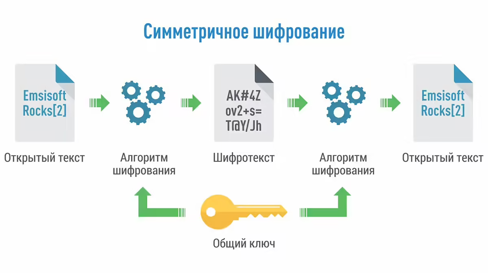
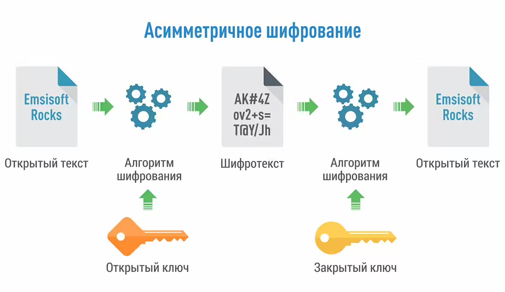

# 🔐 Шифрование (Симметричное и Асимметричное)

**Шифрование** — это обратимый процесс преобразования информации с использованием математического алгоритма и специального ключа (пароля), делающий её нечитаемой для посторонних. В системном анализе и проектировании API критически важно понимать разницу между двумя основными подходами: симметричным и асимметричным шифрованием.

---

## 💡 Шпаргалка для собеседования (Блиц-опрос)

**1. В чем главная разница между симметричным и асимметричным шифрованием?**
В количестве ключей. Симметричное использует **один и тот же ключ** для зашифровки и расшифровки. Асимметричное использует **пару ключей**: то, что зашифровано одним, можно расшифровать только другим.

**2. В чем главная уязвимость симметричного шифрования?**
Проблема передачи ключа. Если Алиса хочет безопасно общаться с Бобом через симметричное шифрование, ей нужно как-то передать ему пароль. Если хакер перехватит пароль в момент передачи, вся безопасность рухнет.

**3. Как они используются вместе на практике (например, в HTTPS/SSL)?**
Асимметричное шифрование очень надежное, но **медленное**. Симметричное — **быстрое**. Поэтому в протоколе SSL они работают в паре: 
1. Клиент и сервер используют *асимметричное* шифрование только для того, чтобы безопасно передать друг другу один общий секретный пароль (сессионный ключ).
2. Как только этот пароль безопасно передан, они переключаются на *симметричное* шифрование для быстрой передачи самого трафика.

---

## 🔄 Симметричное шифрование

Для работы применяется всего **один секретный ключ** (пароль). 

**Как это работает:**
1. На вход математического алгоритма подаётся исходный текст и секретный пароль.
2. На выходе получаем нечитаемый зашифрованный текст.
3. Для получения исходного текста получатель применяет ровно тот же самый пароль к алгоритму дешифрования.

**Особенности:**
*   **Пример стандарта:** AES (Advanced Encryption Standard).
*   **Плюсы:** Работает очень быстро, потребляет мало вычислительных ресурсов.
*   **Минусы:** Безопасность криптосистемы полностью зависит от сохранности одного пароля. Основная сложность — безопасная передача этого пароля между участниками системы.

---

## 🔀 Асимметричное шифрование

Здесь применяется связка из **двух ключей**: 
*   **Публичный (Открытый):** Свободно передается по сети всем желающим.
*   **Секретный (Закрытый):** Никому не передается и надежно хранится на сервере-владельце.

**Как это работает:**
Сообщение, зашифрованное публичным ключом, можно расшифровать **только** соответствующим ему приватным ключом (и наоборот). По сути и значимости они равноценны. 
Если клиент хочет отправить серверу секретные данные, он шифрует их публичным ключом сервера. Даже если хакер перехватит это сообщение (и сам публичный ключ), он не сможет его прочитать, так как для расшифровки нужен приватный ключ, который сервер никому не передавал.

**Особенности:**
*   **Пример алгоритма:** RSA (Rivest, Shamir, Adleman).
*   **Плюсы:** Решает проблему безопасного обмена ключами. Хранить пароли проще (секретный ключ не покидает сервер). В случае компрометации сервер просто генерирует новую пару и рассылает новый публичный ключ.
*   **Минусы:** Работает значительно медленнее симметричного шифрования из-за сложных математических вычислений.

*   ---

## ✍️ Электронная подпись и подписание запросов (API)

Важно понимать базовое отличие: **шифрование** скрывает информацию от чужих глаз, а **электронная подпись** гарантирует, что информацию отправил конкретный человек/система и она не была изменена в пути. Данные при этом могут передаваться в открытом виде.

### 1. Как работает электронная подпись (ЭЦП)
ЭЦП базируется на **асимметричном шифровании**, но алгоритм применяется «наоборот»:
1.  Система берет исходный документ и вычисляет его **хэш** (уникальную строку фиксированной длины).
2.  Отправитель шифрует этот хэш своим **закрытым (приватным) ключом**. Это зашифрованное значение и есть ЭЦП.
3.  Получатель расшифровывает ЭЦП с помощью **публичного (открытого) ключа** отправителя и получает оригинальный хэш.
4.  Затем получатель сам вычисляет хэш присланного документа и сравнивает его с расшифрованным. Если они совпадают — всё отлично.

**Что это дает бизнесу (свойства ЭЦП):**
*   **Целостность:** Если хакер поменяет в перехваченном документе хотя бы одну букву (или сумму платежа), хэш изменится, и подпись станет недействительной.
*   **Неотрекаемость:** Так как закрытый ключ есть только у отправителя, он не сможет заявить: «Я этого не отправлял».
*   **Аутентификация:** Мы точно знаем, кто автор сообщения.

---
