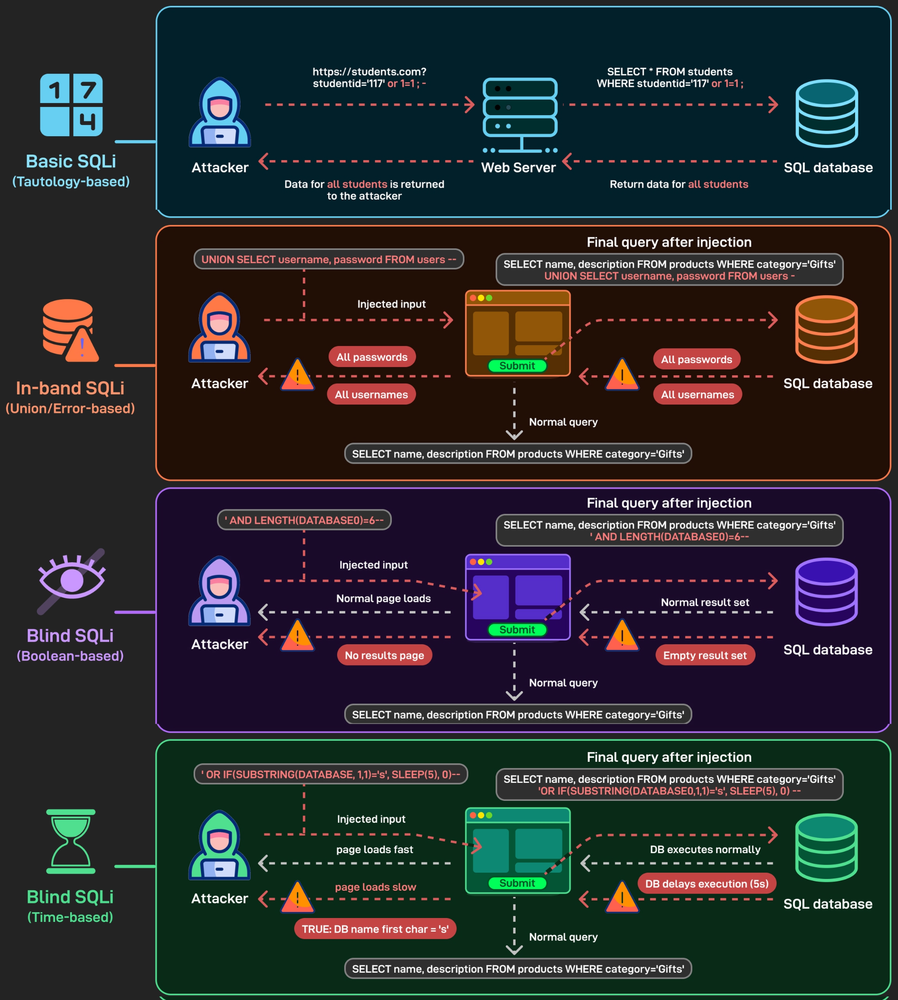
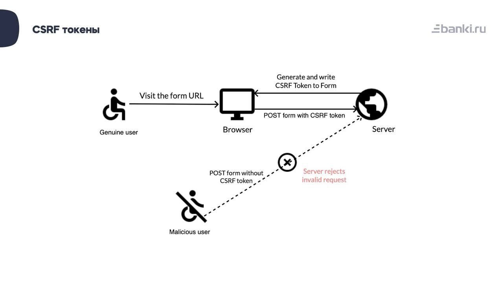
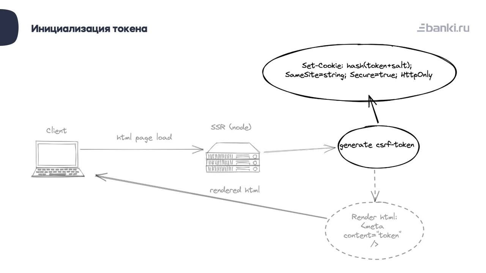
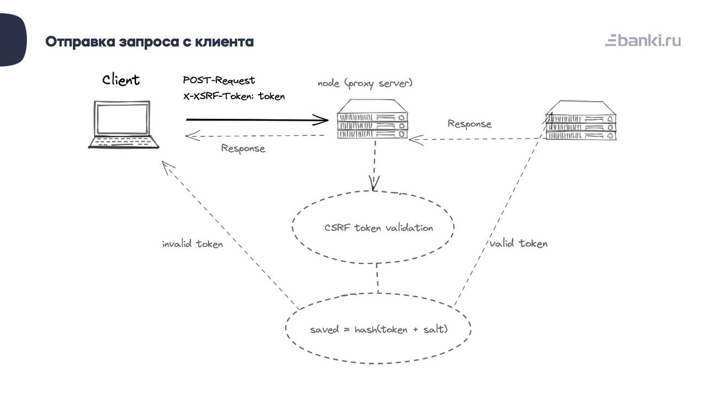
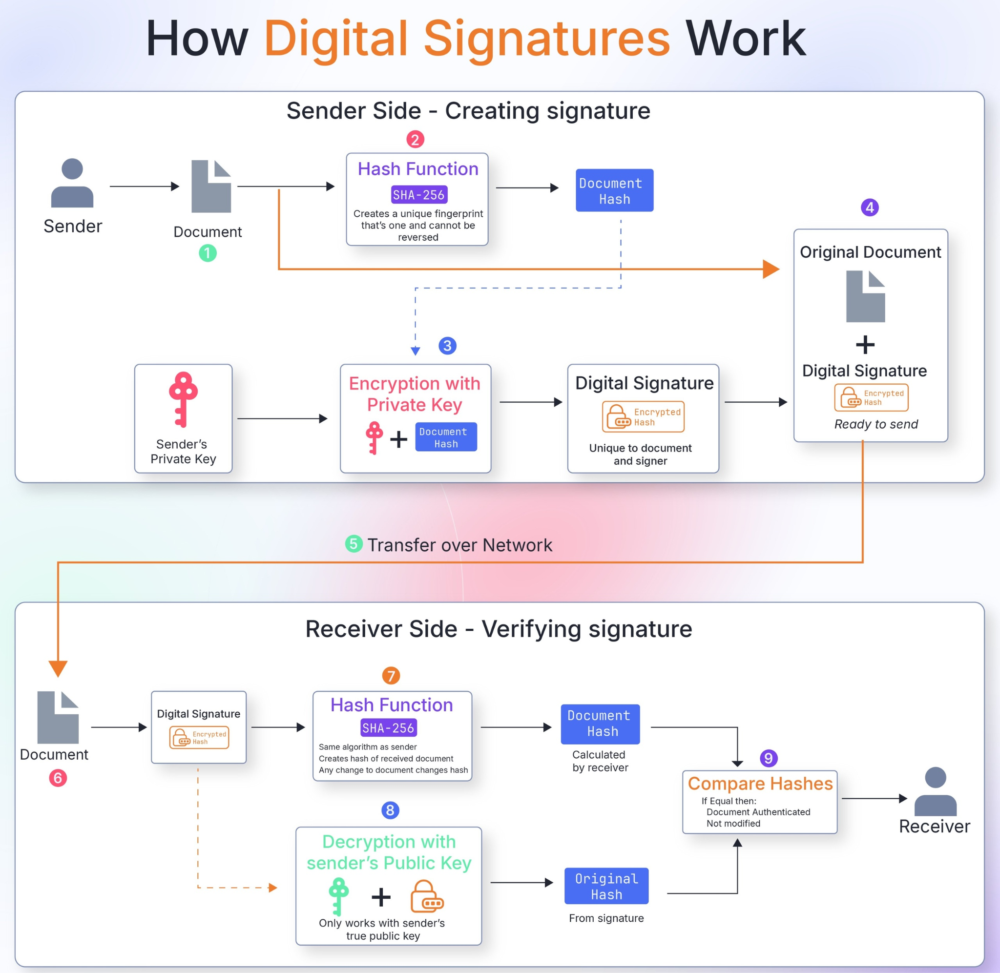

## 💉 SQL-инъекция (SQLi)

**SQL-инъекция (SQLi)** — это критическая уязвимость веб-безопасности, которая позволяет злоумышленнику вмешиваться в запросы, которые приложение делает к своей базе данных. 

Как правило, это позволяет злоумышленнику просматривать данные, которые он обычно не может получить (данные других пользователей или системную информацию). Во многих случаях хакер может изменять или удалять эти данные, вызывая необратимые изменения в содержимом или поведении приложения.

### Распространенные сценарии SQL-инъекций:
1.  **Получение скрытых данных:** Изменение SQL-запроса с целью возврата дополнительных результатов.
2.  **Подрыв логики приложения:** Вмешательство в логику запроса (например, обход проверки пароля).
3.  **Атаки UNION:** Использование оператора `UNION` для извлечения данных из совершенно других таблиц базы данных.
4.  **Изучение базы данных:** Получение информации о версии СУБД, названиях таблиц и структуре базы данных.
5.  **Слепая SQL-инъекция (Blind SQLi):** Результаты контролируемого запроса не возвращаются на экран прямо, но злоумышленник делает выводы по косвенным признакам (например, по времени ответа сервера).

### Пример атаки:
Злоумышленник может «закомментировать» часть оригинального кода через ввод в поле поиска.
**Было (задумка разработчика):**
```sql
SELECT * FROM products WHERE category = 'Gifts' AND released = 1
```
**Стало (после инъекции `Gifts'--`):**
```sql
SELECT * FROM products WHERE category = 'Gifts'--' AND released = 1
```
Символы `--` превращают остаток строки в комментарий. В итоге база данных игнорирует условие `AND released = 1`, возвращая даже скрытые или неопубликованные товары.

> **💡 Как защититься:** Основной метод защиты на стороне бэкенда — использование **параметризованных запросов (Prepared Statements)** или ORM, где пользовательский ввод передается как безопасный параметр, а не склеивается со строкой запроса напрямую.



---

## 🦠 XSS (Cross-Site Scripting)

**XSS (Межсайтовый скриптинг)** — это тип уязвимости, позволяющий внедрить вредоносный клиентский скрипт (эксплойт, обычно на JavaScript) на страницу приложения. В результате у пользователей, посещающих эту страницу, могут украсть чувствительные данные: cookies, сессионные токены, логины с паролями и личную информацию.

Внедрить эксплойт можно различными способами, например, оставив комментарий с JS-кодом под товаром. Если разработчики не позаботились о валидации и экранировании данных, вредоносный скрипт запустится в браузере у всех пользователей, открывших страницу.

### Виды XSS-атак:
*   **Хранимая (Stored XSS):** Скрипт навсегда сохраняется на сервере (например, в базе данных комментариев) и выполняется каждый раз, когда кто-то открывает зараженную страницу.
*   **Отраженная (Reflected XSS):** Скрипт передается через URL (например, в параметре поиска) и отражается сервером обратно на страницу жертвы в виде ответа.
*   **DOM-based XSS:** Уязвимость находится исключительно на стороне клиента (во фронтенде). Скрипт выполняется из-за небезопасного изменения DOM-дерева страницы.

### Современные механизмы защиты в браузерах:
В современных фреймворках (React, Angular) данные экранируются автоматически. Дополнительно браузеры используют следующие механизмы:
*   **SOP (Same-Origin Policy):** Политика безопасности, запрещающая скриптам с одного домена (Origin) получать доступ к данным пользователя (например, содержимому iframe или ответам API) от другого домена.
*   **CSP (Content Security Policy):** Политика, позволяющая серверу передать браузеру список доверенных источников скриптов. Любые скрипты (в том числе встроенные инлайн) из недоверенных источников будут просто проигнорированы.
*   **Валидация и экранирование:** Перевод спецсимволов (таких как `<` и `>`) в безопасные HTML-сущности (`&lt;` и `&gt;`).

---

## 🎭 CSRF (Cross-Site Request Forgery)

**CSRF (Подделка межсайтовых запросов, также XSRF)** — опаснейшая атака, при которой хакер заставляет браузер авторизованного пользователя выполнить нежелательные действия на целевом сайте от его имени. 

Это может быть отправка сообщений, перевод денег со счёта на счёт или смена паролей.

### «Классический» сценарий атаки:
1.  Пользователь Вася залогинен на сайте банка/почты (допустим, `mail.com`). У него есть активная сессия в браузере (сохранены cookies).
2.  Вася случайно попадает на «злую страницу» хакера (перейдя по ссылке из письма или кликнув на баннер).
3.  На злой странице скрыта HTML-форма:
    ```html
    <form action="[http://mail.com/send](http://mail.com/send)" method="POST">
      <input type="hidden" name="message" value="Вредоносное сообщение">
    </form>
    ```
4.  При заходе на страницу JavaScript хакера автоматически вызывает `form.submit()`, отправляя форму на `mail.com`.
5.  Сайт `mail.com` получает запрос, браузер Васи **автоматически прикрепляет к запросу его cookies**. Сервер видит, что посетитель авторизован, и выполняет действие от имени Васи.



---

## 🛡️ Защита: CSRF-токены

Для предотвращения таких атак используются **CSRF-токены** (Anti-CSRF).

Это уникальные криптографические данные, которые сервер отправляет браузеру. При выполнении любого действия (POST/PUT/DELETE) браузер обязан вернуть этот токен обратно. Если токены совпадают, запрос действителен. Хакер на «злой странице» не может прочитать этот токен из-за политики SOP, поэтому его поддельный запрос будет отклонен.




### Требования к надежному токену:
1.  Имеет конечное время жизни.
2.  Генерируется с использованием криптографически стойкого генератора псевдослучайных чисел.
3.  Имеет достаточную длину, чтобы быть устойчивым к брутфорсу (перебору).
4.  В идеале — используется только один раз (на одну сессию или запрос).



### Double Submit Cookie (Двойная отправка)
Также популярен метод использования двух токенов (Double Submit Cookie). Сервер генерирует токен и помещает его значение сразу в два места:
1.  В сессионные cookies (которые браузер отправляет автоматически).
2.  В тело ответа (например, скрытое поле формы или мета-тег), чтобы фронтенд мог считать его и добавить в заголовки запроса (например, `X-CSRF-Token`).

Получая запрос, сервер проверяет совпадение токена из cookies с токеном из заголовка. Такую защиту намного сложнее преодолеть, так как хакер не может ни прочитать cookie, ни записать свой токен в чужой домен.
