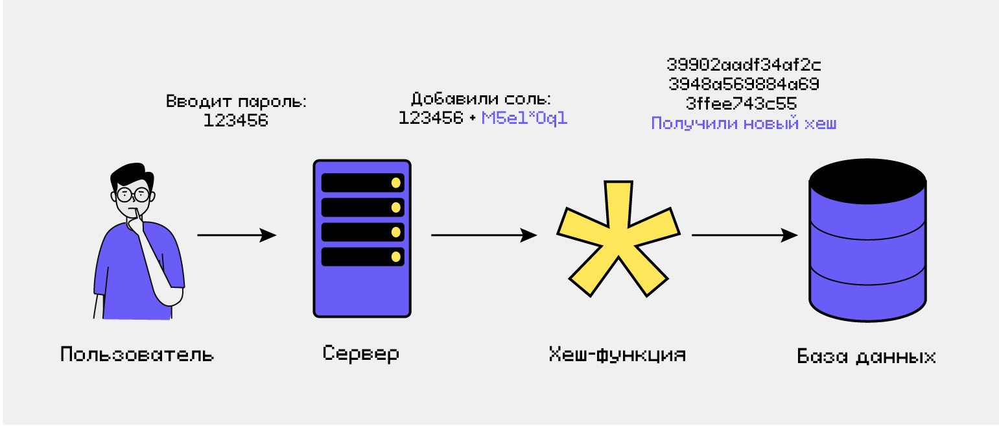

# 🔐 Хеширование

**Хеширование** — преобразование входных данных произвольной длины в строку фиксированного размера (хеш-сумму, дайджест). Хеш-функция работает как «цифровой отпечаток» данных: даже небольшое изменение входных данных кардинально меняет результат.

---

## 🔑 Свойства криптографических хеш-функций

Хорошая хеш-функция должна обладать следующими свойствами:

- **Детерминированность** — одинаковые входные данные всегда дают одинаковый хеш.
- **Быстрота вычисления** — хеш должен вычисляться быстро для любых данных.
- **Лавинный эффект** — малейшее изменение входа (например, один бит) приводит к полностью другому хешу.
- **Необратимость (однонаправленность)** — из хеша невозможно восстановить исходные данные.
- **Устойчивость к коллизиям** — вычислительно невозможно найти два разных сообщения с одинаковым хешем.
- **Стойкость к поиску прообраза** — по заданному хешу нельзя найти сообщение, которое его породило.

---

## ⚙️ Где применяется хеширование

- **Хранение паролей** — в базе хранятся не сами пароли, а их хеши. При входе система хеширует введённый пароль и сравнивает с сохранённым хешем.
- **Контроль целостности данных** — хеш-суммы файлов позволяют проверить, не был ли файл изменён или повреждён (например, при загрузке ISO-образов, в системах контроля версий).
- **Цифровые подписи** — подписывается не сам документ, а его хеш, что уменьшает объём вычислений.
- **Блокчейн** — каждый блок содержит хеш предыдущего блока, что обеспечивает неизменность цепочки.
- **Дедупликация** — одинаковые файлы имеют одинаковый хеш, поэтому можно избежать дублирования данных.

---

## 🧂 Соль (Salt) и защита паролей

**Соль** — случайная строка, добавляемая к паролю перед хешированием. Она делает каждый хеш уникальным, даже если два пользователя выбрали одинаковый пароль. Соль хранится в открытом виде вместе с хешем.

**Зачем нужна соль:**
- Предотвращает атаки по радужным таблицам (готовым словарям хешей популярных паролей).
- Затрудняет подбор пароля перебором, так как для каждого пароля требуется отдельный расчёт.

**Рекомендация:** никогда не храните пароли в открытом виде или с использованием быстрых хеш-функций (MD5, SHA-1). Всегда применяйте специализированные медленные алгоритмы с солью (bcrypt, Argon2).

---

## 🆚 Хеширование vs Шифрование

| Характеристика | Хеширование | Шифрование |
|----------------|-------------|------------|
| **Обратимость** | Необратимо (одностороннее) | Обратимо (двустороннее) |
| **Ключ** | Не требуется | Требуется ключ для расшифровки |
| **Длина результата** | Фиксированная | Зависит от длины исходных данных |
| **Цель** | Проверка целостности, хранение паролей | Конфиденциальность данных |

*Простыми словами:* шифрование — это сейф, который можно открыть ключом; хеширование — это мясорубка: обратно фарш в кусок мяса не превратить.

---

## 📊 Популярные алгоритмы хеширования

| Алгоритм | Размер хеша (бит) | Статус | Применение |
|----------|-------------------|--------|------------|
| **MD5** | 128 | Скомпрометирован, не использовать | Устаревший, коллизии найдены |
| **SHA-1** | 160 | Скомпрометирован, не использовать | Ранее применялся в TLS, Git |
| **SHA-256** | 256 | Безопасен | Цифровые подписи, блокчейн |
| **SHA-3** | 224/256/384/512 | Безопасен | Новый стандарт, альтернатива SHA-2 |
| **bcrypt** | 184 (с солью) | Безопасен | Хранение паролей |
| **Argon2** | настраиваемый | Победитель конкурса Password Hashing | Хранение паролей (рекомендован) |

**Важно для собеседования:** для паролей используйте **bcrypt** или **Argon2** с настраиваемой стоимостью (work factor), чтобы замедлить перебор. Для контроля целостности — **SHA-256** или **SHA-3**.

---

## 💻 Пример работы хеш-функции

Возьмём строку «hello» и вычислим её SHA-256 хеш: 2cf24dba5fb0a30e26e83b2ac5b9e29e1b161e5c1fa7425e73043362938b9824

## ❓ Типичные вопросы с собеседований

- **Что такое хеш-функция?** — функция, преобразующая данные в строку фиксированной длины, обладающая свойствами детерминированности, необратимости и устойчивости к коллизиям.
- **Чем хеширование отличается от шифрования?** — хеширование необратимо, шифрование обратимо с ключом.
- **Зачем нужна соль?** — для защиты от радужных таблиц и уникальности хешей одинаковых паролей.
- **Какой алгоритм выбрать для хранения паролей?** — bcrypt или Argon2, так как они медленные и устойчивы к перебору.
- **Что такое коллизия?** — ситуация, когда два разных сообщения дают одинаковый хеш. Криптографические хеш-функции должны минимизировать вероятность коллизий.
- **Почему MD5 и SHA-1 больше не используют?** — для них найдены практические атаки нахождения коллизий, что подрывает доверие к целостности.

