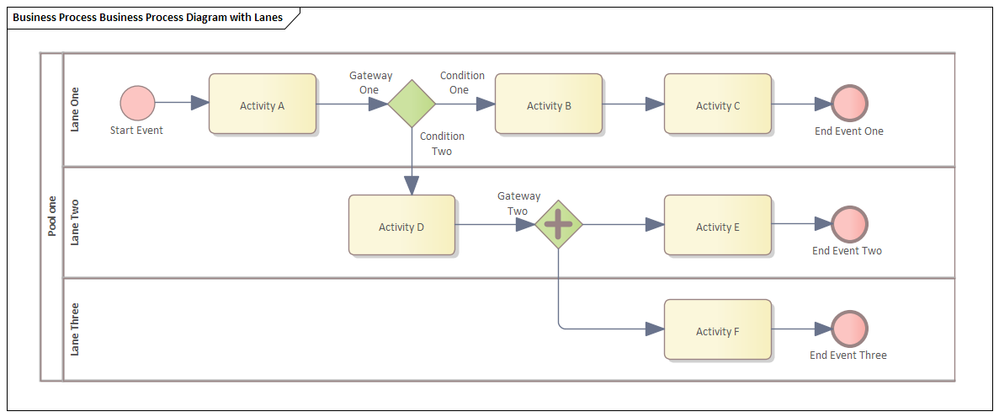
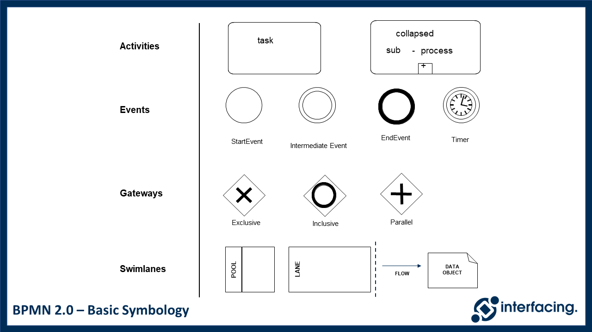
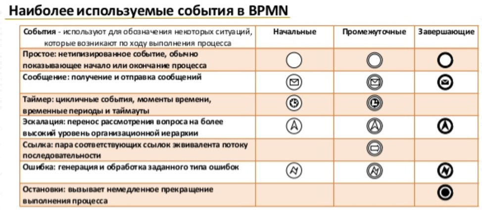
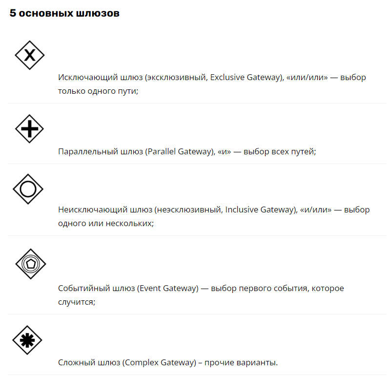
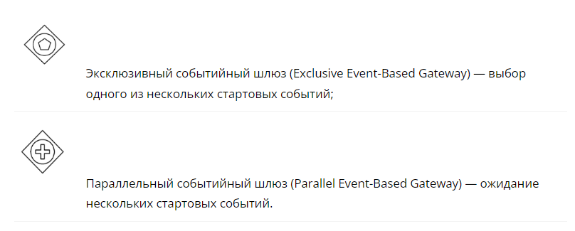
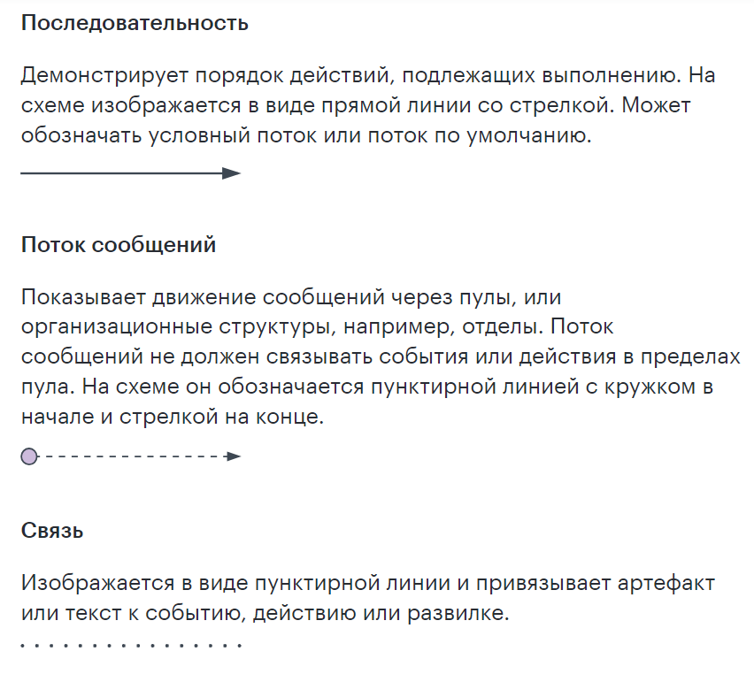
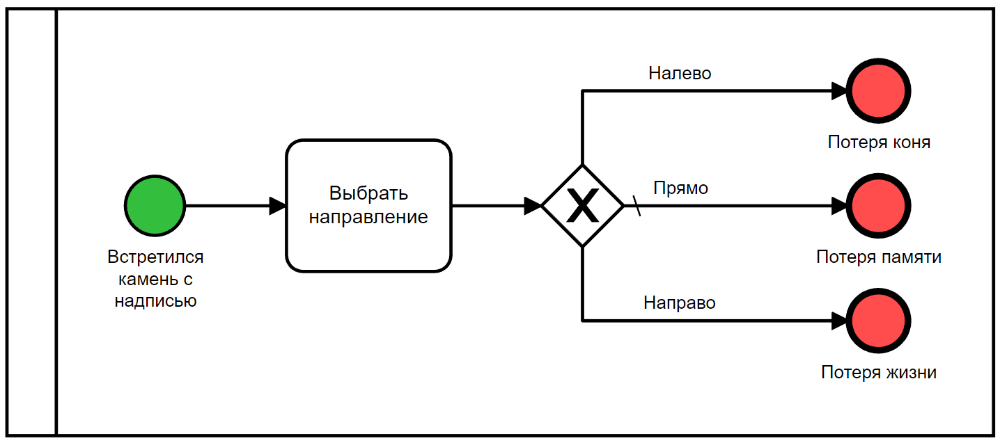
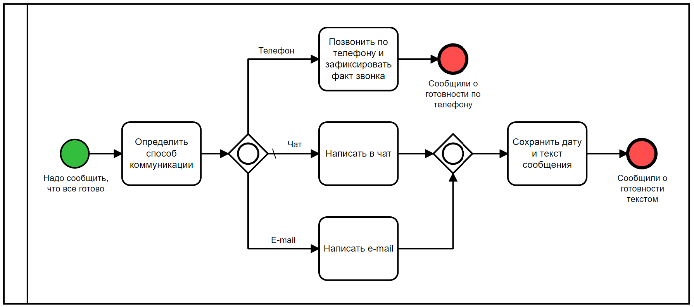
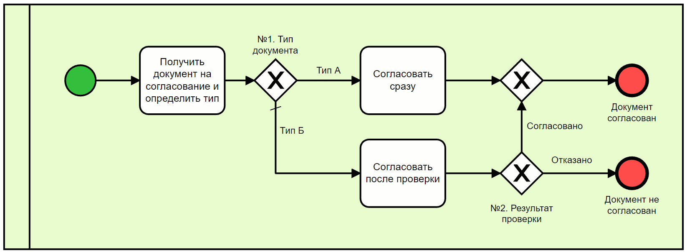

# 🔄 Нотация BPMN (Business Process Model and Notation)

**BPMN (текущая версия 2.0)** — это международный стандарт и графическая нотация для моделирования бизнес-процессов. 

Перед тем как улучшать или автоматизировать процессы любого бизнеса, важно четко описать, как они работают сейчас. BPMN в графическом виде отражает последовательность работ и логику их выполнения. Благодаря строгой стандартизации любой человек (от генерального директора до разработчика) может разобраться, что изображено на схеме, даже если видит её впервые. В дальнейшем эту схему используют для поиска слабых участков, бутылочных горлышек и оптимизации.

---

## 🎯 Два этапа работы бизнес-аналитика с BPMN

Задачи аналитика при оптимизации процессов обычно делятся на два последовательных шага:
1.  **Построение схем «Как есть» (AS-IS):** Детальное описание текущей последовательности работ бизнес-процесса со всеми его текущими проблемами, ручными операциями и задержками.
2.  **Построение схем «Как будет» (TO-BE):** Описание целевого (идеального) процесса с фиксацией требуемых изменений: этапов модернизации, реинжиниринга и автоматизации (какие шаги перейдут роботам или ИТ-системам).

---

## 🧱 Основные элементы нотации BPMN

Все элементы спецификации BPMN делятся на пять базовых категорий. Это позволяет сохранять читаемость даже очень сложных схем.

### 1. Зоны ответственности (Swimlanes & Pools)
Определяют, кто именно выполняет процесс.
*   **Пул (Pool):** Обозначает самостоятельного участника процесса (например, целую компанию, внешнего контрагента или отдельную крупную ИТ-систему). Взаимодействие *между* разными пулами происходит только с помощью **Потоков сообщений**.
*   **Дорожка (Lane / «Плавательная дорожка»):** Это горизонтальное или вертикальное деление внутри одного пула. Обозначает конкретную роль, должность или отдел внутри компании (например, «Бухгалтер», «Менеджер по продажам»). Внутри одного пула между дорожками управление передается через **Поток управления**.

---

### 2. Объекты потока (Flow Objects)
Главные графические элементы, из которых строится скелет схемы: **События**, **Действия** и **Шлюзы**.

#### 🟢 События (Events)
Показывают, что в процессе что-то произошло. Бывают стартовыми (начало процесса), промежуточными (наступают в ходе процесса, например, ожидание таймера) и конечными (завершение процесса).

#### 🟦 Действия (Activities / Actions)
Обозначают конкретную работу или задачу, которую необходимо выполнить. Могут быть атомарными (Task / Задача) или составными (Sub-process / Подпроцесс, внутри которого скрыта своя отдельная схема).

#### 🔶 Шлюзы (Gateways)
Используются для контроля разветвления и слияния потоков управления в зависимости от условий.

*   **Эксклюзивный шлюз (Exclusive / XOR):** Поток направляется только по **одной** из доступных веток. Условия на ветках взаимоисключающие (например, «Да» или «Нет»).
*   **Параллельный шлюз (Parallel / AND):** Разделяет поток на несколько **одновременно** выполняющихся веток. Процесс не пойдет дальше шлюза слияния, пока не завершатся все параллельные задачи.
*   **Включительный шлюз (Inclusive / OR):** Может активировать одну, несколько или сразу все ветки, если условия по ним истинны.

---

### 3. Соединяющие элементы (Flows)
Стрелки, которые связывают элементы схемы между собой и задают логику движения.

*   **Поток управления (Sequence Flow):** Сплошная стрелка. Показывает строгий порядок выполнения действий **внутри одного пула**. Не может пересекать границы пула.
*   **Поток сообщений (Message Flow):** Пунктирная стрелка с незакрашенным кругом у основания. Показывает отправку сообщений, писем или документов **между разными пулами** (например, от Клиента к Компании).
*   **Ассоциация (Association):** Точечная линия (иногда со стрелкой). Используется для связи текстовых аннотаций или объектов данных с элементами схемы.

::: center

:::

---

### 4. Артефакты (Artifacts)
Дополнительная информация, которую аналитики включают в схему для достижения необходимого уровня детализации, не меняя при этом сам ход процесса.

*   **Объект данных (Data Object):** Показывает, какая информация или документы требуются для запуска действия, либо генерируются в процессе его выполнения (например, «Заявка [Заполнена]», «Счет на оплату»).
*   **Группа (Group):** Визуальная рамка с пунктирной линией. Позволяет логически объединить несколько действий для создания акцента (например, выделить «Блок финансового аудита»), не влияя на логику переходов.
*   **Текстовая аннотация (Annotation):** Обычный комментарий на схеме, позволяющий дать развернутое пояснение к любому шагу или шлюзу.

---

## 📋 Примеры реальных процессов в BPMN

Ниже представлены примеры сквозного моделирования различных бизнес-сценариев для демонстрации практического применения нотации:

### Пример 1: Обработка входящего заказа

### Пример 2: Согласование договора внутри организации

### Пример 3: Техническая поддержка и эскалация инцидентов

