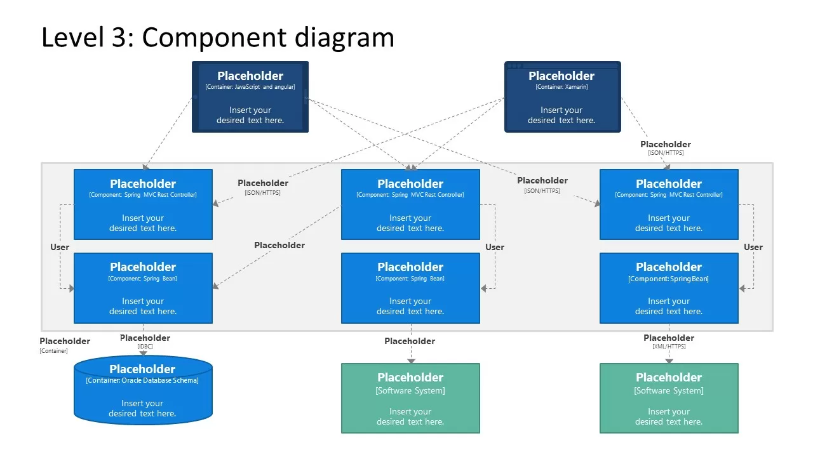

# 🧱 C4 Model — Диаграмма компонентов

**C4 Model** — это подход к визуализации архитектуры программного обеспечения Он фокусируется на четырёх уровнях абстракции (Context, Container, Component, Code), позволяя описывать систему с разной степенью детализации, понятной как разработчикам, так и бизнес-заинтересованным сторонам.

В отличие от классических UML-диаграмм, C4 делает акцент на **иерархии и наглядности**, избегая избыточной сложности нотаций. Модель часто используется в архитектурной документации и при описании микросервисных систем.

---

## 🧩 Уровни C4

| Уровень | Назначение | Аудитория |
|---------|------------|-----------|
| **System Context** | Общая картина: система и её внешние связи (пользователи, смежные системы) | Все заинтересованные стороны |
| **Container** | Высокоуровневые технологические блоки: веб-приложение, база данных, мобильное приложение, брокеры сообщений | Технический менеджмент, архитекторы |
| **Component** | Логические компоненты внутри контейнера: сервисы, репозитории, контроллеры, UI-компоненты | Разработчики, техлиды |
| **Code** | Детали реализации на уровне классов и методов (часто заменяется UML class diagram) | Разработчики |

---

## 📦 Диаграмма компонентов (Component Diagram)

**Диаграмма компонентов** находится на третьем уровне C4 и показывает внутреннее устройство одного контейнера. Каждый компонент — это значимый логический блок с определённой ответственностью, который реализует часть функциональности. Компоненты взаимодействуют между собой через интерфейсы (API, вызовы методов, публикация событий).

### Изображаемые элементы

- **Компонент (Component)** — функциональный модуль внутри контейнера.
- **Интерфейс (Interface)** — точка взаимодействия, предоставляемая или потребляемая компонентом (REST API, интерфейс на Java, порт).
- **Связь (Relationship)** — показывает зависимость и направление вызовов между компонентами.
- **Контейнер (Container)** — граница, в которой находятся компоненты (веб-сервер, backend-сервис, база данных).

---

## 🔧 Инструменты для создания C4 диаграмм

- **PlantUML** со встроенной библиотекой C4 — позволяет описывать диаграммы текстом.
- **Mermaid** — имеет поддержку C4 синтаксиса в новых версиях.
- **Draw.io / diagrams.net** — ручное рисование, подходит для быстрого наброска.

---

## 📚 Дополнительные материалы

- [Официальный сайт C4 Model](https://c4model.com/)
- [PlantUML C4 Plugin](https://github.com/plantuml-stdlib/C4-PlantUML)

---
