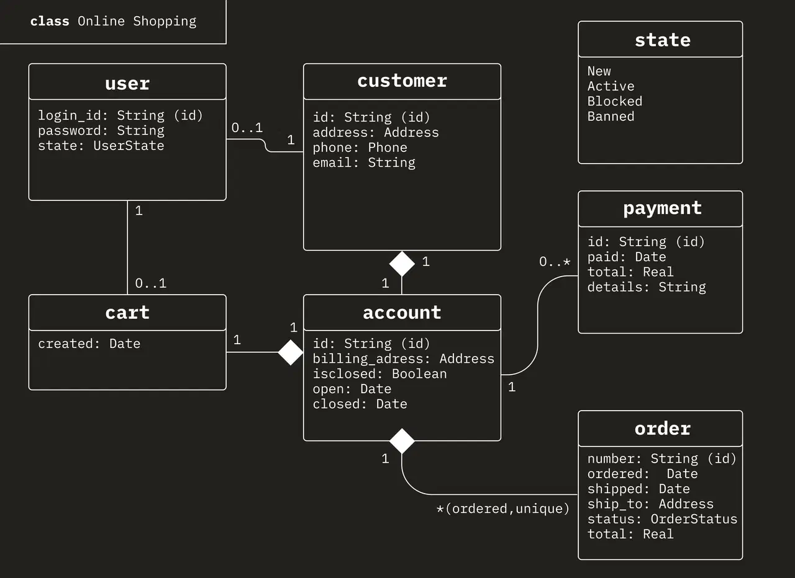
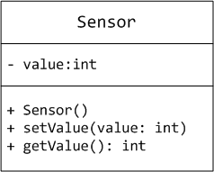
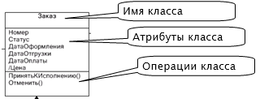
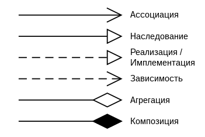
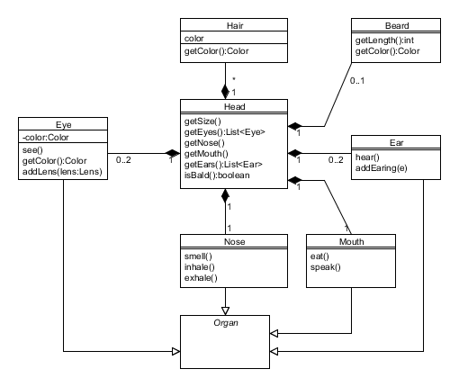

# 📐 Диаграмма классов (Class Diagram)

**Диаграмма классов** отображает структуру системы, содержащей различные объекты и классы. Чаще всего она используется разработчиками и системными аналитиками, чтобы продемонстрировать иерархию классов внутри программы и логическую архитектуру системы.

---

## 📦 Что такое класс?

**Класс** – это описание набора объектов с одинаковыми атрибутами, операциями, связями и семантикой. 

Графически в UML класс изображается в виде прямоугольника, разделенного на 3 блока горизонтальными линиями:
1. **Имя класса**
2. **Атрибуты** (свойства) класса
3. **Операции** (методы) класса

### 🔒 Типы видимости (Модификаторы доступа)
Перед именем атрибута или метода на диаграмме обязательно ставится символ, обозначающий уровень его инкапсуляции:
*   `-` **`private`** — к атрибуту или методу могут обращаться только методы данного класса.
*   `#` **`protected`** — то же, что и `private`, только доступ получают и наследники этого класса в том числе.
*   `+` **`public`** — к атрибуту может получить доступ любой желающий объект в своем неймспейсе.
*   *Дополнительно:* **`global`** — работает как `public`, но доступ к такому классу имеется даже у сторонних приложений (из другого неймспейса).

---

## 🧬 Базовые концепции ООП в контексте диаграмм

Диаграмма классов наглядно визуализирует четыре столпа объектно-ориентированного программирования:

*   **Абстракция** — отделение концепции и бизнес-логики от её конкретного экземпляра.
*   **Инкапсуляция** — это контроль доступа к полям и методам объекта с помощью модификаторов видимости (`+`, `-`, `#`), защищающий внутреннее состояние объекта от некорректного внешнего вмешательства.
*   **Наследование** — способность объекта или класса базироваться на другом объекте или классе. Это главный механизм для повторного использования кода. Наследственное отношение классов четко определяет их иерархию (отображается стрелкой с пустым треугольником от потомка к предку).
*   **Полиморфизм** — свойство системы, позволяющее иметь множество реализаций одного интерфейса. Мы можем объявить абстрактные методы в интерфейсе (например, метод `batch()`), но то, как именно этот метод будет работать внутри конкретного класса, решается на уровне самого класса-реализатора.

---

## 🔗 Отношения между классами (От UML к коду)

Связи показывают, как объекты классов взаимодействуют и зависят друг от друга.

### Имена связей
Связи можно уточнить с помощью имен связей или ролевых имен. Имя связи – это обычно глагол или глагольная фраза, описывающая, зачем она нужна. 

*Например:* между классом `Person` (человек) и классом `Company` (компания) существует ассоциация. Является ли человек клиентом компании, её сотрудником или владельцем? Чтобы определить это, стрелку ассоциации можно назвать **`employs`** (нанимает).

---

## 🔢 Множественность (Multiplicity)

**Множественность** показывает, сколько экземпляров одного класса взаимодействуют с помощью этой связи с одним экземпляром другого класса в данный момент времени. Индикаторы множественности расставляются **на обоих концах** линии связи.

> **Пример:** При разработке системы регистрации курсов в университете между классами `Course` (курс) и `Student` (студент) установлена связь. Множественность должна ответить на два вопроса:
> 1. *«Сколько курсов студент может посещать в данный момент?»* (Мы решили: от 0 до 4 курсов).
> 2. *«Сколько студентов может за раз посещать один курс?»* (Мы решили: от 0 до 20 студентов).

### 📊 Шпаргалка по значениям множественности

Ниже представлена расшифровка основных обозначений множественности на UML-диаграммах:

| Множественность | Значение |
| :--- | :--- |
| **`0..*`** | Ноль или больше |
| **`1..*`** | Один или больше |
| **`0..1`** | Ноль или один |
| **`1..1`** (или просто **`1`**) | Ровно один |

