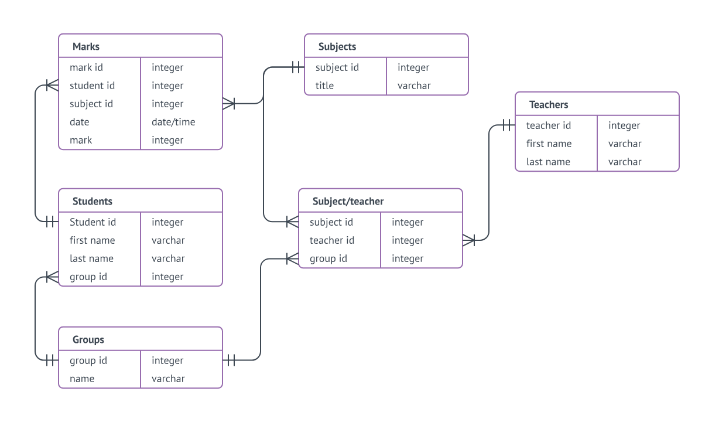
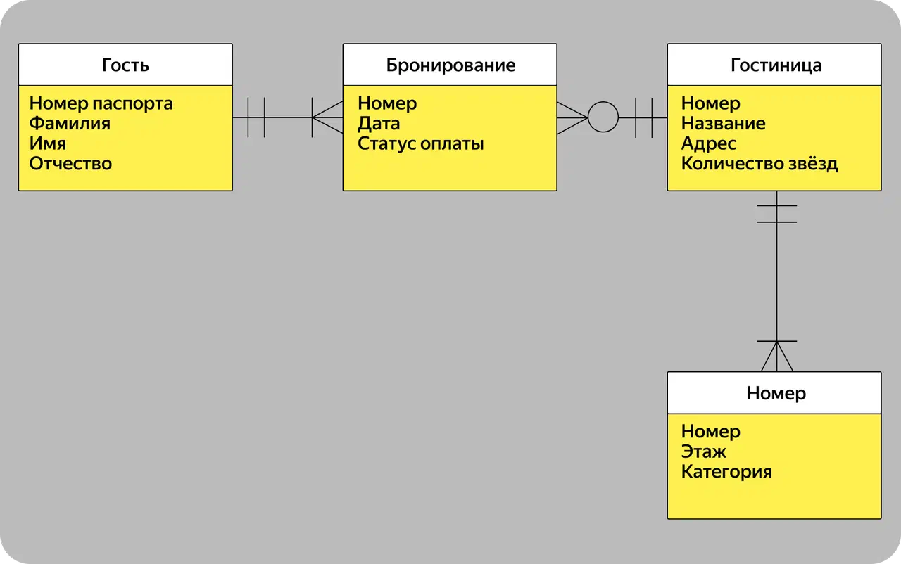
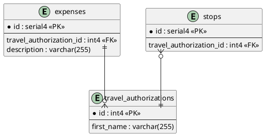

# 🗄️ Диаграмма «Сущность-Связь» (ER-диаграмма)

**ER-модель (Entity-Relationship model)** — это модель данных, позволяющая описывать концептуальные схемы предметной области. 

Она используется при высокоуровневом (и физическом) проектировании баз данных. ER-диаграмма (ERD) помогает визуализировать структуру таблиц, хранимые в них данные и связи между ними до того, как разработчики начнут писать SQL-код для создания таблиц.

---

## 🧱 Основные элементы ER-диаграммы

Для успешного проектирования баз данных аналитику необходимо оперировать следующими понятиями:

*   **Сущность (Entity):** Базовый объект или концепт, данные о котором нужно собирать и хранить. В физической модели базы данных сущность превращается в **таблицу** (например, «Пассажиры», «Заказы», «Рейсы»).
*   **Атрибут (Attribute):** Конкретная характеристика или свойство сущности. В таблице это отдельная **колонка / поле** (например, `first_name`, `age`, `email`).
*   **Первичный ключ (Primary Key — PK):** Специальный атрибут (или набор атрибутов), который *уникально* идентифицирует каждую строку в таблице. Чаще всего это автоинкрементное поле `id`.
*   **Внешний ключ (Foreign Key — FK):** Атрибут одной сущности, который ссылается на первичный ключ другой сущности. Именно внешние ключи создают **связи** между таблицами.

---

## 🔗 Типы связей (Кардинальность)

Связи показывают, как записи из одной таблицы соотносятся с записями из другой. В классическом реляционном моделировании выделяют три основных типа связей:

1.  **«Один-к-одному» (1:1)** 
    Один экземпляр сущности связан только с одним экземпляром другой сущности. 
    *Пример:* пассажир рейса и его посадочное место в самолете. (Один пассажир = одно место).
2.  **«Один-ко-многим» (1:N)**
    Один экземпляр сущности связан со множеством экземпляров другой сущности. Это самый частый вид связи в базах данных.
    *Пример:* у одного пассажира может быть несколько единиц багажа (чемодан, сумка, рюкзак), при этом каждая конкретная единица багажа принадлежит только одному пассажиру.
3.  **«Многие-ко-многим» (M:N)**
    Множество экземпляров одной сущности связаны со множеством экземпляров другой сущности.
    *Пример:* аэропорт обслуживает несколько авиакомпаний. При этом каждая авиакомпания может обслуживаться в десятках разных аэропортов.
    > **Важно для аналитика:** Напрямую в реляционных базах данных связь M:N реализовать нельзя. При физическом проектировании её всегда разбивают на две связи «1:N» через создание промежуточной (связующей) таблицы.

---

## 💻 Проектирование ERD с помощью PlantUML

Описывать архитектуру базы данных можно прямо в виде кода (подход Docs-as-Code). Для этого используется расширение PlantUML. 

Обратите внимание на синтаксис связей: конструкции вроде `||--o{` — это текстовое отображение популярной нотации «Воронья лапка» (Crow's foot), где `||` означает "строго один", а `o{` означает "ноль или много".

---

## 🛠 Инструменты для рисования

Если вы не хотите использовать код, существуют удобные визуальные редакторы для отрисовки схем баз данных:

*   **DrawSQL** — современный, визуально приятный и мощный инструмент, заточенный специально под проектирование реляционных баз данных и генерацию SQL-скриптов.
*   **PlantUML** — (пример выше) используется в случаях, когда ERD интегрируется прямо во внутреннюю wiki-документацию или репозиторий проекта.
*   **DBeaver / DataGrip** — многие современные СУБД-клиенты умеют автоматически строить ER-диаграммы (реверс-инжиниринг) на основе уже существующих баз данных.
