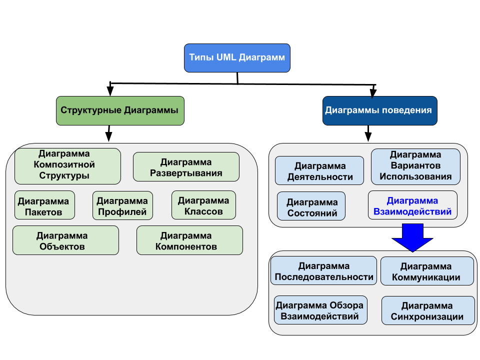

# 🧩 Unified Modeling Language (UML)

**Unified Modeling Language (UML)** — унифицированный язык моделирования. 

Расшифруем значение:
*   **Modeling (моделирование)** подразумевает создание визуальной модели, описывающей объект или процесс. 
*   **Unified (универсальный, единый)** — язык подходит для широкого класса проектируемых программных систем, различных областей, типов организаций, уровней компетентности и размеров проектов. 

UML описывает систему в едином заданном синтаксисе, поэтому где бы вы ни нарисовали диаграмму, её правила будут понятны для всех разработчиков и аналитиков, знакомых с этим графическим языком — даже в другой стране.

---

## 🎯 Задачи, которые решает UML

1.  **Проектирование.** UML-диаграммы помогают при моделировании архитектуры больших проектов. Они позволяют собрать как крупные, так и мелкие детали и нарисовать каркас (схему) приложения, по которому впоследствии будет строиться код.
2.  **Реверс-инжиниринг.** Это создание UML-модели из уже существующего кода приложения (обратное построение). Часто применяется на проектах поддержки, где есть написанный код, но документация неполная или отсутствует.
3.  **Документирование.** Из моделей можно извлекать текстовую информацию и генерировать относительно удобочитаемые тексты. Графика и текст отлично дополняют друг друга при передаче требований в разработку.

---

## 📊 Классификация популярных UML-диаграмм

В стандарте UML 2.5 существует 14 видов диаграмм, однако на практике системные аналитики и разработчики используют лишь несколько самых популярных. Все они строго делятся на две большие группы: **Структурные** (показывают, из чего состоит система) и **Поведенческие** (показывают, как система работает).

| Структурные диаграммы (Structural) | Диаграммы поведения (Behavioral) |
| :--- | :--- |
| **Диаграмма классов** (Class diagram) | **Диаграмма действий / активностей** (Activity diagram) |
| **Диаграмма объектов** (Object diagram) | **Диаграмма прецедентов / сценариев использования** (Use-case diagram) |
| | **Диаграмма последовательностей** (Sequence diagram) |
| | **Диаграмма состояний** (Statechart diagram) |

---

## 💡 Шпаргалка системного аналитика: что и когда применять?

Для успешного прохождения интервью и работы на проекте важно понимать не только как рисовать, но и **зачем** нужна конкретная диаграмма:

*   **Use-case diagram (Прецедентов):** Используется на самом старте сбора требований. Показывает, **кто** (Actor) взаимодействует с системой и **что** именно он может в ней делать. Никакой логики и алгоритмов — только высокоуровневый взгляд.
*   **Sequence diagram (Последовательностей):** Главный инструмент интеграционного аналитика. Идеально подходит для проектирования API и микросервисного взаимодействия. Показывает, как объекты (или системы) обмениваются сообщениями **во времени** (кто кому какой запрос отправил и что получил в ответ).
*   **Activity diagram (Активностей):** Аналог блок-схем. Отлично подходит для описания сложных бизнес-процессов, алгоритмов работы функций и ветвлений логики (часто используется как альтернатива нотации BPMN).
*   **Statechart diagram (Состояний):** Применяется для объектов со сложным жизненным циклом. Например, чтобы показать, как Заказ (Order) переходит из статуса *«Создан»* в *«Оплачен»*, *«Собран»*, *«Отправлен»* и какие триггеры вызывают этот переход.
*   **Class diagram (Классов):** Базовый инструмент для проектирования структур данных, схемы базы данных и логической архитектуры кодовой базы (ООП). Показывает сущности, их атрибуты и связи между ними.
