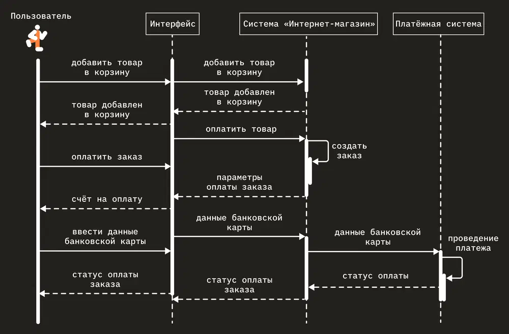
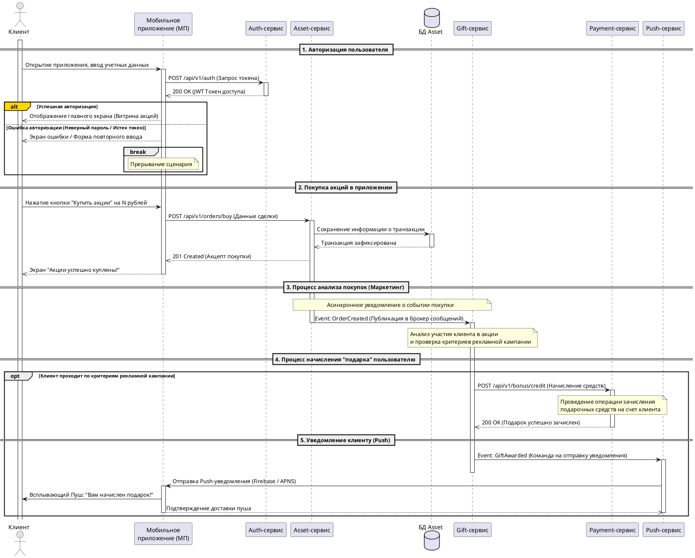
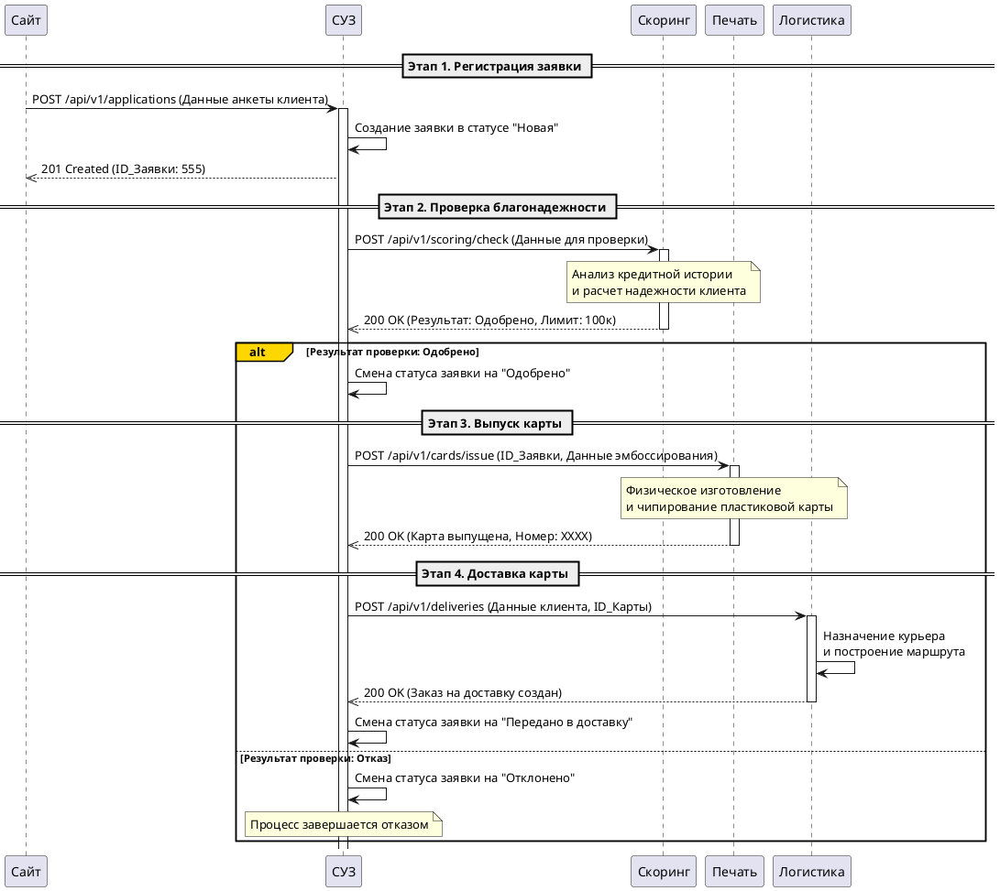

# ⏱️ Диаграмма последовательности (Sequence Diagram)

**Sequence diagram (Диаграмма последовательности)** — это поведенческая UML-диаграмма, которая наглядно представляет совокупность разных элементов модели системы, изображая то, как, в каком порядке и в течение какого времени они взаимодействуют друг с другом. 

Она незаменима для интеграционных аналитиков, так как позволяет детально спроектировать межсистемное взаимодействие (API, очереди сообщений) в хронологическом порядке (сверху вниз).



---

## 🧱 Комбинированные фрагменты (Управляющие конструкции)

Для реализации логических разветвлений, циклов и условий на диаграмме используются специальные рамки — фрагменты:

*   **`alt` (Alternative):** Несколько альтернативных фрагментов. Работает как ветвление `if-else`. Выполняется только тот фрагмент, логическое условие которого истинно.
*   **`opt` (Optional):** Необязательный фрагмент. Выполняется, только если условие истинно. Эквивалентно оператору `if` без ветки `else`.
*   **`par` (Parallel):** Параллельный фрагмент. Все процессы, находящиеся внутри этой рамки, выполняются СУБД или сервисами одновременно.
*   **`loop` (Цикл):** Повторяющийся фрагмент. Блок кода внутри рамки выполняется несколько раз, пока условие (защита) итерации остается верным.

---

## 🛠 Кейс 1: Покупка акций и начисление подарка в МП

### 1. PlantUML код диаграммы
Ниже представлен полностью спроектированный и завершенный код сквозного процесса, разбитый на 5 требуемых бизнес-подпроцессов:



### 2. Виды интеграций между компонентами
*   **Синхронное взаимодействие (REST API over HTTP):**
    *   `МП -> Auth-сервис` и `МП -> Asset-сервис`. Требует мгновенного ответа (ожидание пользователя перед экраном).
    *   `Gift-сервис -> Payment-сервис`. Синхронный вызов команды для гарантированного проведения финансовой транзакции начисления.
*   **Асинхронное взаимодействие (Event-Driven через Message Broker — Kafka/RabbitMQ):**
    *   `Asset-сервис -> Gift-сервис`. Публикация события `OrderCreated`. Покупка акций не должна зависеть от доступности маркетингового сервиса подарков.
    *   `Gift-сервис -> Push-сервис`. Отправка события `GiftAwarded` на нотификацию, выполняемая в фоновом режиме.

### 3. Структура данных (Пример JSON-сообщения при покупке акций)
**Запрос от МП в `Asset-сервис` (`POST /api/v1/orders/buy`):**
```json
{
  "clientId": "usr_998241ad",
  "assetTicker": "GAZP",
  "currency": "RUB",
  "orderType": "MARKET",
  "totalAmount": 15000.00,
  "quantity": 110
}
```

---

## 🛠 Кейс 2: Оформление кредитной карты через сайт (В2В / Логика)

**Бизнес-задача:** Разработать фичу выдачи кредитной карты через сайт. 
**Системы-участники:** Сайт, СУЗ (Система учета заявок), Скоринг, Печать, Логистика.

### 1. PlantUML код диаграммы


