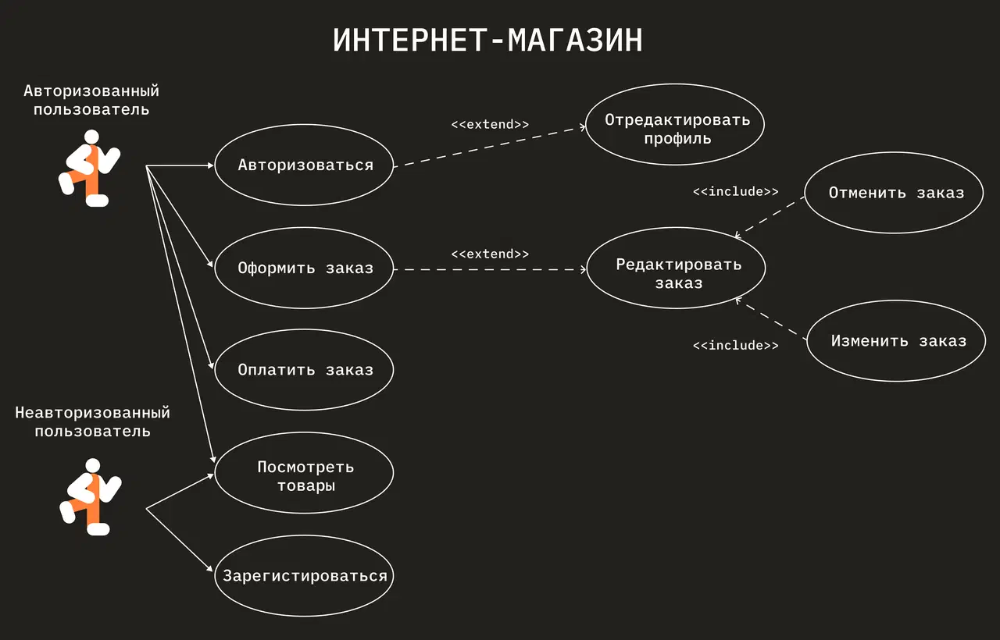
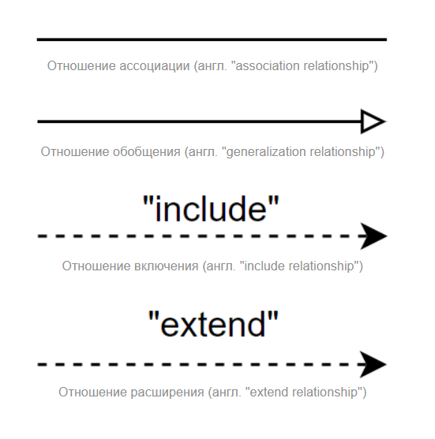

# 👤 Диаграмма вариантов использования (Use Case Diagram)

**Диаграмма вариантов (сценариев) использования**, или **Диаграмма прецедентов**, — это поведенческая UML-диаграмма, которая описывает функциональное назначение системы с точки зрения внешнего пользователя.

В ней обычно изображают пользователей («акторов»), которые взаимодействуют с системой. Эту диаграмму используют для определения высокоуровневых функций ПО и связи сценариев использования (юзкейсов) друг с другом. По ней определяют, какие возможности есть у разных групп пользователей и как именно системы участвуют в выполнении юзкейса.

---

## 🧱 Основные элементы диаграммы

*   **Актор (Actor):** Внешняя сущность, взаимодействующая с системой. Это может быть человек (Клиент, Администратор), смежное программное обеспечение, оборудование или даже время (например, планировщик задач, запускающийся раз в сутки). Обозначается фигуркой «человечка».
*   **Прецедент / Сценарий (Use Case):** Конкретная функция или бизнес-цель, которую актор достигает в системе. Обозначается овалом с глаголом или отглагольным существительным внутри (например, «Оформить заказ», «Авторизация»).
*   **Границы системы (System Boundary):** Прямоугольник, очерчивающий пределы проектируемой системы. Акторы всегда находятся строго снаружи прямоугольника, а прецеденты — строго внутри.

---

## 🔗 Типы связей в Use Case диаграммах

На собеседованиях системных аналитиков чаще всего просят объяснить разницу между `<<include>>` и `<<extend>>`. Это фундамент понимания данной диаграммы.

### 1. Ассоциация (Association)
Обычная сплошная линия, соединяющая Актора и Прецедент. Показывает, что данный актор имеет право запускать этот сценарий или участвует в нем.

### 2. Включение (`<<include>>`)
Связь, показывающая, что один прецедент **обязательно** включает в себя поведение другого прецедента. 
*   **Как рисуется:** Пунктирная стрелка от базового (основного) сценария к включаемому (вспомогательному).
*   **Пример:** Сценарий *«Оплатить заказ»* `<<include>>` *«Проверить баланс карты»*. Вы не можете оплатить заказ, не проверив баланс. Это обязательный шаг алгоритма, который часто выносится в отдельный овал для переиспользования в других местах.

### 3. Расширение (`<<extend>>`)
Связь, показывающая **необязательное (опциональное)** поведение. Дополнительный сценарий выполняется только при наступлении определенных условий (альтернативный поток).
*   **Как рисуется:** Пунктирная стрелка от расширяющего (дополнительного) сценария к базовому (то есть стрелка направлена **в обратную сторону** по сравнению с `include`).
*   **Пример:** Сценарий *«Заказать такси»* может быть расширен `<<extend>>` сценарием *«Добавить детское кресло»*. Пользователь может заказать такси и без кресла, это действие не является обязательным для успешного завершения основного сценария.

### 4. Обобщение / Наследование (Generalization)
Линия со сплошной треугольной стрелкой на конце. Применяется как к акторам, так и к прецедентам для отображения иерархии (от частного к общему).
*   **Для акторов:** Актор *«VIP-клиент»* наследует все возможности базового актора *«Клиент»*, но имеет свои дополнительные права.
*   **Для прецедентов:** Сценарии *«Оплатить картой»* и *«Оплатить наличными»* являются конкретными наследниками абстрактного прецедента *«Оплатить покупку»*.
